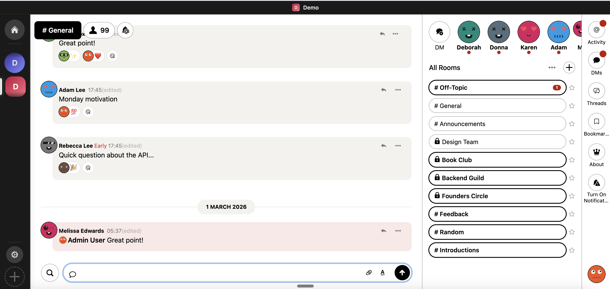

# Sabha

A self-hosted chat application like slack/discord for communities. Built with Rails, Hotwire, and SQLite.

Sabha is a fork of [Once Campfire](https://once.com/campfire), adding threads, mentions, DMs, an activity inbox, email notifications, SSO, a bot/agent API, and everything else needed to run a community without handing your members over to a platform. See [what Sabha adds to Campfire](docs/CAMPFIRE_VS_SABHA.md).



## Why Sabha?

- **You own everything** — server, data, domain, branding
- **No per-seat pricing** — host as many members as your server handles
- **SQLite for app data** — no separate database server to manage
- **One-command deploy** — Kamal or Docker Compose on a small VPS
- **Bot / agent API** — REST + WebSocket surface for LLM agents; first-party [OpenClaw plugin](https://github.com/sabha-co/openclaw-sabha)

## Features

- Rooms (public, private, DMs)
- Threaded replies on any message
- @mentions and `@everyone` with notification badges
- Activity inbox for mentions, boosts, and thread replies
- Rich text, file attachments, and sounds
- Full-text search (SQLite FTS5)
- Typing indicators and presence
- Web push notifications + installable PWA
- Bookmarks and boosts
- Light / dark / auto themes
- Customizable branding (name, logos, colors, emails)
- Password, passwordless email OTP, or external SSO sign-in
- Bot and agent API (REST + WebSocket, HMAC-signed webhooks)

## Tech Stack

Rails 8 with Hotwire/Turbo, ActionCable for real-time, Tailwind CSS v4 via `@tailwindcss/cli`, Importmap for JS, Solid Queue for background jobs. SQLite3 everywhere — app, cache, queue. Redis for the cache store and cable pubsub.

Room types via STI (`Rooms::Open`, `Rooms::Closed`, `Rooms::Direct`, `Rooms::Thread`). Soft deletion via `Deactivatable` concern. Stateless mentions parsed from ActionText HTML.

See [docs/ARCHITECTURE.md](docs/ARCHITECTURE.md) for the full breakdown.

## Self-Hosting

### Kamal (recommended)

Zero-downtime Docker deployments with AnyCable (high-performance WebSockets):

```bash
kamal setup    # First deploy
kamal deploy   # Subsequent deploys
```

### Docker Compose

Pre-built images at `ghcr.io/sabha-co/sabha`. No need to clone the repo.

```bash
# On your server
mkdir -p ~/sabha && cd ~/sabha
# Create docker-compose.yml and .env (see docs/DEPLOYMENT.md)
docker compose up -d
```

Requires a VPS with 2GB+ RAM, a domain, and Docker. See [docs/DEPLOYMENT.md](docs/DEPLOYMENT.md) for the full guide including TLS, backups, and upgrades.

## Development

### Prerequisites

- Ruby 4.0.1
- SQLite3
- Redis
- Node.js + pnpm (Tailwind CSS compilation)

### Setup

```bash
bin/setup    # Install deps, prepare DB, build CSS
bin/dev      # Start dev server
```

### Testing

```bash
bin/rails test                         # Full suite
bin/rails test test/models/user_test.rb # Single file
```

## Documentation

### Getting started

| Doc | What it covers |
|-----|---------------|
| [DEPLOYMENT.md](docs/DEPLOYMENT.md) | Docker Compose, Kamal, backups, upgrades |
| [DEVELOPMENT.md](docs/DEVELOPMENT.md) | Dev setup, testing, code structure |
| [ARCHITECTURE.md](docs/ARCHITECTURE.md) | Models, real-time, room system, auth |
| [BRANDING.md](docs/BRANDING.md) | Environment variables, icons, custom CSS |
| [authentication.md](docs/authentication.md) | Password, OTP, and email-verification flows |
| [sso.md](docs/sso.md) | Single Sign-On integration |
| [CHANGELOG.md](docs/CHANGELOG.md) | Feature history |
| [CAMPFIRE_VS_SABHA.md](docs/CAMPFIRE_VS_SABHA.md) | What Sabha adds to Campfire |

### Multi-tenant SaaS

The `saas/` directory is licensed separately under the [Sabha SaaS License](saas/LICENSE). See [docs/multi-tenant/](docs/multi-tenant/) for the SaaS-specific architecture, deployment, and PostgreSQL untenanted-DB notes.

## Contributing

Bug reports and pull requests are welcome. [Open an issue](https://github.com/sabha-co/sabha/issues/new) first to discuss substantial changes. Please run the test suite before submitting a PR; for SaaS-touching changes, run both the self-hosted and `SAAS=true` test suites.

## Credits

Built on [Once Campfire](https://github.com/basecamp/once-campfire/). Some additional features inherited from the [Small Bets](https://github.com/antiwork/smallbets) fork by Antiwork.

## License

Sabha is available under the [MIT License](LICENSE.md). The multi-tenant SaaS engine (`saas/`) is licensed separately — see [saas/LICENSE](saas/LICENSE).
