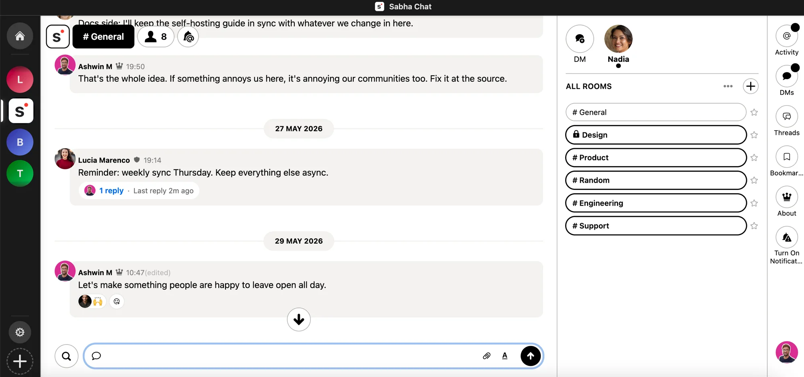

# Sabha

Sabha is an open-source, self-hosted chat platform for friends, groups, and communities — a calm alternative to Discord and Slack. Run it on your own server and own every byte. No per-seat pricing, no message limits, no platform telling you what your community is worth.

[](https://github.com/sabha-co/sabha/actions/workflows/test.yml)
[](LICENSE.md)
[](https://github.com/sabha-co/sabha/stargazers)



## Features

**Real-time chat** — public rooms for the whole community, private rooms for smaller groups, direct messages for one-on-one talks, and threads to keep side conversations tidy. New messages appear the moment they're sent.

**Flexible sign-in** — members can sign in with a password, with a one-time code sent to their email, or with single sign-on. Use one, two, or all three side by side.

**Single sign-on** — already have users signing in to your own product, course, or service? They can join your Sabha community with that same login — no second account, no extra sign-up step.

**Activity inbox** — one page that collects every mention, thread reply, and reaction directed at you. Catch up after a busy day in a minute.

**Calm email notifications** — get a single summary of what you missed, hourly or daily — your pick. No firehose, no per-message ping.

**Bots and AI ready** — drop a bot or AI agent into any room with one invite link. The agent reads what's said and replies like a normal member. The [OpenClaw plugin](https://github.com/sabha-co/openclaw-sabha) is the easy way to put an LLM in a room.

**Installable PWA app** — install Sabha on your phone, tablet, or computer like a regular app. Push notifications, badge counts, and offline support — no app store needed.

**Your branding** — set the name, logo, colors, and support email. Members see your community, not a generic chat app.

**Slack import** — bring your existing Slack workspace over: people, channels, messages, threads, and reactions, all in one go.

**One-command deploy** — run it on a small server with a single command. No external database to set up or pay for.

## Screenshots

Short clips of Sabha in action — rooms, threads, and an AI agent answering in a room.

### Rooms for every topic

https://github.com/user-attachments/assets/1125d6c8-2b49-443c-adad-eb7fdf023ff3

### Threads keep tangents tidy

https://github.com/user-attachments/assets/5b4b78ed-5c6e-47b2-8fb7-490af0cf6bf8

### Bots & AI in any room

https://github.com/user-attachments/assets/ee9ac732-7f6c-495f-8438-bf3c52511dd9

## Architecture

Sabha is a Rails 8 monolith with the added simplicity of SQLite, all on one server.

The frontend is Hotwire/Turbo + Importmap + Tailwind CSS v4. Real-time delivery runs through AnyCable. Background jobs run on Solid Queue.

See [docs/ARCHITECTURE.md](docs/ARCHITECTURE.md) for the full breakdown.

## Deployment

**Self-host (free, MIT)** — single-tenant: one community per instance. Kamal or Docker Compose on a small VPS. See the [deployment guide](docs/DEPLOYMENT.md).

**Managed hosting** — don't want to run a server? [Sabha Cloud](https://cloud.sabha.co) hosts a dedicated Sabha instance for you with continuous backups, custom domain support, and managed updates. Same open-source app, you manage the community we manage the server.

**Multi-tenant** — Sabha is based on Campfire, which is single-tenant by design and MIT-licensed. We added multi-tenancy on top to power the free communities at [sabha.co](https://sabha.co); that engine lives in `saas/` under the separately-licensed [Sabha SaaS License](saas/LICENSE) rather than MIT. See [docs/multi-tenant/](docs/multi-tenant/) for details.

## Development

### Prerequisites

- Ruby 4.0.1
- SQLite3
- Redis
- Node.js 24+
- pnpm (for Tailwind CSS compilation)

### Setup

```bash
bin/setup    # Install deps, prepare DB, build CSS
bin/dev      # Start dev server
```

### Testing

```bash
bin/rails test                          # Full self-hosted suite
bin/rails test test/models/user_test.rb # Single file
SAAS=true bin/rails test saas/test/     # SaaS suite
```

See [docs/DEVELOPMENT.md](docs/DEVELOPMENT.md) for the full guide.

## Help and discussion

#### Bug reports and feature requests

Bug reports and feature requests can be posted on [GitHub Issues](https://github.com/sabha-co/sabha/issues).

#### Contributing

Pull requests are welcome. Please open an issue first to discuss substantial changes. Run the test suite before submitting; for changes that touch the `saas/` engine, run both the self-hosted suite and `SAAS=true bin/rails test saas/test/`.

## Credits

Built on [Once Campfire](https://github.com/basecamp/once-campfire/). Some additional features inherited from the [Small Bets](https://github.com/antiwork/smallbets) fork by Antiwork.

## License

Sabha is available under the [MIT License](LICENSE.md). The multi-tenant SaaS engine in `saas/` is licensed separately — see [saas/LICENSE](saas/LICENSE).
