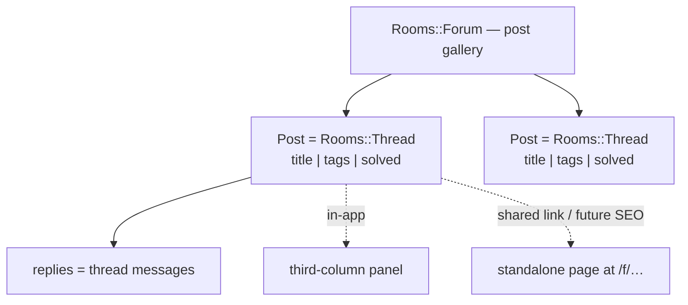

# Forum rooms

## Summary

Add a **Forum** room type for help-desk / Q&A. Instead of a chat stream, the room is a gallery of titled, tagged posts with a filter bar (by tag and by Solved), each post backed by the existing thread infrastructure. A post opens in the familiar third-column panel in-app and also carries a permanent URL that renders it as a standalone page — so shareable links and future SEO come without a rebuild.

---

## Problem Frame

Sabha's audience is community operators — hobbyist groups, open-source projects, interest collectives. Their support and Q&A lives in chat today, where a good answer scrolls away in an hour and the next person with the same question re-asks it. That is the exact job a forum does well: durable, titled, tagged posts whose answers accumulate and stay findable.

This is also a competitive lever. Discord forum channels are a feature communities lean on, and "no forums" is a reason a Discord community would decline to move to Sabha. Building forums makes Sabha recognizable to those communities and lays groundwork for eventual Discord migration. The longer-term payoff is public discoverability — help-desk answers are precisely the content worth indexing, mirroring old-school forums where a search-engine hit lands you on the exact thread that solves your problem.

---

## Key Decisions

- Reuse the thread architecture for posts. A post is a `Rooms::Thread` (title + opening body + threaded replies) rather than a net-new entity, so `Message::Threadable`, the docked thread panel, participant/reply-count logic, and membership inheritance carry over. A forum's posts are its threads; the gallery renders them.

- Panel plus canonical page, not panel-only. Posts open in the existing third-column panel in-app *and* have a permanent URL that renders a full standalone page. This costs slightly more than reusing the panel alone, but keeps the Discord-migration feel for members and keeps the SEO/old-school-forum future cheap. Today the thread `show` route redirects away (`app/controllers/rooms_controller.rb:16`); the canonical post page is the deliberate departure from that behavior.

- Tags are per-forum and admin-curated. Following Discord's model — each forum owns its tag set, defined by a room admin — so a migrating community's tags map cleanly. Tags are not global across forums and not free-form user labels.

- Solved is a first-class post state, not merely a tag. It drives the filter bar and reads differently in the gallery; the original poster or a room admin sets it. A Solved tag may still appear for Discord parity, but the state is the source of truth.

- Tags and filtering ship in v1. Chosen for Discord-migration fidelity even though it grows v1 meaningfully — Sabha has no tagging concept today.

---

## Actors

- A1. Community member — browses the forum, filters and sorts, opens posts, replies.
- A2. Original poster — creates a post, marks it Solved or reopens it.
- A3. Room admin — curates the forum's tag set, moderates posts, and can mark Solved.

An anonymous public reader is out of scope for v1 (see Scope Boundaries).

---

## Requirements

**Forum room & gallery**

- R1. A `Rooms::Forum` room type exists alongside Open / Closed / Direct / Thread, created and discoverable/joinable like other sidebar rooms.
- R2. A forum's main view is a gallery of its posts (not a linear chat stream), showing each post's title, tags, author, reply count, and last activity.
- R3. The gallery supports sort & view (e.g. most recent activity) and a filter bar.

**Posts**

- R4. A post has a title, an author, an opening body, and a threaded reply discussion backed by the existing thread infrastructure.
- R5. Posts are created through a dedicated "New Post" compose that captures title, body, and tags in one step — distinct from replying-in-thread on a message.
- R6. Replying to a post uses the existing thread reply experience (participants, reply counts, live updates).

**Tags & filtering**

- R7. Each forum owns its tag set, curated by a room admin; tags are not shared across forums.
- R8. A post can carry zero or more of its forum's tags, set at creation and editable afterward.
- R9. The filter bar filters the gallery by tag and by Solved/unsolved, and filtering composes with sorting.

**Solved state**

- R10. A post has a first-class Solved/unsolved state, surfaced in the gallery and in the filter bar.
- R11. The original poster or a room admin can mark a post Solved or reopen it.

**Rendering**

- R12. In the app, opening a post shows it in the existing third-column thread panel.
- R13. Every post also has a permanent, shareable URL that renders the same content as a standalone full page — no redirect — so links and future indexing work without a rebuild.

**Permissions & membership**

- R14. A post inherits membership and visibility from its forum, mirroring how threads inherit from their parent room; v1 post pages are member-gated, with anonymous/public access deferred.

---

## Key Flows

- F1. Create a post
  - **Trigger:** Member selects "New Post" in a forum.
  - **Actors:** A1, A2
  - **Steps:** Member enters title + body and selects tags from the forum's set; submits; a post-thread is created in the forum and appears at the top of the gallery.
  - **Covered by:** R4, R5, R7, R8

- F2. Browse & filter
  - **Trigger:** Member opens a forum.
  - **Actors:** A1
  - **Steps:** Gallery lists posts; member filters by one or more tags and/or by Solved/unsolved, and sorts by recent activity; results update.
  - **Covered by:** R2, R3, R9, R10

- F3. Read & reply
  - **Trigger:** Member clicks a post in the gallery.
  - **Actors:** A1
  - **Steps:** Post opens in the third-column panel; member reads the opening post and replies; reply count and participants update live.
  - **Covered by:** R6, R12

- F4. Mark Solved
  - **Trigger:** OP or admin decides a post is answered.
  - **Actors:** A2, A3
  - **Steps:** They mark the post Solved; the gallery and Solved filter reflect it; they can reopen later.
  - **Covered by:** R10, R11

- F5. Share / deep-link
  - **Trigger:** Someone opens a post's URL directly (shared link, bookmark, later a search result).
  - **Actors:** A1
  - **Steps:** The URL renders the full post as a standalone page with the same content the panel shows.
  - **Covered by:** R13, R14

---

## Acceptance Examples

- AE1. Solved is OP/admin-only
  - **Covers R10, R11.**
  - **Given** an unsolved post, **When** the OP marks it Solved, **Then** it shows a Solved indicator in the gallery and appears under the Solved filter.
  - **Given** the same post, **When** a member who is neither OP nor admin views it, **Then** they see the Solved state but cannot change it.

- AE2. Filters compose
  - **Covers R9.**
  - **Given** posts with mixed tags and solved states, **When** a member selects tag "Question" and filter "Unsolved", **Then** only unsolved posts tagged Question appear.

- AE3. Panel in-app, page on direct open
  - **Covers R12, R13.**
  - **Given** a post, **When** opened from the gallery in-app, **Then** it renders in the third-column panel.
  - **Given** the same post, **When** its URL is opened directly, **Then** it renders as a full standalone page with the same content, no redirect.

- AE4. Tags are forum-scoped
  - **Covers R7, R8.**
  - **Given** forum A with tags {Question, Setup} and forum B with tags {Bug, Idea}, **When** creating a post in forum A, **Then** only A's tags are selectable.

---

## Success Criteria

- A community migrating from a Discord forum channel recognizes the Sabha forum as the same tool: titled posts, per-forum tags, a filter bar, and a Solved state.
- Every post is reachable at a stable URL that renders standalone, so enabling public SEO later is a visibility/formatting change rather than a re-architecture.
- Filtering by tag and by Solved returns correct, composable results on a forum with many posts.

---

## Scope Boundaries

**Deferred for later**

- Public / anonymous SEO indexing (sitemaps, meta tags, no-login read) and the per-forum public/private visibility setting it requires. v1 posts get a permanent URL and page, but member-gated.
- Discord import / migration tooling. v1 only stays model-compatible so posts and tags can map in later.
- Post upvotes, pinning, and locking (present in Discord forums, not needed for the Q&A core).

**Not in v1**

- Global / cross-forum tags or free-form user-authored tags.
- Threading off arbitrary forum messages — forum content is posts, not a chat log to branch from.

---

## Dependencies / Assumptions

- Builds on the existing thread stack: `Rooms::Thread`, `Message::Threadable`, the `thread_panel_frame` docked panel, and STI `Room`.
- Reuses membership inheritance — posts inherit forum members the way threads inherit parent-room members (`app/models/room.rb` `grant_to`/`revoke_from`).
- Assumes the canonical post page reuses the panel's content rendering at a real route instead of the current redirect (`app/controllers/rooms_controller.rb:16`).
- Assumes a room-admin capability exists or is added for tag curation and moderation; if absent today, establishing it is part of this work.

---

## Outstanding Questions

**Deferred to Planning**

- Where the post title lives (the thread `name` column vs a new field) and where the opening body lives (a post message vs the thread's first message).
- The tag data model (per-forum tag records, post↔tag join) and how gallery filtering is queried.
- The post URL/slug scheme (id vs human-readable slug); slug choice matters for the eventual SEO surface.
- Whether Solved is a boolean state, a reserved tag, or both — and exactly how it renders in the gallery.
- How the "New Post" compose differs from the current message composer, and whether `Rooms::Thread`'s `validates_presence_of :parent_message` needs to relax for forum-originated posts.
- Sidebar treatment for forums: extending `Room#sidebar_room?` and the type filters in `app/models/sidebar_memberships.rb`, plus a `room_type_indicator` glyph (`app/helpers/rooms_helper.rb:78`).

---

## Sources / Research

- `app/models/room.rb` — STI base: `sidebar_room?`, `applicable_activity_types`, `create_for`, membership `grant_to`/`revoke_from`, destroy cascade.
- `app/models/rooms/thread.rb` — `find_or_create_for`, participant creators, deactivate/reactivate, `validates_presence_of :parent_message`.
- `app/controllers/rooms/threads_controller.rb` — thread create/show; DM/Thread parent exclusions in `set_parent_message`; `show` renders into the panel with `layout: false`.
- `app/controllers/rooms_controller.rb:16` — thread `show` redirect (the behavior the canonical post page must not do).
- `app/views/layouts/application.html.erb:91`, `app/assets/stylesheets/application/thread_panel.css`, `app/javascript/controllers/thread_panel_controller.js` — the docked third-column panel to reuse.
- `app/views/messages/_actions.html.erb`, `app/views/messages/_threads.html.erb`, `app/models/message/threadable.rb` — thread affordances, post summaries, live reply updates.
- `app/models/sidebar_memberships.rb`, `app/helpers/rooms_helper.rb:78` — sidebar inclusion and the room-type indicator to extend for forums.
- `app/controllers/rooms/opens_controller.rb`, `app/controllers/rooms/closeds_controller.rb`, `app/views/rooms/_unified_form.html.erb`, `app/javascript/controllers/room_form_controller.js` — the room-creation pattern a `Rooms::ForumsController` should follow.
- `config/routes.rb` — the `namespace :rooms` block where `resources :forums` would go.
