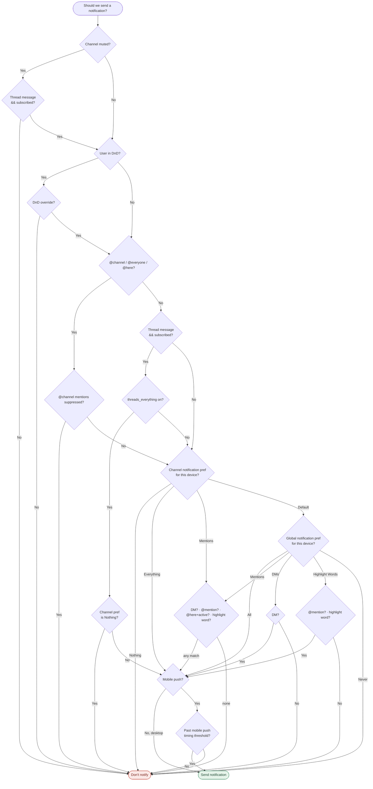

# Notification model: what to adopt from Slack (and what not to)

## Summary

Prompted by the well-known Slack "Should we send a notification?" flowchart, we
mapped it node-by-node against Sabha's actual push logic. Read through Sophie
Alpert's [essential-vs-accidental lens](https://sophiebits.com/2024/10/30/everyone-is-wrong-about-that-slack-flowchart):
most of that chart's box-count is *accidental* complexity (threads and
highlight-words each drawn six times; the channel-pref and global-pref trees are
the same shape drawn twice). Collapsed, the real logic is ~6 decisions.

**Roughly half of those essential axes already exist in Sabha — and it's the
essential half** (channel level × event type × presence). Our own decision tree,
collapsed the same way, is ~4 boxes: three universal gates (common gates → push
enabled → actively-watching-the-room) feeding one type-and-level branch (DM /
`@everyone` / mention / thread-reply, each against `involvement`).

This doc records the candidate adoptions from the half we *don't* have. The gaps
aren't implementation debt — they're product surfaces we never chose to build.
**Nothing decided, no work scheduled here.**

The theme: add only the essential axes that fit a community/hobbyist product;
skip Slack's structural duplication and its multi-client tail.

---

## The Slack tree (what we compare against)

Reproduced from Slack's published "Should we send a notification?" flowchart. Note
how much of the box-count is repetition — the thread `&& subscribed?` check appears
three times, highlight-word matching several more, and the channel-pref and
global-pref subtrees are the same shape drawn twice. That duplication is Alpert's
"accidental complexity." Collapsed, it's the ~6 essential axes; ours (below, in
prose) is ~4 boxes.

Everything in this chart below "Channel muted?" that we *don't* have — DnD/override,
`@here`/`@channel`, highlight words, the global-pref subtree, and the whole
mobile-timing tail — is catalogued as a candidate or a deliberate skip below.

---

## Candidates (adopt)

### C1 — Do Not Disturb / quiet hours *(top pick)*
- **Slack:** "User in DnD?" + "DnD Override?" gate near the top of the tree.
- **Sabha:** absent. No DnD, snooze, quiet hours, or schedule anywhere in the
  schema.
- **Read:** the single biggest missing thing, and the most universally expected —
  nobody wants a 3am ping. Self-contained: a per-user schedule (+ optional
  per-day windows) and a DnD-override flag for urgent paths. On-brand — "warm,
  respects your time" is the stated personality.
- **Insertion point:** one more push-suppression gate, right beside the existing
  "already watching this room?" check in the push path — the tree already
  branches there, so it's a clean add rather than a re-architecture. In-app
  Activity rows should still write (DnD suppresses *push*, not history).
- **Effort:** small. Strongest candidate to do first.

### C2 — Highlight / keyword words
- **Slack:** "Highlight word?" appears repeatedly; a global-pref value too.
- **Sabha:** absent. Triggers are only explicit `@user` / `@everyone` / cites,
  DMs, thread replies, boosts.
- **Read:** the one Slack feature that fits *our* audience better than Slack's.
  Interest-based communities care about topics — a project name, a game, a
  handle. We already own the matching infra (`Message::SearchIndex`, FTS5 /
  tsvector).
- **Scale caveat:** matching every new message against every user's keyword set is
  a fan-out cost on a single SQLite writer at the ~10k-concurrent target. Do it
  as a per-workspace keyword index checked on message create — never a per-user
  scan. Worth prototyping the cost before committing.
- **Effort:** medium. Second priority; distinctive value.

### C3 — Expose the global notification mode *(cheap win, already built)*
- **Slack:** the entire "global notification pref for this device" subtree
  (All / Mentions / DMs / Highlight / Never).
- **Sabha:** partial/dormant. `User::NotificationSettings#mode` already exists
  with the enum `nothing` / `mentions_and_dms` / `all`, and
  `effective_involvement` already combines it with per-room involvement — but
  `mode` is **not in the controller's permitted params**, so there's no UI. It
  sits at its default and only `:nothing` would ever be meaningful.
- **Read:** nearly free. Wiring `mode` into the settings form gives a global
  "mute everything except DMs" without new model work.
- **Effort:** trivial. Good starter / bundles with C1.

### C4 — Thread mute / unfollow
- **Slack:** the "thread message && user subscribed?" mute-bypass — muting a
  channel still notifies threads you follow.
- **Sabha:** partial. Following exists (`Room::Followable`), but there's no
  per-thread control and muting a room doesn't cleanly carve a thread exception.
- **Read:** this is already a flagged consistency gap — see
  `2026-07-06-thread-forum-consistency-gaps.md` (G3): forum posts have a
  Follow/Unfollow control, threads don't, and the mute plumbing
  (`Room#silence_thread_follows_for` flipping involvement to `invisible`) already
  exists — only the button is missing. Completing follow/unfollow/mute per thread
  closes both our internal gap and Slack's mute-bypass at once.
- **Effort:** small–medium (reuse existing plumbing). Couples to the thread-forum
  consistency work.

---

## Defer (coupled to the mobile roadmap)

### C5 — Per-device routing + mobile push timing + mark-as-read handoff
- **Slack:** "Mobile? → past mobile push timing threshold?" and the NB that a
  desktop mark-as-read suppresses the mobile push.
- **Sabha:** absent. Web Push (VAPID) only — no desktop/mobile split, no per-device
  timing, no cross-device suppression.
- **Read:** don't build until native mobile push exists (Flutter client is ahead
  of us) — there's no second device to route to. **But** design the push-token /
  subscription model now so "don't double-notify across devices" is *possible*
  later; retrofitting device-awareness onto `Push::Subscription` is the painful
  path.
- **Effort:** large, and premature. Design-forward only.

---

## Skip — intentional non-gaps

Recorded so we don't re-litigate:

- **`@here` / `@channel`** — we deliberately have only `@everyone`, admin-only,
  open-rooms-only, with a member-count **ceiling degradation** (above the ceiling
  the fan-out drops to a single `:everyone_room_message` and per-member
  push/email is skipped). That already solves "don't blast a huge room,"
  differently. Low marginal value in adding `@here`.
- **Comment-on-file-you-own notifications** — not a concept we have.
- **Slack's pref *structure*** — the duplicated channel-vs-global trees and
  six-times-repeated branches. Keep our single `involvement` axis
  (`invisible` / `nothing` / `mentions` / `everything`). This is exactly the
  accidental complexity Alpert's post is about *not* reproducing.

---

## Cross-cutting: collapse our own accidental complexity

Independent of adopting anything, our notification path has its own accidental
complexity worth a cleanup pass: **two parallel systems** run side by side —
in-app Activity rows written by legacy `after_*_commit` callbacks, and
multi-channel dispatch via `Notification::DispatchJob` (push / missed-email).
The dispatcher deliberately **no-ops** on mention & thread-reply in-app rows and
lets the callbacks own them. Unifying row-creation under the dispatcher (or
clearly documenting the split) would make every adoption above land in one place
instead of two. Very much in the spirit of the Alpert post.

---

## Open questions for later

- **Priority order:** confirm C1 (DnD) first. It's the smallest surface, clearest
  demand, and cleanest insertion point.
- **DnD granularity:** fixed daily quiet hours vs. a schedule vs. manual
  snooze-for-N-hours? And does an `@everyone` (or a DM) override DnD, or nothing?
- **Highlight words (C2):** per-user or also per-workspace defaults? Word-boundary
  vs. substring matching? Prototype the fan-out cost before committing.
- **Do we unify the two systems (cross-cutting) before or alongside the first
  adoption**, so C1 doesn't add a third code path?
- **Global mode (C3):** is "mute all except DMs" enough, or do we want the full
  Slack-style All/Mentions/Never surface once C1 and C2 exist?
