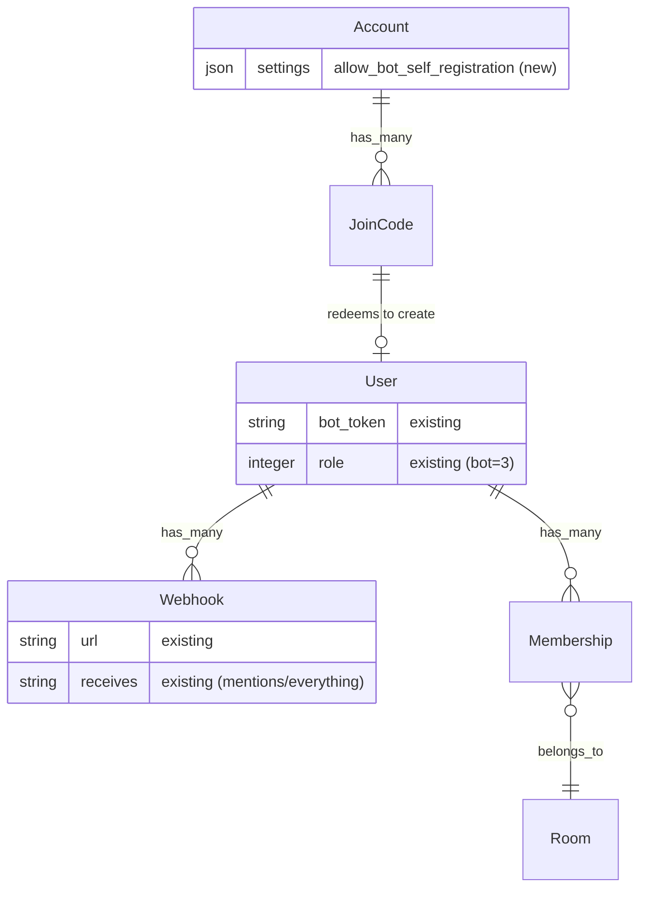

# Bot Self-Registration, Agent Discovery, and Bot API Endpoints

## Overview

Make Sabha fully AI-agent friendly by adding five capabilities:

1. **`/skill` discovery endpoint** — unauthenticated GET returning a text/plain document describing the bot API
2. **Bot self-registration via join code** — POST JSON to `/join/:join_code` to create a bot and receive a `bot_key`
3. **Room listing endpoint** — bot can discover rooms it belongs to (including rooms created after registration)
4. **Message reading endpoint** — bot can read message history in a room
5. **Bot self-update endpoint** — bot can update its own webhook URLs and name

Sabha already has a comprehensive bot system (User::Bot concern, webhooks, admin CRUD, bot message posting, DM creation). These features make the existing system accessible to autonomous AI agents end-to-end.

## Problem Statement / Motivation

Currently:
- Creating a bot requires admin UI access (`/account/bots`)
- No machine-readable API description exists
- After creation, bots can post messages and receive webhooks, but cannot list rooms, read messages, or update their own configuration
- AI agents (like OpenClaw) cannot self-onboard or operate autonomously

## Proposed Solution

### Feature 1: `/skill` Agent Discovery Endpoint

A new `SkillsController#show` (plural, matching Sabha convention — `resource :skill` singular resource route) returning `text/plain`.

**Key decisions:**
- **Unauthenticated** — the join code gates actual access, discovery is safe to expose
- **`text/plain` format** — simplest for LLM agents to parse
- **Dynamic content** — reads instance name from `Current.account`, generates absolute URLs from request host
- **Cacheable** — `expires_in 1.hour` (no `public: true` to avoid leaking across tenants in SaaS)

### Feature 2: Bot Self-Registration via Join Code

A new `Bots::RegistrationsController#create` accepting JSON POST, distinguished by routing constraint on Accept header.

**Key decisions:**
- **Separate controller** — `UsersController#create` already has 3 branches (SaaS unauth, SaaS auth, self-hosted) with 6 before_actions. Bot registration is a different resource with different auth requirements.
- **Route constraint** — `constraints: ->(req) { req.format.json? }` placed BEFORE existing human signup route
- **`allow_unauthenticated_access`** (not `require_unauthenticated_access`) — avoids `redirect_signed_in_user_to_root` which is meaningless for a JSON API
- **Account-level toggle** — `allow_bot_self_registration` setting (default: `false`). Admins must opt in. This is critical because global join codes have no usage limit by default.
- **Transaction-first** — redeem join code BEFORE creating bot inside a transaction to prevent race conditions
- **`BlockBannedRequests`** included — matches `UsersController` security posture
- **Accepts both `mentions_url` and `everything_url`** — matches existing `create_bot!` interface
- **SSRF validation** — via existing `PrivateNetworkGuard` on Webhook model
- **Machine-stable error codes** — `{ error: "message", code: "error_code" }` for agent-parseable responses

### Feature 3: Room Listing Endpoint

`GET /rooms/:bot_key` — returns JSON list of rooms the bot belongs to.

### Feature 4: Message Reading Endpoint

`GET /rooms/:room_id/:bot_key/messages` — returns JSON list of recent messages in a room.

### Feature 5: Bot Self-Update Endpoint

`PATCH /bots/:bot_key` — bot updates its own webhook URLs and name. Uses existing `update_bot!` method.

## Technical Approach

### Phase 1: Account Setting + Bot Self-Registration

#### Migration: Add `allow_bot_self_registration` to account settings

No migration needed — `Account` uses `has_json :settings` with a JSON column. Just add the default:

```ruby
# app/models/account.rb — add to has_json declaration
has_json :settings,
  restrict_room_creation_to_administrators: false,
  restrict_direct_messages_to_administrators: false,
  allow_users_to_create_invite_links: true,
  allow_bot_self_registration: false
```

#### `app/controllers/bots/registrations_controller.rb`

```ruby
class Bots::RegistrationsController < ApplicationController
  include BlockBannedRequests

  allow_unauthenticated_access only: :create
  allow_bot_access only: :create

  rate_limit to: 10, within: 1.hour, only: :create,
    with: -> { render json: { error: "Too many attempts", code: "rate_limited" }, status: :too_many_requests }

  before_action :reject_banned_ip, only: :create
  before_action :verify_self_registration_enabled
  before_action :set_join_code
  before_action :verify_join_code_active

  def create
    ActiveRecord::Base.transaction do
      @join_code.redeem!
      @bot = User.create_bot!(bot_params)
    end
    render json: registration_response, status: :created
  rescue Account::JoinCode::InactiveCodeError
    render json: { error: "Join code is no longer valid", code: "join_code_inactive" }, status: :gone
  rescue ActiveRecord::RecordInvalid => e
    render json: { error: e.record.errors.full_messages.to_sentence, code: "validation_failed" }, status: :unprocessable_entity
  end

  private
    def verify_self_registration_enabled
      unless Current.account.settings.allow_bot_self_registration?
        render json: { error: "Bot self-registration is not enabled", code: "self_registration_disabled" }, status: :forbidden
      end
    end

    def set_join_code
      @join_code = Current.account.join_codes.find_by(code: params[:join_code])
      render json: { error: "Invalid join code", code: "join_code_not_found" }, status: :not_found unless @join_code
    end

    def verify_join_code_active
      render json: { error: "Join code has expired", code: "join_code_expired" }, status: :gone unless @join_code.active?
    end

    def bot_params
      params.permit(:name, :mentions_url, :everything_url).to_h.symbolize_keys
    end

    def registration_response
      @bot.reload  # ensure after_create_commit callbacks (grant_membership_to_open_rooms) have fired

      {
        bot_key: @bot.bot_key,
        name: @bot.name,
        webhooks: { mentions_url: @bot.mentions_url, everything_url: @bot.everything_url },
        rooms: @bot.rooms.where.not(type: "Rooms::Thread").map { |room|
          { id: room.id, name: room.name, type: room.type.demodulize,
            messages_url: room_bot_messages_url(room, @bot.bot_key) }
        }
      }
    end
end
```

**Key changes from original plan:**
- `allow_unauthenticated_access` instead of `require_unauthenticated_access` (no redirect for signed-in users)
- `BlockBannedRequests` included with `reject_banned_ip`
- `verify_self_registration_enabled` before_action — checks account setting
- Transaction wraps `redeem!` + `create_bot!` with redeem FIRST
- `@bot.reload` before building response (ensures `after_create_commit` memberships are loaded)
- Filters out thread rooms from response
- Includes `webhooks` in response for verification
- Machine-stable `code` field in all error responses

#### Route change in `config/routes.rb`

```ruby
# Self-hosted mode
unless Sabha.saas?
  # Bot self-registration (JSON) — must come before human signup route
  post "join/:join_code", to: "bots/registrations#create",
    constraints: ->(req) { req.format.json? }, as: :join_bot

  get "join/:join_code", to: "users#new", as: :join
  post "join/:join_code", to: "users#create"
end

# SaaS mode (inside workspace scope)
if Sabha.saas?
  # Bot self-registration (JSON) — before human signup
  post "join/:join_code", to: "bots/registrations#create",
    constraints: ->(req) { req.format.json? }, as: :join_bot

  get "join/:join_code", to: "users#new"
  post "join/:join_code", to: "users#create"
end
```

### Phase 2: `/skill` Discovery Endpoint

#### `app/controllers/skills_controller.rb`

```ruby
class SkillsController < ApplicationController
  allow_unauthenticated_access only: :show

  def show
    expires_in 1.hour
    render formats: :text
  end
end
```

#### `app/views/skills/show.text.erb`

```text
# <%= Current.account.name %> — Bot API

This document describes how to interact with <%= Current.account.name %> as a bot.

## Self-Registration

To register as a bot, POST JSON to the join URL with a valid join code:

    POST <%= join_bot_url("JOIN_CODE") %>
    Accept: application/json
    Content-Type: application/json

    {
      "name": "My Bot",
      "mentions_url": "https://example.com/webhook"
    }

IMPORTANT: You MUST send the `Accept: application/json` header. Without it, the
request will be treated as a human signup and fail.

Parameters:
- name (required): Display name for the bot
- mentions_url (optional): Webhook URL called when the bot is @mentioned or DM'd.
  Your response body (text/plain or text/html, 200 status) is auto-posted as a reply.
- everything_url (optional): Webhook URL called for ALL events. Responses are ignored.

Response (201 Created):

    {
      "bot_key": "42-AbCdEfGhIjKl",
      "name": "My Bot",
      "webhooks": { "mentions_url": "https://...", "everything_url": null },
      "rooms": [
        { "id": 1, "name": "General", "type": "Open",
          "messages_url": "<%= request.base_url %>/rooms/1/42-AbCdEfGhIjKl/messages" }
      ]
    }

Store the bot_key immediately — it is shown only once.

## Authentication

All bot API requests authenticate via bot_key in the URL path. The bot_key is a
secret equivalent to a bearer token. Always use HTTPS in production.

## Posting Messages

    POST <%= request.base_url %>/rooms/{room_id}/{bot_key}/messages
    Content-Type: text/plain

    Hello from my bot!

To mention a user, use @{user_id} syntax in the message body:

    Hello @{42}, welcome!

To send a file attachment:

    POST <%= request.base_url %>/rooms/{room_id}/{bot_key}/messages
    Content-Type: multipart/form-data

    attachment: (file)

Response: 201 Created with Location header pointing to the message.

## Creating Direct Messages

    POST <%= request.base_url %>/rooms/{bot_key}/directs
    Content-Type: application/json

    { "user_ids": [42] }

Response: { "room": { "id": 5 } } with status 201 (new) or 200 (existing).

## Listing Rooms

    GET <%= request.base_url %>/rooms/{bot_key}

Response: JSON array of rooms the bot is a member of, with message posting URLs.

## Reading Messages

    GET <%= request.base_url %>/rooms/{room_id}/{bot_key}/messages

Response: JSON array of recent messages (last 50) with sender, body (HTML + plain text),
mentionees, and created_at.

## Updating Bot Settings

    PATCH <%= request.base_url %>/bots/{bot_key}
    Content-Type: application/json

    { "name": "New Name", "mentions_url": "https://new-url.com/webhook" }

## Webhook Payloads

When your bot receives a webhook, the payload is JSON:

### message_created / message_updated

    {
      "event": "message_created",
      "user": { "id": 1, "name": "Alice", "path": "/users/1" },
      "room": {
        "id": 5, "name": "General", "type": "Open",
        "members": 42, "has_bot": true,
        "path": "/rooms/5/{bot_key}/messages"
      },
      "message": {
        "id": 10,
        "body": { "html": "<p>Hello @MyBot</p>", "plain": "Hello @MyBot" },
        "mentionees": [{ "id": 99, "name": "MyBot" }],
        "path": "/rooms/5@10"
      }
    }

### boost_created

Same structure plus: "boost": { "id": 123, "body": "👍" }

### user_created

    { "event": "user_created", "user": { "id": 1, "name": "Alice", "path": "/users/1" } }

### Webhook Response Convention (mentions webhooks only)

For mentions webhooks, your HTTP response is automatically posted as a reply:
- Return text/plain or text/html with 200 → auto-posted as a message from the bot
- Return a binary content type with 200 → auto-posted as an attachment
- Timeout (300s) or error → error message posted to the room

Everything webhooks: responses are ignored (fire-and-forget).

## Error Responses

All errors return JSON with `error` (human-readable) and `code` (machine-stable):

    { "error": "Join code has expired", "code": "join_code_expired" }

Common codes: join_code_not_found, join_code_expired, join_code_inactive,
self_registration_disabled, rate_limited, validation_failed, forbidden.
```

#### Route

```ruby
resource :skill, only: :show, controller: "skills"
```

### Phase 3: Bot Read & Update Endpoints

#### `app/controllers/bots/rooms_controller.rb`

```ruby
class Bots::RoomsController < ApplicationController
  allow_bot_access only: :index

  def index
    rooms = Current.user.rooms.where.not(type: "Rooms::Thread")
    render json: rooms.map { |room|
      { id: room.id, name: room.name, type: room.type.demodulize,
        messages_url: room_bot_messages_url(room, Current.user.bot_key) }
    }
  end
end
```

#### `app/controllers/messages/reads_by_bots_controller.rb`

```ruby
class Messages::ReadsByBotsController < ApplicationController
  allow_bot_access only: :index

  def index
    @room = Current.user.rooms.find(params[:room_id])
    messages = @room.messages.active.with_creator.ordered.last(50).reverse

    render json: messages.map { |msg|
      { id: msg.id,
        creator: { id: msg.creator.id, name: msg.creator.name },
        body: { html: msg.body.body.to_s, plain: msg.plain_text_body },
        mentionees: msg.mentionees.map { |m| { id: m.id, name: m.name } },
        created_at: msg.created_at.iso8601 }
    }
  end
end
```

#### `app/controllers/bots/profiles_controller.rb`

```ruby
class Bots::ProfilesController < ApplicationController
  allow_bot_access only: :update

  def update
    Current.user.update_bot!(bot_params)
    render json: {
      name: Current.user.name,
      webhooks: { mentions_url: Current.user.mentions_url, everything_url: Current.user.everything_url }
    }
  rescue ActiveRecord::RecordInvalid => e
    render json: { error: e.record.errors.full_messages.to_sentence, code: "validation_failed" }, status: :unprocessable_entity
  end

  private
    def bot_params
      params.permit(:name, :mentions_url, :everything_url).to_h.symbolize_keys
    end
end
```

#### Routes for bot API

```ruby
# Inside the rooms resource block
resources :rooms do
  # ... existing routes ...
  post ":bot_key/messages", to: "messages/by_bots#create", as: :bot_messages

  # New: bot reads messages
  get ":bot_key/messages", to: "messages/reads_by_bots#index", as: :bot_messages_read
end

# Bot room listing
namespace :rooms do
  # ... existing routes ...
  get ":bot_key", to: "bots/rooms#index", as: :bot_rooms, constraints: { bot_key: /\d+-.+/ }
end

# Bot self-update
patch "bots/:bot_key", to: "bots/profiles#update", as: :bot_profile, constraints: { bot_key: /\d+-.+/ }
```

Note: The `constraints: { bot_key: /\d+-.+/ }` prevents conflicts with other routes by ensuring bot_key matches the `ID-TOKEN` format.

### Phase 3b: Retrofit Existing Bot Endpoints for Consistent Error Responses

The existing `Messages::ByBotsController` returns bare `head` statuses and `Rooms::Directs::ByBotsController` returns `{ error }` without a `code` field. Update both for consistency with the new endpoints.

#### `app/controllers/messages/by_bots_controller.rb` changes

```ruby
class Messages::ByBotsController < MessagesController
  skip_before_action :deny_bots

  def create
    super
    head :created, location: message_url(@message) if @message&.persisted? && !performed?
  rescue LoadError
    render json: { error: "Storage service unavailable", code: "service_unavailable" }, status: :service_unavailable
  end

  # ... existing private methods unchanged ...
end
```

#### `app/controllers/rooms/directs/by_bots_controller.rb` changes

```ruby
class Rooms::Directs::ByBotsController < Rooms::DirectsController
  rescue_from Exception, with: :respond_with_error
  allow_bot_access only: :create

  def create
    @room = Rooms::Direct.find_or_create_for(selected_users)
    render json: { room: { id: @room.id } }, status: (@room.previously_new_record? ? :created : :ok)
  end

  private
    def respond_with_error(error)
      render json: { error: error.message, code: "internal_error" }, status: :internal_server_error
    end
end
```

### Phase 4: Account Settings UI

Add a checkbox to the admin account settings page for `allow_bot_self_registration`:

```ruby
# In the account settings form (existing file)
<%= form.check_box :allow_bot_self_registration %>
<%= form.label :allow_bot_self_registration, "Allow bots to self-register via join code" %>
```

### Phase 5: Tests

#### `test/controllers/bots/registrations_controller_test.rb`

- Successful registration returns 201 with bot_key, name, webhooks, rooms
- Returns 403 when `allow_bot_self_registration` is false (default)
- Returns 404 for invalid join code
- Returns 410 for expired join code
- Returns 410 for usage-exhausted join code
- Missing name uses default
- Invalid webhook URL returns 422
- Rate limiting returns 429
- Banned IP returns 403
- Bot is granted membership to open rooms (not threads)
- Join code usage_count increments
- HTML request falls through to UsersController (not this controller)
- All error responses include `code` field
- `.json` URL extension also triggers bot registration

#### `test/controllers/skills_controller_test.rb`

- Returns 200 with text/plain content type
- Contains instance name
- Contains registration URL with join code placeholder
- Contains message posting URL pattern
- Contains webhook payload examples
- Sets cache headers (private, not public)
- Accessible without authentication

#### `test/controllers/bots/rooms_controller_test.rb`

- Returns JSON list of rooms bot belongs to
- Excludes thread rooms
- Requires bot authentication (returns 403 for non-bot)
- Each room includes messages_url with bot_key

#### `test/controllers/messages/reads_by_bots_controller_test.rb`

- Returns JSON list of messages in room
- Only returns messages from rooms the bot is a member of
- Returns 404 for rooms the bot is not in
- Messages include creator, body (html + plain), mentionees, created_at
- Returns at most 50 messages

#### `test/controllers/bots/profiles_controller_test.rb`

- Updates bot name
- Updates webhook URLs
- Returns 422 for invalid webhook URL
- Requires bot authentication

#### SaaS tests (`saas/test/`)

- Bot self-registration works within workspace scope
- `/skill` endpoint returns workspace-specific URLs
- Bot registration creates user in correct tenant database
- Bot room listing works within tenant context

## Acceptance Criteria

- [x] `allow_bot_self_registration` account setting (default false), with admin UI toggle
- [x] `GET /skill` returns text/plain document with full API description and webhook payload examples
- [x] `POST /join/:join_code` with `Accept: application/json` creates bot when setting enabled, returns `{ bot_key, name, webhooks, rooms }`
- [x] `POST /join/:join_code` with `Accept: text/html` still goes to `UsersController#create` (human signup unchanged)
- [x] Returns `{ code: "self_registration_disabled" }` when setting is off
- [x] Join code redeemed inside transaction BEFORE bot creation
- [x] Banned IPs blocked via `BlockBannedRequests`
- [x] Webhook URLs validated for SSRF via existing `PrivateNetworkGuard`
- [x] `GET /rooms/:bot_key` returns JSON rooms list (excludes threads)
- [x] `GET /rooms/:room_id/:bot_key/messages` returns JSON message history
- [x] `PATCH /bots/:bot_key` updates bot name and webhook URLs
- [x] All error responses include `error` (human) and `code` (machine-stable) fields
- [x] Rate limited to 10 registrations per hour per IP
- [x] Self-registered bots appear in admin UI at `/account/bots`
- [x] SaaS: routes work at workspace scope, `/skill` returns workspace-specific URLs
- [x] All tests pass: `bin/rails test` and `SAAS=true bin/rails test saas/test/`

## Multi-Tenant / Single-Tenant Support

All features must work identically in both deployment modes. The key differences are routing and tenant context.

### How it works in each mode

| Concern | Self-hosted (single tenant) | SaaS (multi-tenant) |
|---------|---------------------------|---------------------|
| `Current.account` | `Account.sole` (always available) | `Account.sole` within tenant SQLite (available when tenant is set) |
| `Current.user` for bots | Set by `bot_authentication` in Authentication concern | Same — `User.authenticate_bot` runs against active tenant DB |
| Join codes | Scoped to `Current.account.join_codes` | Same — each workspace has its own join codes in tenant DB |
| `/skill` URL | `https://chat.example.com/skill` | `https://app.example.com/{workspace_id}/skill` |
| Bot registration URL | `https://chat.example.com/join/CODE` | `https://app.example.com/{workspace_id}/join/CODE` |
| Bot API URLs | `https://chat.example.com/rooms/1/BOT_KEY/messages` | `https://app.example.com/{workspace_id}/rooms/1/BOT_KEY/messages` |
| Bot data isolation | Single database | Per-workspace SQLite — bot user, webhooks, memberships all in tenant DB |

### Route definitions

All bot routes must exist in BOTH the self-hosted and SaaS route blocks. In SaaS mode, all routes are workspace-scoped (tenant middleware sets `ApplicationRecord.current_tenant` before the request reaches the controller).

```ruby
# Self-hosted mode
unless Sabha.saas?
  resource :skill, only: :show, controller: "skills"

  post "join/:join_code", to: "bots/registrations#create",
    constraints: ->(req) { req.format.json? }, as: :join_bot
  get "join/:join_code", to: "users#new", as: :join
  post "join/:join_code", to: "users#create"
end

# SaaS mode (workspace-scoped)
if Sabha.saas?
  constraints(->(req) { ApplicationRecord.current_tenant.present? }) do
    # ... existing workspace routes ...
    resource :skill, only: :show, controller: "skills"
  end

  post "join/:join_code", to: "bots/registrations#create",
    constraints: ->(req) { req.format.json? }, as: :join_bot
  get "join/:join_code", to: "users#new"
  post "join/:join_code", to: "users#create"
end

# Bot read/update routes (shared — work in both modes via existing route blocks)
# These go inside the existing `resources :rooms` and `namespace :rooms` blocks
# which are already shared between modes:

resources :rooms do
  get ":bot_key/messages", to: "messages/reads_by_bots#index", as: :bot_messages_read
  # existing: post ":bot_key/messages", to: "messages/by_bots#create"
end

namespace :rooms do
  get ":bot_key", to: "bots/rooms#index", as: :bot_rooms,
    constraints: { bot_key: /\d+-.+/ }
end

patch "bots/:bot_key", to: "bots/profiles#update", as: :bot_profile,
  constraints: { bot_key: /\d+-.+/ }
```

### Controllers — no mode-specific branching needed

All new controllers use `Current.account` and `Current.user` which resolve correctly in both modes:
- **Self-hosted:** `Current.account = Account.sole`, `Current.user` set by `bot_authentication`
- **SaaS:** `Current.account = Account.sole` (within tenant context), `Current.user` set by `bot_authentication` (within tenant DB)

The `SkillsController` uses `request.base_url` for absolute URLs, which automatically includes the workspace path prefix in SaaS mode (via Rack's `SCRIPT_NAME`).

No `Sabha.saas?` checks should appear in any new controller code.

### Testing both modes

Every test file must have a corresponding SaaS variant. Run both suites:

```bash
bin/rails test                           # Self-hosted
SAAS=true bin/rails test saas/test/      # SaaS
```

SaaS-specific test cases to add:
- Bot registration creates user in correct tenant database (not in another workspace's DB)
- `/skill` endpoint returns workspace-scoped URLs (includes workspace path prefix)
- Bot room listing returns rooms from the correct tenant
- Bot message reading returns messages from the correct tenant
- Bot self-update modifies the correct tenant's user record
- A bot_key from workspace A cannot access workspace B's data

## Dependencies & Risks

- **Low risk:** All features are additive — minimal changes to existing files
- **Security:** Bot self-registration gated by `allow_bot_self_registration` (default: false). Admins must opt in.
- **No new migrations** — uses existing `bot_token` column, `webhooks` table, and `settings` JSON column
- **No new gems** — uses existing Rails infrastructure

## Files to Create/Modify

| File | Action |
|------|--------|
| `app/models/account.rb` | Modify (add `allow_bot_self_registration` to `has_json :settings`) |
| `app/controllers/bots/registrations_controller.rb` | Create |
| `app/controllers/skills_controller.rb` | Create |
| `app/controllers/bots/rooms_controller.rb` | Create |
| `app/controllers/messages/reads_by_bots_controller.rb` | Create |
| `app/controllers/bots/profiles_controller.rb` | Create |
| `app/views/skills/show.text.erb` | Create |
| `config/routes.rb` | Modify (add routes) |
| Account settings view (existing) | Modify (add checkbox) |
| `test/controllers/bots/registrations_controller_test.rb` | Create |
| `test/controllers/skills_controller_test.rb` | Create |
| `test/controllers/bots/rooms_controller_test.rb` | Create |
| `test/controllers/messages/reads_by_bots_controller_test.rb` | Create |
| `test/controllers/bots/profiles_controller_test.rb` | Create |
| `saas/test/controllers/bots/registrations_controller_test.rb` | Create |
| `saas/test/controllers/skills_controller_test.rb` | Create |
| `saas/test/controllers/bots/rooms_controller_test.rb` | Create |
| `saas/test/controllers/messages/reads_by_bots_controller_test.rb` | Create |
| `saas/test/controllers/bots/profiles_controller_test.rb` | Create |

## ERD



No new tables or columns — all existing schema.

## References

- Existing bot concern: `app/models/user/bot.rb`
- Existing bot admin: `app/controllers/accounts/bots_controller.rb`
- Existing bot message posting: `app/controllers/messages/by_bots_controller.rb`
- Existing bot DM creation: `app/controllers/rooms/directs/by_bots_controller.rb`
- Join code model: `app/models/account/join_code.rb`
- Webhook model: `app/models/webhook.rb`
- Authentication concern: `app/controllers/concerns/authentication.rb`
- Account settings: `app/models/account.rb` (line 7, `has_json :settings`)
