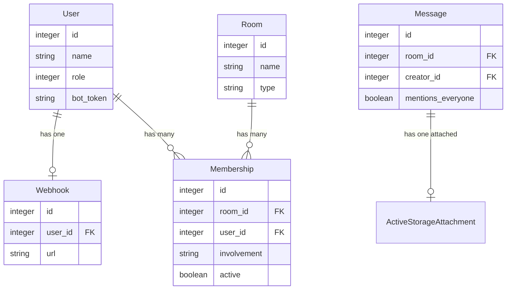

# Bot Room Permissions & Attachment URLs

## Overview

Two enhancements to Sabha's bot API:

1. **Per-room bot permissions** — Use existing membership `involvement` to control webhook delivery per room, with an admin UI for toggling room access and involvement levels per bot.
2. **Attachment URLs in API responses** — Include attachment info (URL, filename, content_type, byte_size) in webhook payloads and the read messages API.

## Problem Statement

**Permissions:** Bots currently have two global webhook URLs (`mentions_url` and `everything_url`). The `NotifyBots` concern decides which bots to notify based on hard-coded logic — not per-room settings. An admin cannot say "this bot should hear everything in #general but only mentions in #random."

**Attachments:** Webhook payloads and the read messages API omit attachment data entirely. Bots that process images, files, or media have no way to discover or download attachments.

## Proposed Solution

### Feature 1: Per-Room Bot Permissions

**Key insight:** The `memberships` table already has an `involvement` enum (`invisible | nothing | mentions | everything`) that is per-room. We use this directly — no new models or tables needed.

**Changes:**

1. **Collapse the two webhook URLs into one.** Currently bots have `mentions_url` and `everything_url` as separate webhooks. Replace with a single `webhook_url` on the webhook record. The per-room membership `involvement` controls *what* triggers delivery; the webhook URL is just *where* to deliver.

2. **Rewrite `NotifyBots#bots_eligible_for_webhook`** to check the bot's membership involvement for the specific room:
   - `involvement: everything` → deliver all events (fire-and-forget, response ignored)
   - `involvement: mentions` → deliver only when bot is @mentioned or `mentions_everyone` is true (response auto-posted as reply)
   - `involvement: nothing` → no webhooks
   - `involvement: invisible` → no webhooks (bot has left the room)

3. **Direct rooms bypass involvement** — always deliver to the bot (current behavior preserved). Users DMing a bot expect a response.

4. **Webhook response behavior keyed to involvement, not URL:**
   - `everything` involvement → fire-and-forget (response ignored)
   - `mentions` involvement → response auto-posted as reply

5. **Admin UI** on the bot edit/show page: list all non-direct, non-thread rooms with involvement toggles. Allow adding/removing bot from rooms inline.

6. **Default involvement for bots:** `mentions` (same as humans via `Room#default_involvement`). This means newly created bots respond to @mentions out of the box.

### Feature 2: Attachment URLs in API Responses

1. **Add attachment data to `Webhook#message_to_api`:**

```ruby
# In the message hash:
{
  id: message.id,
  body: { html: ..., plain: ... },
  has_attachment: message.attachment?,
  attachment: message.attachment? ? {
    url: rails_blob_url(message.attachment, expires_in: 1.hour),
    filename: message.attachment.filename.to_s,
    content_type: message.attachment.content_type,
    byte_size: message.attachment.byte_size
  } : nil,
  mentionees: [...],
  path: ...
}
```

2. **Same structure in `Messages::ReadsByBotsController#index`** response.

3. **URL strategy:** Signed URLs with 1-hour expiration via `rails_blob_url(..., expires_in: 1.hour)`. Simple, no extra auth needed, generous enough for bot processing.

4. **Background job URL generation:** `Bot::WebhookJob` needs `Rails.application.routes.default_url_options` set (or pass host as job argument) so `rails_blob_url` generates absolute URLs.

5. **Update skill endpoint** (`app/views/skills/show.text.erb`) to document the new attachment fields.

## Technical Approach

### Phase 1: Collapse Webhook URLs & Per-Room Delivery

**Files to modify:**

| File | Change |
|---|---|
| `app/models/webhook.rb` | Replace `mentions`/`everything` receives enum with single webhook. Add `url` validation only. Remove `cares_about?` logic that checks receives type. |
| `app/models/user/bot.rb` | Replace `mentions_url`/`everything_url` accessors with single `webhook_url`. Update `create_bot!` and `update_bot!`. Keep backward compat in registration response. |
| `app/controllers/concerns/notify_bots.rb` | Rewrite `bots_eligible_for_webhook` to query membership involvement per room. Direct rooms always deliver. |
| `app/models/webhook.rb` (`deliver` method) | Key response behavior (auto-post vs fire-and-forget) off the bot's membership involvement in the room, not the webhook receives type. |
| `db/migrate/xxx_simplify_webhooks.rb` | Migration: remove `receives` column from webhooks (or leave it unused). |

**Webhook delivery logic (pseudocode):**

```ruby
def bots_eligible_for_webhook(message, room)
  bot_memberships = room.memberships.active.joins(:user)
    .merge(User.active_bots)
    .where.not(involvement: [:invisible, :nothing])
    .includes(user: :webhook)
    .where.not(webhooks: { url: nil })

  if room.direct?
    # Always deliver to bots in DMs
    bot_memberships.map(&:user)
  else
    bot_memberships.select do |membership|
      membership.involved_in_everything? ||
        (membership.receives_mentions? && mentioned?(message, membership.user))
    end.map(&:user)
  end
end

def mentioned?(message, bot)
  message.mentionees.include?(bot) || message.mentions_everyone?
end
```

### Phase 2: Admin UI for Room Permissions

**Files to create/modify:**

| File | Change |
|---|---|
| `app/views/accounts/bots/show.html.erb` | Add room permissions section showing rooms with involvement badges |
| `app/views/accounts/bots/edit.html.erb` | Add room list with involvement select dropdowns |
| `app/views/accounts/bots/_form.html.erb` | Replace `mentions_url`/`everything_url` fields with single `webhook_url` field |
| `app/controllers/accounts/bots_controller.rb` | Accept nested room involvement params. Load rooms for the form. |
| `app/controllers/accounts/bots/rooms_controller.rb` | **New** — RESTful controller for adding/removing bot from rooms (create/destroy on memberships) |

**UI sketch for bot edit page:**

```
Bot Settings
  Name: [________]
  Webhook URL: [________________]

Room Permissions
  ┌──────────────────────────────────────────┐
  │ Room             │ Access  │ Involvement  │
  ├──────────────────┼─────────┼──────────────┤
  │ #general         │ [x]     │ [everything] │
  │ #random          │ [x]     │ [mentions ▼] │
  │ #engineering     │ [ ]     │ —            │
  │ #announcements   │ [x]     │ [nothing   ] │
  └──────────────────────────────────────────┘
```

- Checkbox toggles membership (create/destroy)
- Dropdown sets involvement (mentions/everything/nothing)
- Only shows Open and Closed rooms (not Direct, not Thread)

### Phase 3: Attachment URLs

**Files to modify:**

| File | Change |
|---|---|
| `app/models/webhook.rb` | Add attachment data to `message_to_api` |
| `app/controllers/messages/reads_by_bots_controller.rb` | Add attachment data to JSON response. Include `ActiveStorage::SetCurrent`. |
| `app/jobs/bot/webhook_job.rb` | Ensure URL options are set for `rails_blob_url` generation |
| `app/views/skills/show.text.erb` | Document attachment fields in webhook payload and read response |

### Phase 4: Migration & Backward Compatibility

**Migration for webhook simplification:**

```ruby
class SimplifyWebhooks < ActiveRecord::Migration[8.1]
  def up
    # The 'receives' column becomes unnecessary — involvement is per-room now.
    # Keep the column but stop using it, or remove it.
    remove_column :webhooks, :receives, :string
  end

  def down
    add_column :webhooks, :receives, :string, default: "mentions"
  end
end
```

**Bot registration backward compat:** The self-registration endpoint currently accepts `mentions_url` and `everything_url`. Accept both but map to single `webhook_url` (prefer `mentions_url` if both provided). Return the new field name in responses.

## Acceptance Criteria

### Per-Room Permissions
- [x] Webhook delivery checks bot's membership involvement for the specific room
- [x] `everything` involvement delivers all events (response ignored)
- [x] `mentions` involvement delivers only on @mention or @everyone (response auto-posted)
- [x] `nothing`/`invisible` involvement delivers nothing
- [x] Direct rooms always deliver regardless of involvement
- [x] Admin can view bot's room permissions on bot show page
- [x] Admin can edit involvement per room on bot edit page
- [x] Admin can add/remove bot from rooms on bot edit page
- [x] Bot self-registration accepts `webhook_url` (plus legacy `mentions_url`/`everything_url`)
- [x] Skill endpoint documents per-room involvement behavior

### Attachment URLs
- [x] Webhook payloads include `has_attachment` and `attachment` object
- [x] Read messages API includes `has_attachment` and `attachment` object
- [x] Attachment URLs are signed with 1-hour expiration
- [x] Attachment URLs work correctly when generated in background jobs
- [x] Messages without attachments have `has_attachment: false` and `attachment: null`
- [x] Skill endpoint documents attachment fields

## ERD



Key: `Webhook` loses its `receives` column. `Membership.involvement` becomes the per-room control for webhook delivery behavior.

## References

- `app/models/webhook.rb` — Current webhook model with `receives` enum and payload construction
- `app/models/user/bot.rb` — Bot concern with `create_bot!`, `mentions_url`/`everything_url`
- `app/controllers/concerns/notify_bots.rb` — Current webhook delivery logic
- `app/models/membership.rb:69` — Involvement enum definition
- `app/controllers/messages/reads_by_bots_controller.rb` — Bot read API
- `app/controllers/accounts/bots_controller.rb` — Admin bot CRUD
- `app/models/message/attachment.rb` — ActiveStorage attachment handling
- `app/views/skills/show.text.erb` — Bot API documentation
- `app/jobs/bot/webhook_job.rb` — Background webhook delivery
