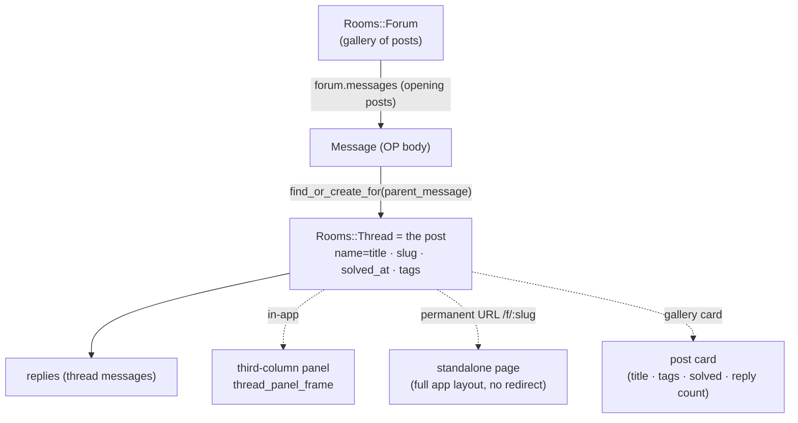

# feat: Add Forum room type for help-desk/Q&A

## Summary

Add a `Rooms::Forum` STI room type whose main view is a gallery of posts instead of a chat stream. Each post is an opening `Message` in the forum plus a `Rooms::Thread` spawned on it for replies — reusing the existing thread machinery and its `parent_message` invariant. Posts carry a title, per-forum admin-curated tags, and a first-class Solved state; the gallery filters by tag and Solved. A post opens in the existing third-column thread panel in-app and also renders at a permanent canonical URL as a standalone page.

---

## Problem Frame

Sabha communities run support and Q&A in chat today, where a good answer scrolls away within the hour and the next person re-asks it. Forums are the durable, findable alternative — and the main forum feature Discord communities rely on, so their absence is a reason those communities decline to migrate (see origin: `docs/brainstorms/2026-07-02-forum-rooms-requirements.md`).

The implementation risk is not the happy path — the thread stack already models "a titled sub-conversation with its own message stream." It is that the thread stack is anchored on `parent_message`, and several correctness behaviors (reactivation, delete cascade, membership fan-out, live-update DOM targets) were written for ephemeral chat threads and change meaning when posts become first-class, individually-managed, and long-lived. This plan reuses the machinery and fixes the seams that reuse exposes.

---

## High-Level Technical Design

A forum post is not a new entity — it is the existing pairing of an opening message and a thread, surfaced three ways.

The forum room's messages are the opening posts; each opening message's `Rooms::Thread` *is* the post, holding title (`rooms.name`), canonical slug (`rooms.slug`), Solved state, and tag associations. The gallery lists `forum.threads` ordered by `last_active_at`. The panel, the standalone page, and the gallery card all render the same post-thread and must share Turbo DOM target ids so a reply or Solved change updates every surface live.

---

## Key Technical Decisions

- Post = opening message + reply-thread. Each post is a `Message` in the forum room with a `Rooms::Thread` spawned on it via the existing `Rooms::Thread.find_or_create_for(parent_message, users:)` path. This preserves `validates_presence_of :parent_message` and reuses membership inheritance, the delete cascade, and `Message::Threadable` live updates unchanged, instead of relaxing the validation and making ~8 `thread? && parent_message` call sites nil-safe. Consequence: the forum's own `last_message`/`messages_count`/unread must be kept clean — the gallery's "last activity" reads each post-thread's `last_active_at`, not the forum stream.

- Post attributes ride existing schema. Title → the unused `rooms.name`; canonical URL → the existing `rooms.slug` column and its unique partial index; Solved → a new `solved_at` timestamp on `rooms` (nullable, reads as boolean). Only tags need net-new tables.

- Tags are hand-rolled, per-forum. A `Tag` belongs to its forum (`room_id`, `name`, `color`) modeled on the `Badge` precedent; a `Tagging` join (`id: false`, `dependent: :delete_all`) modeled on `Mention`. No `acts-as-taggable` gem, per project conventions.

- v1 "room admin" = forum creator + account admins. `User#can_administer?` already resolves to global admin or record creator; Solved additionally allows the post's original poster. No new per-room moderator role — deferred.

- v1 reuses the existing per-post membership mechanism. `memberships.grant_to`/`revoke_from` iterate the forum's threads (O(posts)) on join/leave. Accepted for v1 with a scaling ceiling noted; forum-scale membership (posts read visibility through the forum) is a fast-follow.

- The canonical page is the one deliberate departure from thread behavior. `RoomsController#show` redirects any `thread?` room to its parent message (`app/controllers/rooms_controller.rb:16`); the forum post page renders standalone in `layouts/application` at a slug route and must bypass that redirect. It is member-gated in v1 (public/anonymous indexing deferred).

- All forum Turbo broadcasts are scoped by a tenanted model. Every `broadcast_*`/`turbo_stream_from` for the gallery, Solved state, tags, and reply counts passes the forum or post model (never a bare symbol), or updates leak across workspaces in SaaS.

---

## Requirements

Traced to origin `docs/brainstorms/2026-07-02-forum-rooms-requirements.md`.

**Forum room & gallery**

- R1. A `Rooms::Forum` STI type exists alongside Open/Closed/Direct/Thread, created and discoverable/joinable like other sidebar rooms. (origin R1)
- R2. The forum's main view is a gallery of its posts showing title, tags, author, reply count, and last activity — not a chat stream. (origin R2)
- R3. The gallery supports sort by recent activity and a filter bar. (origin R3)

**Posts**

- R4. A post has a title, author, opening body, and a threaded reply discussion backed by the thread stack. (origin R4)
- R5. Posts are created through a dedicated "New Post" compose capturing title, body, and tags, distinct from replying-in-thread. (origin R5)
- R6. Replying uses the existing thread reply experience (participants, reply counts, live updates). (origin R6)

**Tags & filtering**

- R7. Each forum owns its tag set, curated by an admin; tags are not shared across forums. (origin R7)
- R8. A post carries zero or more of its forum's tags, set at creation and editable afterward. (origin R8)
- R9. The filter bar filters by tag and by Solved/unsolved, composed with sort. (origin R9)

**Solved state**

- R10. A post has a first-class Solved/unsolved state surfaced in the gallery and filter bar. (origin R10)
- R11. The original poster or an admin can mark a post Solved or reopen it. (origin R11)

**Rendering**

- R12. Opening a post in-app shows it in the existing third-column thread panel. (origin R12)
- R13. Every post has a permanent, shareable URL that renders the same content as a standalone full page — no redirect. (origin R13)

**Permissions & membership**

- R14. A post inherits membership/visibility from its forum; v1 pages are member-gated, with anonymous/public access deferred. (origin R14)

**Correctness (exposed by making posts first-class — not in origin)**

- R15. Deleting a forum and later restoring it must not resurrect posts that were individually deleted before the forum was deleted.
- R16. The new tag and tagging tables participate in the room delete cascade in FK-safe order.

---

## Implementation Units

Grouped into four phases. U-IDs are stable; dependencies cite U-IDs.

### Phase 1 — Model & data foundation

### U1. `Rooms::Forum` STI model and Room base wiring

- **Goal:** Introduce `Rooms::Forum` and register it across the Room type system and sidebar so a forum behaves like a joinable sidebar room.
- **Requirements:** R1
- **Dependencies:** none
- **Files:** `app/models/rooms/forum.rb` (new), `app/models/room.rb` (add `forum?`, `scope :forums`, extend `sidebar_room?`, `applicable_activity_types`, `ensure_visible_members_remain!`, and the `display_name` post branch), `app/helpers/rooms_helper.rb` (add a forum glyph to `room_type_indicator`, add `when Rooms::Forum` to `edit_room_path`), `app/models/membership.rb` (add `"Rooms::Forum"` to the `:shared` scope allowlist at line 36), `app/controllers/accounts_controller.rb` (add forum type to the room count at line 7), `test/models/rooms/forum_test.rb` (new), `test/fixtures/rooms.yml`.
- **Approach:** Mirror `Rooms::Open`. A forum is a sidebar room, starrable by default, and joinable (so `ensure_visible_members_remain!` returns for forums like open rooms). `applicable_activity_types` for the forum's opening messages returns `[]` (posts do not ping everyone). `SidebarMemberships` needs no change — forums already pass its thread/direct exclusions.
- **Patterns to follow:** `app/models/rooms/open.rb`, `app/models/rooms/closed.rb`, the type scopes and predicates in `app/models/room.rb:51-119`.
- **Test scenarios:**
  - A forum is created via `Rooms::Forum.create_for` and grants creator membership.
  - `forum?` is true; `sidebar_room?` is true; `thread?`/`direct?` false.
  - `room_type_indicator` returns the forum glyph; `edit_room_path(forum)` resolves without raising.
  - A forum appears in `SidebarMemberships#shared` for a member and in the per-room notification settings list (`membership :shared` scope includes it).
  - `applicable_activity_types` for a forum opening message does not include `:everyone_room_message`.

### U2. Post attributes — title, Solved state, canonical slug

- **Goal:** Give a post-thread its title, a Solved state, and a stable slug for the canonical URL.
- **Requirements:** R4, R10, R13
- **Dependencies:** U1
- **Files:** `db/migrate/<ts>_add_solved_at_to_rooms.rb` (new), `app/models/rooms/thread.rb` (title accessor over `name`, `slug` generation, `solved?`/`mark_solved!`/`reopen!` — inlined directly, not extracted to a concern, per the project's anti-over-extraction rule), `db/schema.rb`, committed schema cache dump, `test/models/rooms/thread_test.rb` or `forum_test.rb`.
- **Approach:** `solved_at` is a nullable timestamp on `rooms` — reads as boolean, records when solved. The post title lives in the existing `rooms.name`; slug is generated from the title on creation using the existing `rooms.slug` unique index. `mark_solved!`/`reopen!` are `!`-methods that set/clear `solved_at` (raise on failure, per project convention). Migration is tenanted (`db/migrate/`), additive and reversible; regenerate the schema cache dump.
- **Patterns to follow:** the `active`/`Deactivatable` boolean-state pattern, `rooms.slug` unique partial index in `db/schema.rb:236-254`, `!`-method convention in `CLAUDE.md`.
- **Test scenarios:**
  - `mark_solved!` sets `solved_at`; `solved?` true; `reopen!` clears it.
  - A post gets a unique slug on creation; two posts with the same title get distinct slugs.
  - The post title is present in the search index and a title-only query matches (Covers the "findable answers" success criterion).
  - `solved?` defaults false on a new post.

### U3. Tag and Tagging data model

- **Goal:** Hand-roll per-forum tags and a post↔tag join.
- **Requirements:** R7, R8, R16
- **Dependencies:** U1
- **Files:** `db/migrate/<ts>_create_tags.rb`, `db/migrate/<ts>_create_taggings.rb` (new), `app/models/tag.rb` (new), `app/models/tagging.rb` (new), `app/models/rooms/forum.rb` (`has_many :tags`), the post model (`has_many :tags, through: :taggings`), `app/models/room.rb` (slot tag/tagging cleanup into `destroy_all_associated_records` in FK-safe order), `db/schema.rb` + schema cache dump, `test/models/tag_test.rb`, `test/models/tagging_test.rb`.
- **Approach:** `Tag` belongs to its forum (`room_id`, `name`, `color`) — the `Badge` precedent (curated, named, colored). `Tagging` is a join (`tag_id` + post `room_id`), `id: false`, `dependent: :delete_all` — the `Mention` precedent. Deleting a tag that posts still use strips its taggings (with an admin confirmation surfaced in U5), not a hard block. Tenanted migrations; regenerate schema cache dump.
- **Patterns to follow:** `Badge` (`db/schema.rb:92-99`), `Mention` join convention (`docs/ARCHITECTURE.md`, `id: false` + `dependent: :delete_all`), `Room#destroy_all_associated_records` ordering (`app/models/room.rb:335`).
- **Test scenarios:**
  - A tag belongs to exactly one forum; the same tag name may exist in two forums independently.
  - Applying and removing a tag on a post adds/removes a tagging row.
  - Deleting a tag used by N posts removes the N taggings (Covers the tag-in-use case) and leaves the posts intact.
  - Hard-deleting a forum with tags and tagged posts destroys tags and taggings without FK violation.

### U4. Cascade and reactivation correctness

- **Goal:** Stop forum reactivation from resurrecting individually-deleted posts, and cover the delete cascade for the new associations.
- **Requirements:** R15, R16
- **Dependencies:** U1, U3
- **Files:** `db/migrate/<ts>_add_deactivation_origin_to_rooms.rb` (new marker), `app/models/room.rb` (`reactivate_threads` restores only cascade-deactivated posts; `deactivate_threads`/`destroy_all_associated_records` cover tags), `app/models/rooms/thread.rb` (record deactivation origin on cascade vs self-delete), `test/models/rooms/forum_test.rb`, `test/models/room_test.rb`.
- **Execution note:** Write the cascade/reactivation tests before modifying `app/models/room.rb` — this is legacy behavior with data-integrity stakes.
- **Approach:** Add a marker distinguishing "deactivated because the forum was deactivated" from "deleted on its own." `reactivate_threads` restores only the former. Follow the `docs/plans/FOUNDATION-REFACTOR.md` framing of `destroy_all_associated_records` (FK ordering + missing `dependent:`, not soft-delete bypass).
- **Patterns to follow:** `Room#deactivate`/`reactivate`/`deactivate_threads`/`reactivate_threads` (`app/models/room.rb:139-175, 322-346`), `Rooms::Thread#deactivate`/`reactivate` (`app/models/rooms/thread.rb:81-96`).
- **Test scenarios:**
  - Delete a post, then delete and restore its forum → the post stays deleted (Covers R15).
  - Delete a forum with active posts, then restore → those posts return active.
  - Hard-delete a forum with tags/taggings/posts → no FK violation, all rows removed (Covers R16).
  - A post deactivated with its forum carries the cascade-origin marker; a self-deleted post does not.

### Phase 2 — Creation & routing

### U5. `Rooms::ForumsController`, routes, and forum creation

- **Goal:** CRUD for forums mirroring Open/Closed, with initial tag-set curation.
- **Requirements:** R1, R7
- **Dependencies:** U1, U3
- **Files:** `app/controllers/rooms/forums_controller.rb` (new), `config/routes.rb` (`resources :forums` in the `namespace :rooms` block; nest `resources :tags` or an edit tab for curation), `app/views/rooms/forums/new.html.erb` + `edit.html.erb` (new, wrapped in `rooms/layouts/_new`), a dedicated forum form partial, `app/javascript/controllers/room_form_controller.js` (forum URL value if the unified picker deep-links to it), `test/controllers/rooms/forums_controller_test.rb`.
- **Approach:** Mirror `app/controllers/rooms/opens_controller.rb` — `create` calls `Rooms::Forum.create_for(forum_params, users: [Current.user])`, broadcasts the sidebar add, and redirects to the forum. Use a dedicated forum form (tags are net-new and don't fit the open/closed toggle). Tag curation and Solved-marking are gated by `ensure_can_administer`.
- **Patterns to follow:** `app/controllers/rooms/opens_controller.rb`, `app/controllers/rooms/closeds_controller.rb`, `broadcast_create_room` / `Sidebar` concern, `resources :opens` in `config/routes.rb:147-153`.
- **Test scenarios:**
  - `new` renders the forum form; `create` makes a `Rooms::Forum`, grants creator membership, broadcasts one sidebar add, and redirects to the forum.
  - Creating a forum with an initial tag set persists the tags scoped to that forum.
  - A non-admin non-creator cannot reach `edit`/`update`/tag curation.
  - Covers AE4: a tag created in forum A is not selectable in forum B.

### U6. New Post compose and post creation

- **Goal:** The "New Post" flow creates an opening message in the forum plus its post-thread, with title and tags.
- **Requirements:** R4, R5, R8
- **Dependencies:** U2, U3, U5
- **Files:** `app/controllers/rooms/forums/posts_controller.rb` (new — RESTful `new`/`create`), `config/routes.rb` (nest `resources :posts` under `rooms/forums`), `app/views/rooms/forums/posts/new.html.erb` (compose: title + rich body + tag picker), the post-creation model method, `test/controllers/rooms/forums/posts_controller_test.rb`.
- **Approach:** In a transaction: create the opening `Message` in the forum (ActionText body), `Rooms::Thread.find_or_create_for(message, users:)` to make the post-thread, set the thread `name` = title, generate slug, apply taggings. The rich composer reuses `composer_form_tag`; the title + tag picker are the net-new fields. Distinct from `Rooms::ThreadsController#create` (which is reply-in-thread on an existing message).
- **Patterns to follow:** `Rooms::Thread.find_or_create_for` (`app/models/rooms/thread.rb:38-43`), `composer_form_tag` (`app/helpers/rooms_helper.rb:73`), `Message` creation with `has_rich_text :body`.
- **Test scenarios:**
  - Creating a post makes one opening message in the forum and one `Rooms::Thread` on it; title, slug, and tags persist on the thread.
  - A post created with no tags is valid (R8 "zero or more").
  - The new post appears atop the forum gallery and broadcasts a tenant-scoped gallery update to other members.
  - Bots posting via the existing webhook path either create a valid post or are cleanly rejected (define which; low stakes).

### Phase 3 — Reading surfaces

### U7. Forum gallery view and post card

- **Goal:** Render the forum as a gallery of post cards, each opening the post in the third-column panel.
- **Requirements:** R2, R6, R12
- **Dependencies:** U2, U5
- **Files:** `app/controllers/rooms/forums_controller.rb` (`show` renders the gallery), `app/views/rooms/forums/show.html.erb` (new), `app/views/rooms/forums/_post_card.html.erb` (new), gallery CSS in the Tailwind entrypoint, `test/system/forum_posts_test.rb` (new).
- **Approach:** `show` lists `forum.threads` ordered by `last_active_at`. The post card mirrors `app/views/messages/_threads.html.erb` (participant avatars + reply count + last-reply time) and adds title, tag chips, and a Solved badge. Each card links to the post-thread with `data: { turbo_frame: "thread_panel_frame" }`, reusing the existing docked panel. A "New Post" button links to U6's compose.
- **Patterns to follow:** `app/views/messages/_threads.html.erb`, the panel wiring in `app/views/layouts/application.html.erb:91-96` and `thread_panel_controller.js`, `Rooms::Thread.preload_participant_creators` (`app/models/rooms/thread.rb:8`).
- **Test scenarios:**
  - The gallery renders one card per post with title, tags, reply count, and Solved badge.
  - Clicking a card opens the post in the thread panel (Covers R12, AE3 in-app arm).
  - An empty forum shows an empty-state CTA rather than a blank gallery.
  - Cards order by most recent activity.

### U8. Filter bar (tag + Solved) and sort

- **Goal:** Filter the gallery by tag(s) and Solved/unsolved, composed with sort, without mis-inserting live posts under an active filter.
- **Requirements:** R3, R9
- **Dependencies:** U3, U7
- **Files:** `app/controllers/rooms/forums_controller.rb` (`show` reads filter params into a scoped query), `app/views/rooms/forums/_filter_bar.html.erb` (new), a filter/query scope on the post model (by tag, by solved), `app/javascript/controllers/forum_filter_controller.js` (new), `test/controllers/rooms/forums_controller_test.rb`, `test/system/forum_posts_test.rb`.
- **Approach:** Filters are query params; tag and Solved compose in one scoped query, then sort by activity. Under an active filter, live inserts do not append blindly — show a "N new posts" pill that refreshes on click (filter-aware). The unfiltered default view live-appends normally.
- **Patterns to follow:** existing query-object style in `app/models/sidebar_memberships.rb`, Stimulus controllers under `app/javascript/controllers/`.
- **Test scenarios:**
  - Selecting tag "Question" and Solved "Unsolved" returns only unsolved posts tagged Question (Covers AE2).
  - Composing two tags returns posts having either/both per the chosen semantics (define; test it).
  - An empty filter result renders an empty state, not an error.
  - Covers R9: a new post arriving while a non-matching filter is active does not silently insert into the list.

### U9. Canonical standalone post page

- **Goal:** Serve each post at a permanent slug URL as a standalone full page, no redirect, member-gated with a real gated affordance for non-members.
- **Requirements:** R13, R14
- **Dependencies:** U2, U7
- **Files:** `config/routes.rb` (`get "/f/:slug", to: "forum_posts#show", as: :forum_post`), `app/controllers/forum_posts_controller.rb` (new), `app/views/forum_posts/show.html.erb` (new — post header + message list in `layouts/application`), `app/views/rooms/forums/_post_header.html.erb` (new, shared with the panel — title + tags + Solved toggle), `app/controllers/rooms_controller.rb` (ensure the `thread?` redirect at line 16 does not catch forum-post pages), `test/controllers/forum_posts_controller_test.rb`, `test/system/forum_posts_test.rb`.
- **Approach:** `show` resolves the post by slug, reuses `find_messages` + `messages/message_list` inside the full app layout (not `layout: false`). The post header partial is shared by the panel and the page so title/tags/Solved render identically. A logged-in non-member sees a gated page with a "join this forum to view" CTA (not a silent bounce); a logged-out visitor is sent through auth and returned to the deep link. Public/anonymous access stays deferred.
- **Patterns to follow:** `find_messages` (`app/controllers/rooms_controller.rb:60-90`), `messages/message_list`, the redirect to avoid at `app/controllers/rooms_controller.rb:16-20`, the `set_room` member-gating at `rooms_controller.rb:42`.
- **Test scenarios:**
  - Opening `/f/:slug` directly renders the full standalone page with the same content as the panel, no redirect (Covers R13, AE3 direct arm).
  - A member sees the post; a logged-in non-member sees the gated join CTA, not a root bounce.
  - A logged-out visitor is returned to the post URL after auth.
  - A slug for a deleted/deactivated post renders a tombstone or 404 (define), not a stack trace.

### Phase 4 — Live state

### U10. Solved toggle and tenant-scoped live broadcasts

- **Goal:** Marking/reopening Solved updates the gallery card, panel, and standalone page live, with all broadcasts tenant-scoped.
- **Requirements:** R6, R10, R11, R12, R13
- **Dependencies:** U2, U7, U9
- **Files:** `app/controllers/rooms/forums/solutions_controller.rb` (new RESTful create/destroy for the Solved state) or a `solved` sub-resource, `config/routes.rb`, `app/models/rooms/thread.rb` (Solved broadcast), `app/models/message/threadable.rb` (ensure reply-count/summary broadcasts target ids present on gallery, panel, and page), the shared `_post_header`/`_post_card` partials (shared DOM ids), `test/controllers/...`, `test/system/forum_posts_test.rb`.
- **Approach:** Mark/reopen Solved is a RESTful sub-resource, authorized to the post's OP or an admin. It broadcasts a replace of the post card and header to the gallery, panel, and page — all scoped by the tenanted forum/post model, never a bare symbol. Solved is silent (no notification) and allowed with zero replies. Reply-count and participant broadcasts from `Message::Threadable` must target DOM ids that exist on all three surfaces.
- **Patterns to follow:** `Message::Threadable` broadcasts (`app/models/message/threadable.rb`), tenant-scoped broadcast rule (`docs/multi-tenant/activerecord-tenanted-guide.md`), `Membership::Starrable#broadcast_star_change` for a small toggle-broadcast precedent.
- **Test scenarios:**
  - OP marks a post Solved → the Solved badge updates on the gallery card, panel, and page (Covers R10, R11).
  - The OP or an admin can reopen a Solved post; a non-OP non-admin cannot (Covers R11 reopen arm).
  - A non-OP non-admin cannot mark Solved (Covers AE1 restriction arm).
  - A post can be marked Solved with zero replies.
  - A reply on the standalone page updates the reply count live (shared DOM ids; the page-surface arm of R6/R13).
  - Broadcasts carry a tenant-scoped stream name (SaaS isolation regression guard).

---

## Scope Boundaries

**Deferred for later** (from origin)

- Public / anonymous SEO indexing (sitemaps, meta tags, no-login read) and the per-forum public/private setting it requires. v1 pages are member-gated.
- Discord import / migration tooling. v1 stays model-compatible so posts and tags can map in later.
- Post upvotes, pinning, and locking.

**Outside v1** (from origin)

- Global / cross-forum tags or free-form user-authored tags.
- Threading off arbitrary forum messages — forum content is posts.

### Deferred to Follow-Up Work

- Forum-scale membership: replacing the O(posts) per-post grant/revoke loop with visibility read *through* the forum. Accepted ceiling for v1 (see Risks); revisit when a forum grows large.
- A dedicated per-room moderator role. v1 uses forum creator + account admins.

---

## Risks & Dependencies

- Membership fan-out is O(posts). `memberships.grant_to`/`revoke_from` iterate `room.threads.find_each` (`app/models/room.rb:12,25`). A large forum makes join/leave slow. v1 accepts this; the follow-up above removes it. Mitigation for v1: none required functionally, but avoid auto-join defaults that would mass-grant across many posts.
- Count pollution from opening messages. Opening posts are messages *in the forum*, so `last_message`/`messages_count`/unread on the forum must not treat them as chat activity (KTD: gallery reads per-post `last_active_at`). Verify sidebar ordering and unread badges ignore forum opening messages.
- Three-surface live-update contract. Gallery, panel, and standalone page must share Turbo DOM target ids or the page won't update live. Tackled in U10; a miss here silently breaks live reply counts / Solved on the page.
- SaaS tenant isolation. New tables are tenanted (`db/migrate/`, additive + reversible); regenerate and commit the schema cache dump or production cold starts break. All broadcasts must be tenant-scoped. Verify both suites: `bin/rails test` and `SAAS=true bin/rails test saas/test/`.
- Title search indexing. `Message::Searchable` indexes message bodies, not the `rooms.name` title (U2 adds title indexing); without it the "findable answers" value prop is undercut.

---

## Acceptance Examples

Carried from origin; mapped to units.

- AE1. Solved is OP/admin-only. Given an unsolved post, when the OP marks it Solved, it shows Solved in the gallery and under the Solved filter; a non-OP non-admin sees the state but cannot change it. (U10, U8)
- AE2. Filters compose. Given mixed posts, selecting tag "Question" + "Unsolved" returns only unsolved Question posts. (U8)
- AE3. Panel in-app, page on direct open. Opening from the gallery uses the panel; opening the URL directly renders the standalone page with the same content, no redirect. (U7, U9)
- AE4. Tags are forum-scoped. Forum A's tags are not selectable when posting in forum B. (U5, U6)

---

## Open Questions

**Deferred to implementation**

- Composed-tag semantics: does selecting two tags mean AND or OR? Pick during U8 and encode in the test.
- Tombstone vs 404 for a slug pointing at a deleted/deactivated post (U9).
- Exact slug scheme (title-derived vs id-suffixed) — settle when generating slugs in U2; the `rooms.slug` unique index is the only hard constraint.
- Whether the "New Post" composer is a variant of `composer_form_tag` or a bespoke form (U6) — decide against the real composer once touched.
- Bot/webhook post creation surface (U6) — confirm behavior; low stakes.

---

## Sources / Research

- Origin requirements: `docs/brainstorms/2026-07-02-forum-rooms-requirements.md`.
- Room STI + reuse map: `app/models/room.rb` (predicates/scopes `:51-119`, `create_for` `:63`, `sidebar_room?` `:121`, cascade `:335`, membership fan-out `:12,25`), `app/models/rooms/thread.rb` (`find_or_create_for` `:38`, `validates_presence_of :parent_message` `:5`, deactivate/reactivate `:81-96`), `app/models/rooms/open.rb`.
- Panel + canonical page: `app/controllers/rooms_controller.rb` (thread redirect `:16`, `find_messages` `:60-90`, member-gating `:42`), `app/views/rooms/threads/show.html.erb`, `app/views/layouts/application.html.erb:91-96`, `app/javascript/controllers/thread_panel_controller.js`, `app/models/message/threadable.rb`, `app/views/messages/_threads.html.erb`.
- Sidebar + helpers: `app/models/sidebar_memberships.rb` (no change needed), `app/helpers/rooms_helper.rb` (`room_type_indicator` `:78`, `edit_room_path` `:90`), `app/models/membership.rb:36`, `app/controllers/accounts_controller.rb:7`.
- Schema homes: `db/schema.rb` (`rooms` `:236-254` — `name`, `slug` + unique index; `messages` `:164-180`; `action_text_rich_texts` `:43-51`; `badges` `:92-99`), `app/models/message/searchable.rb`.
- Tag prior art: `Badge` (curated named+colored entity), `Mention` (`id: false` + `dependent: :delete_all` join), `Boost`/`Membership` (unique-index joins).
- SaaS/tenanting: `docs/multi-tenant/ARCHITECTURE.md` (tenanted migrations), `docs/multi-tenant/activerecord-tenanted-guide.md` (tenant-scoped broadcasts, schema cache dump), `docs/plans/FOUNDATION-REFACTOR.md` (`destroy_all_associated_records` framing).
- Creation pattern: `app/controllers/rooms/opens_controller.rb`, `app/views/rooms/_unified_form.html.erb`, `app/javascript/controllers/room_form_controller.js`, `config/routes.rb` (`namespace :rooms` `:147-153`).
- External research: none — local patterns are strong and recently touched; tags are conventional hand-rolled Rails. Recorded per Phase 1.2.
