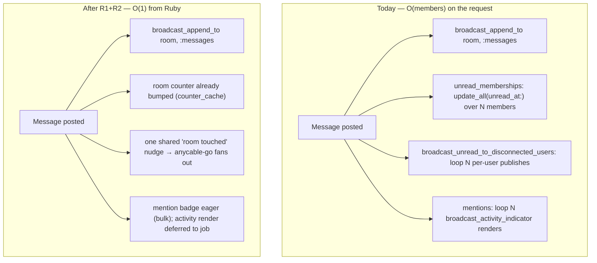
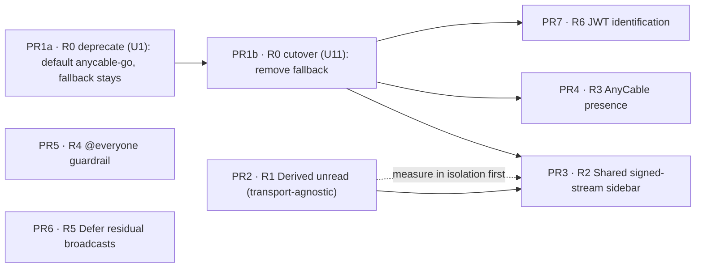
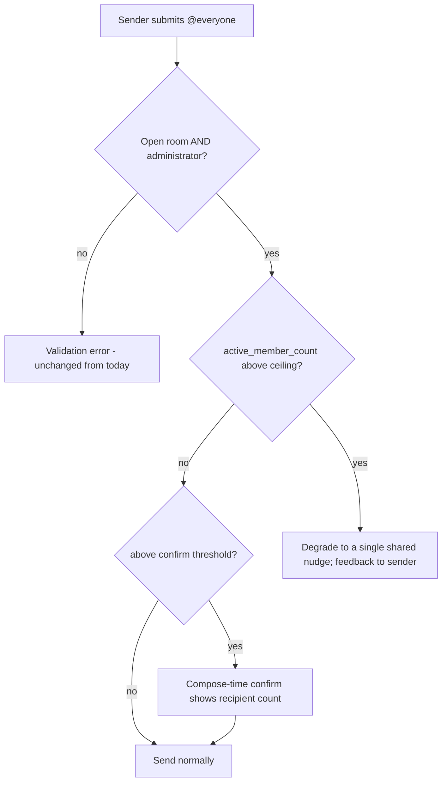

# perf: Real-time delivery at scale

## Summary

Decouple a message's send-path cost from room membership size so a large (Discord/Slack-scale) community can run on self-hosted Sabha without the fan-out overwhelming its single SQLite writer. The work ships as seven independent PRs mapped to the study's R0–R6: make AnyCable required, derive unread instead of pushing it per-member, move the sidebar signal onto a shared stream, adopt AnyCable presence, add an `@everyone` guardrail, defer residual per-recipient broadcasts, and add JWT identification for connection storms. Existing behavior is preserved throughout.

---

## Problem Frame

Posting a message to an N-member room currently does per-member work twice, synchronously on the poster's request thread. `Room#unread_memberships` (`app/models/room.rb:383-391`) runs a bulk `update_all(unread_at:)` across every disconnected read member and then `broadcast_unread_to_disconnected_users` (`app/models/room.rb:393-406`) loops every such member pushing a `UserUnreadRoomsChannel` payload — on every message, mention or not. Mentions add more per-recipient loops (`Message::Mentionee#create_mention_notifications`, `app/models/message/mentionee.rb:63-85`), and `@everyone` widens the recipient set to the whole room. `Rooms::Forum#mark_members_unread` (`app/models/rooms/forum.rb:127-146`) repeats the same shape per forum post.

The message body itself is already right: `broadcast_append_to room, :messages` is one O(1) publish that anycable-go fans out. The divergence is the sidebar/unread signalling on bespoke per-user channels, which are per-user *by construction* and force the Ruby-side loop. On self-hosted Sabha each per-member write also competes for the one SQLite write lock — so the loop is writer contention, not just request CPU. Load testing (`docs/performance/load-testing.md`) confirms message throughput is dominated by room membership size, and that connection *establishment* — not steady-state holding — is the sharp ceiling. This is pre-emptive headroom: nothing is on fire, but the per-member send path is what would make a large community migrating off Discord/Slack fall over.

The mechanism, prior art, and recommendations are worked out in the origin requirements doc and the study it draws on (see Sources).

---

## Key Technical Decisions

- KTD1. **Derive unread from a delete-aware last-read cursor, mirroring Mattermost.** Keep a per-member last-read marker advanced at view time; derive the unread count and the dot from "messages after the marker," with the member row advanced only on view. This is Mattermost's `TotalMsgCount − ChannelMembers.MsgCount` derivation (`server/channels/store/sqlstore/channel_store.go:898-926`, `GetChannelUnread`) with the advance on view (`UpdateLastViewedAt`, `:2747-2803`). Two correctness constraints the naive form misses: (1) **`rooms.messages_count` (Rails `counter_cache`) is not delete-aware** — the app soft-deletes messages via `deactivate`, which does not decrement `counter_cache`, so `messages_count − snapshot` would count deleted messages as phantom unread; derive against a delete-aware active-message count or a `(created_at, id)` last-read cursor instead. (2) A **NULL/absent marker must read as "read," not "everything unread"** (`COALESCE`), so members not yet backfilled don't see every room light up (see U2). Mattermost's `TotalMsgCount` is a purpose-maintained counter, not Rails' delete-blind `counter_cache` — do not reuse `counter_cache` as the total.
- KTD1a. **The mention badge (`unread_notifications_count`) is coupled to the `unread_at` write U2 removes — re-derive it.** Today `Message::Unreadable#increment_unread_notifications_counters` bumps the badge only `WHERE unread_at IS NOT NULL AND unread_at <= created_at`, and that guard depends on `deliver_to_room` having just set `unread_at` (the ordering comment in `message/unreadable.rb`). Removing the broad per-member `unread_at` write makes that match zero rows, so a disconnected mentionee/DM recipient would get no badge bump (AE2 fails). The recompute paths (`count_unread_notifications_from`, `read_until`, `mark_unread_at`) also anchor on the `unread_at` timestamp, which a last-read cursor cannot feed without a translation. **Resolved (2026-07-09): `unread_at` is replaced by the cursor; the badge counter is retained but re-anchored on it.** The `increment_unread_notifications_counters` guard and the `.unread` badge-eligibility filter both re-express as a cursor comparison (`cursor < message (created_at, id)`) instead of an `unread_at` predicate, so a disconnected mentionee/DM recipient is bumped without the removed broad write, and the recompute paths re-anchor on the cursor. The counter is kept rather than fully derived precisely so `Push::Subscription`'s device-badge aggregate stays a cheap `unread_notifications_count > 0` pre-filter (`app/models/push/subscription.rb`) — it must stay honest.

- KTD2. **Preserve sidebar liveness by pairing write-removal with a single shared nudge.** Removing the per-member push (R1) without a replacement would regress live sidebar updates for members connected-elsewhere. R1 therefore replaces the per-member loop with *one* shared, account-scoped "room touched" nudge on the existing `RoomListChannel` shared-stream shape (`stream_for Current.account`), which works on both plain ActionCable and AnyCable. R2 then moves that nudge onto an AnyCable signed stream and retires the per-user channels. No liveness gap between the two PRs.

- KTD3. **Keep the existing admin-only, open-rooms-only `@everyone` floor; layer the ceiling and confirm on top.** Today `@everyone` is already gated — `Message#ensure_everyone_mention_allowed` (`app/models/message.rb:396-407`) requires a `Rooms::Open` and an administrator, raising a validation error otherwise. The guardrail extends this gate with a member-count ceiling (`Room#active_member_count`, `app/models/room.rb:187-195`): above it, `@everyone` degrades instead of doing per-member notification work. **`@everyone` is not push-only** — `Message::Mentionee#create_mention_notifications` does a `Notification.insert_all` for `room.user_ids`, then loops `broadcast_activity_indicator` per recipient, `increment_unread_notifications_counters` bumps the badge for the same set, and the email path enqueues per-member bundle items (`docs/features/NOTIFICATIONS.md`: "`@everyone` creates rows for all room members"). Push is one of at least four O(members) passes. **Resolved (2026-07-09): the Zulip model — durable in-app rows kept, expensive external fan-out bounded.** Above the ceiling `@everyone` keeps the two cheap, durable in-app surfaces — the bulk `Notification.insert_all` (deferred to the job) and the single `increment_unread_notifications_counters` bump — so the Activity tab, its dot, and the mention badge are all preserved (R3/R11). It bounds the genuinely expensive O(members) passes: the per-recipient *live* broadcast loops (activity-indicator render, Activity append, live badge publish), the **push** fan-out, and the **email** bundle fan-out — degrading them to a single room-wide signal with sender feedback. This mirrors Zulip (rows written; the wildcard wakeup/push suppressed), not Mattermost (notification suppressed entirely), and it answers the study's stated cap rationale — an uncapped wildcard is a push to every device that hits APNs/FCM limits and reads as spam (the mobile lens). The row insert and badge bump ride the deferred job, so no O(members) work lands synchronously on the poster's request.

- KTD4. **AnyCable presence is live-only; keep a persisted last-seen.** Presence replaces the real-time role of `Membership::Connectable#connected_at`, but push gating reads `connected?` (60s TTL) and email gating reads `workspace_locally_away?` (1h tier). Retain a persisted last-seen column for those and for activity tiers; presence replaces only the live driver, not the whole `Membership::Connectable` model.

- KTD5. **Tenant-scope every shared/signed stream by a tenanted model.** Under `activerecord-tenanted`, a bare-symbol stream name (`:sidebar`) collides across workspaces. The shared nudge must be scoped by a tenanted model (`broadcast_* Current.account, :sidebar`), mirroring `RoomListChannel` and `BotEventsChannel.stream_name_for`. This is the easiest way to ship a change that passes self-hosted tests but silently cross-talks in SaaS.

- KTD6. **JWT identification skips `Connection#connect` — which does authorization and user materialization, not just tracking.** When anycable-go decodes identity in Go, `Connection#connect` never runs, so U10 must preserve three things it currently performs, none of which is "connection tracking": (a) **SaaS tenant-membership authorization** — `connect_saas` verifies a live `WorkspaceMembership` for the tenant (`app/channels/application_cable/connection.rb`); the gem's own identification only checks the tenant DB exists, not that the identity is a member, so cross-tenant access is the sharpest risk; (b) **lazy tenant-user materialization** — `membership.user || membership.create_user!`, without which a first-connecting member has no `Current.user` and every channel subscribe fails; (c) **ban/deactivation rejection** — `reject_unauthorized_connection if user.banned? || user.deactivated?`, which under a cached JWT stops firing until the token expires. Preserve each: bind the tenant as a validated signed claim minted only after `WorkspaceMembership` was checked, materialize the tenant user, and bound the ban/deactivation window with a short `jwt_ttl` or a forced-disconnect on ban. Presence/last-seen already lives on channel subscribe (`PresenceChannel#present`), so it needs no relocation. Emit both cable meta-tag variants — plain `action_cable_meta_tag` and the tenanted `?wid=` form (`saas/app/helpers/tenanting_helper.rb`). Budget `RAILS_MAX_THREADS`: under AnyCable the connection-establishment path (Rails RPC + SQLite contention) becomes the ceiling this PR targets.

- KTD7. **Backfills and deferrals use plain batched idempotent jobs, never `ActiveJob::Continuable`.** Under `activerecord-tenanted`, Continuable's checkpoint/resume can restore the wrong tenant — unsafe. Per-batch commits also release the SQLite writer between batches, which is the point. This mirrors the recent thread-fanout work (`docs/plans/2026-07-04-001-thread-fanout-and-forum-deactivation-plan.md`, decision F1).

- KTD8. **Characterization-first on the fan-out tests.** `test/controllers/messages_controller_test.rb` pins today's behavior (`assert_broadcasts UserUnreadRoomsChannel..., 1`; `assert_no_broadcasts "unread_rooms"`; payload capture). These encode the current per-user contract and must be rewritten as protective coverage before the refactor, not deleted after.

---

## High-Level Technical Design

**Send-path cost, before and after R1+R2.** Today the send path forks into per-member writes and per-member publishes; after, it touches one counter and one shared publish.

**PR sequencing and dependencies.** Seven PRs, one per study recommendation. R1 is transport-agnostic and needs nothing. The AnyCable-native PRs (R2/R3/R6) depend on R0's **cutover** (the fallback removal, U11), not merely its deprecation step (U1) — shipping them while the in-process fallback still exists would leave a holdout on `ANYCABLE_ENABLED=false` booting fine but with a broken sidebar, presence, and reconnect.

**`@everyone` guardrail decision flow (R4).** The existing admin/open gate stays as the floor; the ceiling and confirm are new.

---

## Requirements

Carried from the origin (brainstorm R1–R11). Grouped by concern; each maps to a study recommendation and therefore a PR (mapping table in Sources). The `@everyone` requirements are corrected from the origin: the origin assumed any member could `@everyone` today, but the code already restricts it to administrators in open rooms — that floor is kept (see KTD3).

**Precondition**
- R1. AnyCable is required in both self-hosted and SaaS modes; the disable path is removed behind a one-release deprecation of `ANYCABLE_ENABLED=false`.

**Unread**
- R2. Room-unread is derived from a room counter and a per-member last-read snapshot; a message advances no per-member unread row and issues no per-member sidebar push.
- R3. Every unread surface visible today is preserved: room unread dot and count, mark-as-unread, the Activity tab, and mention badges. Mentions, DMs, and thread/followed replies stay eager `Notification` records.

**Transport**
- R4. The residual sidebar/unread signal rides one shared signed stream that anycable-go fans out, tenant-scoped by a tenanted model, replacing the per-user unread channels; the payload stays consumer-agnostic for a future JSON/native subscriber.
- R5. "Who's connected" comes from AnyCable presence rather than per-message DB `connected_at` reads; a persisted last-seen is kept for push/email gating and activity tiers.

**`@everyone` guardrail**
- R6. `@everyone` keeps its existing floor (administrator, open room only) and gains a hard member-count ceiling above which it degrades to a single shared nudge instead of per-member notification work.
- R7. A permitted sender sees a compose-time confirm showing the real recipient count, tiered by room size (no friction small; inline confirm bar medium; never a modal).
- R8. Every `@everyone` path gives the sender explicit feedback — never a silent drop.

**Resilience**
- R9. Residual per-recipient broadcasts still running synchronously in `MessagesController#create` move off the request path into a job.
- R10. Connection storms are absorbed via JWT identification so anycable-go skips the `Connection#connect` RPC on reconnect.

**Compatibility (cross-cutting)**
- R11. No user-visible regression to unread, notification, or presence behavior; existing self-hosted installs upgrade without manual reconfiguration beyond the announced AnyCable requirement. Validated in both `bin/rails test` and `SAAS=true bin/rails test saas/test/`.

---

## Implementation Units

Grouped into seven PRs. Each PR is independently landable; U-IDs are stable across reordering.

### PR 1 · R0 — Make AnyCable required

#### U1. Deprecation release: default to anycable-go, keep the fallback functional

- Goal: Make anycable-go the default and warn on `ANYCABLE_ENABLED=false`, while the in-process fallback stays fully functional for one release, so a self-hoster who hasn't cut over is warned — not broken.
- Requirements: R1, R11
- Dependencies: none
- Files: `bin/dev`, `Procfile.dev`, `Procfile.dev.anycable`, `config/environments/development.rb` (the `ANYCABLE_ENABLED` branch), an initializer or boot check to emit the deprecation warning, `test/controllers/anycable_rpc_test.rb`, typing-channel test.
- Approach: Make anycable-go the default `bin/dev` path (fold `Procfile.dev.anycable` into `Procfile.dev`). Emit a deprecation warning when `ANYCABLE_ENABLED=false` is resolved. **Do not** flip `config/cable.yml` to `adapter: any_cable` or drop the `ANYCABLE_ENABLED` branching yet — that branching is what keeps the redis ActionCable fallback working, and removing it here is the cutover, which would break holdouts in the deprecation release (the silent break R1/R11/AE6 forbid). The fallback must keep delivering real-time, not merely boot.
- Patterns to follow: existing `Procfile.dev*` and accessory wiring in `config/deploy*.yml`.
- Execution note: keep `broadcast_batching: true` on — disabling it floods anycable-go per the load-testing notes.
- Test scenarios:
  - Covers R1. anycable-go RPC stays mounted: POST `/_anycable/connect` returns 401 (`test/controllers/anycable_rpc_test.rb` stays green).
  - Covers AE6. With `ANYCABLE_ENABLED=false`, the deprecation warning is logged AND real-time still works on the fallback — assert a broadcast is delivered on the redis adapter, not merely that the app boots.
  - anycable-go is the default when no flag is set.
  - Both suites green (`bin/rails test`, `SAAS=true bin/rails test saas/test/`).
- Verification: dev defaults to anycable-go; a fallback install logs the warning and still delivers messages.

#### U11. Cutover release: remove the in-process fallback

- Goal: After one deprecation release, make AnyCable required by removing the fallback path entirely. This is the boundary the AnyCable-only transport PRs (R2/R3/R6) gate on.
- Requirements: R1, R11
- Dependencies: U1 (ships in a later release than U1)
- Files: `config/cable.yml`, `config/anycable.yml`, `config/environments/development.rb`, `app/helpers/application_helper.rb` (`anycable_whisper_enabled?`), `app/channels/typing_notifications_channel.rb` (the `AnyCable::Rails.enabled?` stream-option branch), `app/views/layouts/application.html.erb` (the `anycable-whisper` meta), `config/deploy.yml`, `config/deploy.multitenant.yml`, `.env.sample`, `.env.multitenant.sample`, `.github/workflows/deploy_with_kamal.yml`, `test/controllers/anycable_rpc_test.rb`.
- Approach: Set `adapter: any_cable` across all app envs in `config/cable.yml` (keep `adapter: test` for the test env), drop the `ANYCABLE_ENABLED` branching in `config/anycable.yml` and `config/environments/development.rb`, remove the two `AnyCable::Rails.enabled?` app branches (whisper becomes unconditional) and the JS meta gate, and remove the disable path from the deploy configs and env samples. Grep for every remaining `ANYCABLE_ENABLED` reference (deploy workflow, env samples) so none is orphaned.
- Patterns to follow: the HTTP-RPC-mode setup already in `config/anycable.yml`.
- Test scenarios:
  - `whisper` typing works without any `ANYCABLE_ENABLED` gate (typing-channel test asserts the whisper stream option is always set).
  - No remaining `AnyCable::Rails.enabled?` conditional in `app/`; no remaining `ANYCABLE_ENABLED` reference in configs, env samples, or the deploy workflow (grep assertion).
  - Both suites green.
- Verification: the fallback is gone; deploy configs no longer offer a disable path; the transport PRs can assume AnyCable.

### PR 2 · R1 — Derived unread

#### U2. Per-member last-read snapshot, read-time derivation, view-time advance

- Goal: Stop writing per-member unread on send; derive it from the room counter and a per-member snapshot advanced on view.
- Requirements: R2, R3
- Dependencies: none (transport-agnostic)
- Files: `db/migrate/` (add the last-read snapshot column to `memberships`; `db/schema.rb`), `app/models/membership.rb`, `app/models/membership/unreadable.rb` or `app/models/message/unreadable.rb`, `app/models/room.rb` (`receive`, `unread_memberships`), `app/models/membership/connectable.rb` (the `connect`/`present` path that clears unread today), `app/jobs/` (batched backfill job), `test/models/membership_test.rb`, `test/models/room_test.rb`, `test/models/message_test.rb`.
- Approach: Add a per-member last-read marker advanced when the member views/presents in the room. Derive unread against a **delete-aware** basis (an active-message count or a `(created_at, id)` cursor), not raw `messages_count`, since soft-delete doesn't decrement `counter_cache` (KTD1). Derive with `COALESCE(marker, read)` semantics so a member without a marker yet reads as read, not all-unread (KTD1 interim rule). Remove the broad `update_all(unread_at:)` from `Room#unread_memberships` so send touches no per-member unread row — but re-derive the mention badge (`unread_notifications_count`), which today's `increment_unread_notifications_counters` bumps only for rows the removed write just set (KTD1a). **Decided: replace `unread_at` with the cursor and re-anchor the badge counter's bump and `.unread` eligibility on the cursor comparison** (keep the counter, don't fully derive it). Reconcile `mark_unread_at` / `read_until` / `count_unread_notifications_from` (`app/models/membership.rb`), which anchor on the `unread_at` timestamp, onto the cursor. Backfill via a batched idempotent job (KTD7); the job must read and write separate columns so a retried batch stays idempotent (do not read `unread_at` to compute the marker in the same job that clears `unread_at`).
- Technical design (directional, not spec): derivation mirrors Mattermost `GetChannelUnread` (`TotalMsgCount − MsgCount`); view-advance mirrors `UpdateLastViewedAt`. **Decided (2026-07-09): a `(created_at, id)` cursor column replacing `unread_at`**, with the unread count derived on read from `index_messages_on_active_room_created` (delete-honest) rather than a stored snapshot. Must still satisfy the delete-aware and COALESCE-read constraints above, plus the KTD1a badge re-anchoring.
- Patterns to follow: the derived-access pattern already live in `Rooms::Thread`/`Rooms::Forum` (access delegated to `parent_room#viewable_by?` instead of fanned-out rows); counter_cache on `messages_count`.
- Execution note: characterization-first — pin current unread/mark-unread behavior in `membership_test`/`messages_controller_test` before changing the write path (KTD8).
- Test scenarios:
  - Covers AE1. A member disconnected while 20 messages land has the correct derived unread count on reopen, with no per-message unread write to their row (assert no broad `update_all(unread_at:)` fires on send; assert derived count = 20).
  - Covers AE2. A **disconnected** `@mentioned` (or DM'd) user still gets an eager `Notification` and `unread_notifications_count` bump — the badge re-derivation (KTD1a) must fire without the removed broad write; assert the badge increments for a disconnected mentionee specifically.
  - A member with no marker yet (mid-backfill) renders as read, not every-room-unread (`COALESCE` semantics).
  - A soft-deleted (`deactivate`d) message does not count toward derived unread — no phantom dot after deletion.
  - Viewing/presenting in a room advances only that member's marker (single-row write), zeroing derived unread.
  - Mark-as-unread from a message moves the marker behind that message; the dot reappears; `read_until` still resolves.
  - Send to a large room performs no per-member unread write (integration: assert row-write count independent of membership size).
  - Backfill job is idempotent under retry/resume even mid-run — reading and writing separate columns (a resumed batch must not read an already-cleared source); runs in batches with per-batch commits.
  - Both suites green.
- Verification: a message to an N-member room issues one counter update and zero per-member unread writes; unread counts render correctly for connected, disconnected, and mark-as-unread members.

#### U3. Replace the per-member unread push with one shared nudge

- Goal: Preserve live sidebar updates while removing the per-member broadcast loop.
- Requirements: R2, R4, R11
- Dependencies: U2
- Files: `app/models/room.rb` (`broadcast_unread_to_disconnected_users` → shared nudge), `app/models/membership.rb` (`broadcast_unread`), `app/channels/room_list_channel.rb` (or a sibling shared channel), `app/javascript/controllers/rooms_list_controller.js`, `test/controllers/messages_controller_test.rb`, `test/models/room_test.rb`.
- Approach: Delete the per-member `UserUnreadRoomsChannel` loop; broadcast one shared "room touched" nudge to the account-scoped shared stream (`RoomListChannel` shape, `stream_for Current.account`, tenant-scoped per KTD5). The nudge is **not** content-free — it carries `roomUpdatedAt` (the active `updatedAt`-desc sidebar sort key) so a touched room still re-floats by recency; it drops the per-member `forceUnread`/per-user unread state. Repoint `rooms_list_controller.js` to derive/refetch that room's unread on the nudge rather than consuming a per-user `{roomId, roomSize, forceUnread}` payload. This rides plain ActionCable or AnyCable equally (RoomListChannel already proves the shape), so it ships in R1's PR without depending on R0.
- Patterns to follow: `RoomListChannel#stream_for Current.account` and its `rooms_list_controller.js#roomUpdated` handler; keep `broadcast_append` for the message body untouched.
- Execution note: rewrite the `messages_controller_test` fan-out assertions (the `UserUnreadRoomsChannel`/`unread_rooms` guards) as protective coverage first (KTD8).
- Test scenarios:
  - Send to a room issues one shared-stream nudge, not N per-user publishes (assert one broadcast on the account stream; assert no `UserUnreadRoomsChannel` broadcast).
  - A member connected to a *different* room still sees the touched room's sidebar update live (system test).
  - The nudge is tenant-scoped: in SaaS, a broadcast in workspace A never reaches workspace B (SaaS suite; assert stream name carries the tenanted model).
  - Both suites green.
- Verification: sidebar unread updates live for connected-elsewhere members via a single shared publish; no per-user unread channel broadcast remains on the send path.

#### U4. Forum-post parity

- Goal: Apply the same derived-unread + shared-nudge treatment to the forum path so no O(members) loop survives there.
- Requirements: R2, R4
- Dependencies: U2, U3
- Files: `app/models/rooms/forum.rb` (`mark_members_unread`, `mark_unread_from_post`, `broadcast_dot`), `test/models/rooms/forum_test.rb` (or equivalent).
- Approach: Replace `mark_members_unread`'s per-member `update_all` + per-member `broadcast_dot` loop with the derived snapshot and the shared nudge, matching U2/U3. Forums are auto-join and community-wide, so this is the highest-fan-out path.
- Patterns to follow: U2/U3.
- Test scenarios:
  - A new forum post performs no per-member unread write and issues one shared nudge (assert row-write count independent of community size).
  - Forum unread dot still appears for members who haven't viewed the post.
  - Both suites green.
- Verification: posting to a large forum touches one counter and one shared publish.

### PR 3 · R2 — Shared signed-stream sidebar

#### U5. Move the shared nudge onto an AnyCable signed stream; retire per-user channels

- Goal: Formalize the shared nudge as an AnyCable signed stream and retire the bespoke per-user unread channels where the payload is shareable.
- Requirements: R4
- Dependencies: U11 (cutover — signed streams are AnyCable-only), U3
- Files: `app/channels/user_unread_rooms_channel.rb`, `app/channels/unread_notifications_channel.rb`, `app/channels/user_involvements_channel.rb` (retire/repoint as shareable), `app/javascript/controllers/rooms_list_controller.js`, `app/models/room.rb`/`app/models/membership.rb` (broadcast call sites), channel tests.
- Approach: Broadcast the shared nudge via an AnyCable signed stream (the `$pubsub`/signed-stream path anycable-rails-core auto-enables), keeping the stream name derived from a tenanted model. **Retire only `UserUnreadRoomsChannel`** — its payload is identical across members. `UnreadNotificationsChannel` (the mention badge; recipients = `mentionee_ids`/`@everyone`) and `UserInvolvementsChannel` (per-membership `involvement`) are genuinely per-recipient and **stay targeted** (confirmed 2026-07-09 — not foldable); R5 defers the mention-badge loop but does not fold it onto the shared stream. Keep the nudge payload consumer-agnostic (carrying `roomUpdatedAt`) so a future JSON/native subscriber reads the same stream (native-friendly design constraint).
- Patterns to follow: `AnyCable::Rails.signed_stream_name`; `RoomListChannel`; `BotEventsChannel.stream_name_for` for tenant-scoped stream names.
- Test scenarios:
  - The sidebar subscribes to the signed shared stream; a broadcast reaches all subscribers via one publish.
  - Signed-stream name is rejected when tampered/unsigned (unsigned streams not allowed by default).
  - Tenant isolation holds on the signed stream (SaaS suite).
  - `UserUnreadRoomsChannel` is gone and no call site still broadcasts to it; `UnreadNotificationsChannel` and `UserInvolvementsChannel` remain (per-recipient) but ride the deferred job from R5.
  - Both suites green.
- Verification: the room-touched sidebar nudge rides one signed, tenant-scoped shared stream carrying `roomUpdatedAt`; `UserUnreadRoomsChannel` is retired while the genuinely per-recipient channels stay targeted.

### PR 4 · R3 — AnyCable presence

#### U6. Replace the DB connected_at live driver with AnyCable presence

- Goal: Make "who's connected to this room" a Go-side fact instead of a per-message DB read/loop, keeping a persisted last-seen for gating.
- Requirements: R5
- Dependencies: U11 (cutover — AnyCable presence is AnyCable-only)
- Files: `app/channels/presence_channel.rb`, `app/channels/room_channel.rb`, `app/models/membership/connectable.rb`, `app/javascript/controllers/presence_controller.js`, `test/channels/presence_channel_test.rb`, `test/models/membership_test.rb`.
- Approach: Add `AnyCable::Rails::Channel::Presence` + `join_presence`/`leave_presence` on the room stream; drive the live "present/absent" view from the presence set. Retain a persisted last-seen column written on presence join/leave so push (`connected?`, 60s) and email (`workspace_locally_away?`, 1h) gating and activity tiers keep working (KTD4). Presence is live-only and ephemeral; it replaces the real-time driver, not the persisted model.
- Patterns to follow: the existing `PresenceChannel`/`presence_controller.js` wiring and its `with_tenant_context` command wrapping; whisper's `@anycable/web` client usage in `typing_notifications_controller.js`.
- Test scenarios:
  - Presenting joins the presence set; unsubscribing/disconnecting leaves it (with the configured delay).
  - A persisted last-seen is written on join/leave; `connected?` (60s) and `workspace_locally_away?` (1h) still compute correctly.
  - Presence-derived "who's here" no longer requires a per-message `connected_at` read.
  - Tenant-scoped: presence sets don't leak across workspaces (SaaS suite).
  - Both suites green.
- Verification: room presence is driven by the AnyCable presence set; push/email gating still reads persisted last-seen.

### PR 5 · R4 — @everyone guardrail

#### U7. Server: hard ceiling and degrade-to-nudge above it

- Goal: Bound `@everyone` fan-out above a member ceiling while keeping the existing admin/open floor.
- Requirements: R6, R8
- Dependencies: none
- Files: `app/models/message.rb` (`ensure_everyone_mention_allowed`, the `mentions_everyone` recipient resolution), `app/models/message/mentionee.rb` (`create_mention_notifications`, the `broadcast_activity_indicator` loop), `app/models/message/unreadable.rb` (`increment_unread_notifications_counters`), `app/models/message/broadcasts.rb` (`broadcast_notifications`), `app/models/room.rb` (`active_member_count`), `test/models/message_test.rb`, `test/controllers/messages_controller_test.rb`.
- Approach: Extend the existing gate: keep the `Rooms::Open` + `administrator?` floor unchanged; add a `Room#active_member_count` ceiling. **Decided (2026-07-09): the Zulip model (see KTD3 / Decisions).** Above the ceiling, `@everyone` keeps the two cheap, durable in-app surfaces — the `Notification.insert_all` over `room.user_ids` in `create_mention_notifications` (deferred to the job) and the single `increment_unread_notifications_counters` bump — so the Activity tab, its dot, and the mention badge survive (R3/R11). It bounds the expensive external O(members) passes: the per-recipient `broadcast_activity_indicator` loop, the `broadcast_notifications` live-badge loop, the **push** candidate fan-out (`push_candidate_memberships_for`, which resolves `@everyone` to `room.user_ids`), and the **email** bundle fan-out (`email_candidate_user_ids_for`) — degrading them to a single shared room-wide signal with sender feedback. The per-recipient `broadcast_activity_indicator` loop is shared with U9 (defer residual broadcasts); U9 owns moving it off the request path, U7 owns bounding it above the ceiling — sequence so they don't fight over the same call site. Ceiling default: `active_member_count > 1000`, config-tunable.
- Patterns to follow: `ensure_everyone_mention_allowed` as the compose-time gate; `Room#active_member_count` (5-min cached) as the count source; `Membership#effective_involvement` as the delivery-time eligibility source of truth (reuse, don't re-derive).
- Test scenarios:
  - Covers AE4. `@everyone` above the ceiling degrades to one shared room-wide signal: no per-recipient live broadcast, and no push/email fan-out to the whole room (assert the push and email candidate sets are bounded, not `room.user_ids`); the Activity-tab rows + badge are still written via the deferred job; the sender is told it was delivered room-wide.
  - Above the ceiling, push is not enqueued to the whole membership — assert `push_candidate_memberships_for` (or the enqueued push set) does not scale with `active_member_count`; below the ceiling it fans out as today.
  - Covers AE5. A regular member cannot `@everyone` (unchanged floor); a non-open room rejects `@everyone` (unchanged).
  - Below the ceiling, an admin's `@everyone` in an open room fans out as today.
  - Threshold is read from config (tunable), not hard-coded at a call site.
  - Both suites green.
- Verification: `@everyone` above the ceiling issues no per-recipient push, email, or live broadcast fan-out (the expensive external passes degrade to one room-wide signal), while the deferred Activity-tab rows + badge are preserved; the admin/open floor is intact.

#### U8. Compose-time confirm with recipient count

- Goal: Show a permitted sender the blast size before send, tiered by room size.
- Requirements: R7, R8
- Dependencies: U7
- Files: `app/javascript/controllers/` (composer confirm controller), `app/views/messages/` or the composer partial, `test/system/` (compose confirm system test).
- Approach: In the composer, when `@everyone` is present and the room is above a small confirm threshold, show an inline confirm bar with the real recipient count (`Room#active_member_count`) that the sender acknowledges before send — no friction below the threshold, never a modal (matches Sabha's restraint). Reference calibration: Mattermost confirms above 5 members (client), Zulip's banner above 15. **Decided: confirm above 15, config-tunable.** No new non-REST controller action — the existing create path plus the client confirm suffice.
- Patterns to follow: existing Stimulus composer controllers; inline banner styling already used in the UI.
- Test scenarios:
  - Covers AE3. In a room of ~50 members, a permitted sender typing `@everyone` sees an inline confirm showing the recipient count before send.
  - Below the confirm threshold, no confirm appears.
  - Acknowledging sends; dismissing does not.
  - Test expectation: system-test the confirm interaction; unit-test the threshold boundary.
- Verification: the confirm bar appears above the threshold with an accurate count and blocks send until acknowledged.

### PR 6 · R5 — Defer residual broadcasts

#### U9. Move the synchronous per-recipient broadcasts off the request path

- Goal: Get the remaining synchronous per-recipient work out of `MessagesController#create`.
- Requirements: R9
- Dependencies: none
- Files: `app/models/message/mentionee.rb` (the synchronous `broadcast_activity_indicator` loop, `:83`), `app/models/message/broadcasts.rb` (`broadcast_notifications` residual loop), `app/jobs/` (new/existing broadcast job), `test/models/message_test.rb`, `test/jobs/`.
- Approach: Wrap the still-synchronous per-recipient `broadcast_activity_indicator` render loop (and any residual `UnreadNotificationsChannel` loop not shared by R2) in a `perform_later` job, following the app's existing custom-job-wrapping pattern (`BroadcastMentionNotificationsJob`, `BroadcastMentioneeSidebarUpdatesJob`) rather than Turbo's `_later` helpers, which the app doesn't use. Plain, idempotent job (KTD7).
- Patterns to follow: `BroadcastMentionNotificationsJob`, `BroadcastMentioneeSidebarUpdatesJob`.
- Test scenarios:
  - Posting a mention enqueues the broadcast job rather than rendering per-recipient inline (`assert_enqueued_jobs`).
  - The job renders the activity indicator for each recipient when performed (`perform_enqueued_jobs`).
  - `MessagesController#create` no longer runs the per-recipient render synchronously (integration: request time independent of mentionee count).
  - Both suites green.
- Verification: the mention activity-indicator render is off the request path; create latency no longer scales with mentionee count.

### PR 7 · R6 — JWT identification

#### U10. JWT identification for connection storms

- Goal: Let anycable-go decode identity in Go and skip the Rails `Connection#connect` RPC on reconnect.
- Requirements: R10
- Dependencies: U11 (cutover — JWT identification is AnyCable-only)
- Files: `app/views/layouts/application.html.erb` (`action_cable_with_jwt_meta_tag`), `saas/app/helpers/tenanting_helper.rb` (the tenanted `?wid=` meta variant), `app/channels/application_cable/connection.rb` (per-connect work that must move), `config/anycable.yml` (secret/ttl), a small JSON cable-config/discovery endpoint (`app/controllers/api/` — native-readiness, see below), `test/controllers/anycable_rpc_test.rb`, `test/channels/application_cable/connection_test.rb`.
- Approach: Emit `action_cable_with_jwt_meta_tag` carrying the connection identifiers for both the plain and tenanted (`?wid=`) cable URLs; configure `jwt_ttl`. **Sign the JWT with a distinct client-facing secret, not `ANYCABLE_SECRET`** (two-secret split, per Decisions) — signed-stream signing derives from that same client-facing secret; `ANYCABLE_SECRET` stays the RPC/broadcast master. Pair the short `jwt_ttl` with a REST-API token-refresh path so native clients (which lack the browser session cookie and use JWT as their primary socket-auth) can refresh, and so the ban/revocation window stays bounded. Preserve the three things `Connection#connect` does that JWT-in-Go can't (KTD6): (1) mint the tenant as a validated signed claim only after `WorkspaceMembership` was checked, so the token can't grant cross-tenant access; (2) materialize the tenant user (`membership.create_user!`) so a first-connecting member has a resolvable `Current.user`; (3) enforce ban/deactivation via a short `jwt_ttl` or a forced-disconnect on ban rather than waiting for token expiry. Presence/last-seen already fires on channel subscribe, so it needs no relocation. Keep `restore_from_cache: true`. Budget `RAILS_MAX_THREADS`.
- Patterns to follow: existing meta-tag emission in the layout and `tenanting_helper.rb`; `restore_from_cache` already configured in `config/anycable.yml`; the `Api::Bots::BaseController` token-auth pattern for the JSON endpoint.
- Native-readiness (scope-preserving — this does *not* build the native client API): the web client reads its socket credentials from `action_cable_with_jwt_meta_tag` in HTML, which a headless native/JSON client can't scrape. So expose the *same* JWT + cable config through a small JSON endpoint (a cable-config / `.well-known`-style discovery doc returning the plain and `?wid=` cable URL(s) and a freshly-minted token), mirroring the `api/bots` token-auth pattern; the REST token-refresh path above is that endpoint's refresh sibling. This builds no end-user content API and no JSON events stream — it only keeps U10's identity/transport reachable by a non-browser client, so the separate native track (and a "point the app at your self-hosted URL" flow) inherits a token+transport contract instead of retrofitting one. Everything else U10 does is unchanged.
- Test scenarios:
  - Covers AE6-adjacent. A JWT-identified client connects without invoking `Connection#connect` (no RPC hit).
  - Native-readiness: a headless client fetches the cable URL(s) + a valid token from the JSON config endpoint (no HTML scraping) and the token is accepted by anycable-go identification; the tenanted (`?wid=`) URL is present in SaaS.
  - Both cable meta-tag variants (plain and `?wid=`) carry a valid token.
  - An expired token triggers a `token_expired` disconnect the client can refresh.
  - SaaS cross-tenant: a token minted for workspace A cannot subscribe to workspace B's streams.
  - SaaS revocation: a token minted while a member of workspace A is rejected (or the socket dropped) once that `WorkspaceMembership` is removed, within the `jwt_ttl` window.
  - SaaS first-connect: a member connecting for the first time via JWT still has a materialized tenant `User` and resolvable `Current.user` (channel subscribes succeed).
  - A banned/deactivated user's reconnect is rejected or force-disconnected — not served live until token expiry.
  - Reconnect storm: connection establishment no longer hits the Rails RPC per reconnect (load-test observation, noted in verification).
  - Both suites green.
- Verification: reconnecting clients skip the Rails connect RPC; a reconnect burst no longer saturates the establishment path in the load test; cross-tenant, revocation, first-connect, and ban cases are all covered in the SaaS suite.

---

## Acceptance Examples

Carried from the origin, with the `@everyone` examples corrected to the kept admin/open floor.

- AE1. Covers R2, R3. Given a member disconnected while 20 messages land, when they reopen the room, then unread is derived (`messages_count − snapshot`) and correct, with no per-message unread write to their row.
- AE2. Covers R3. Given a user is `@mentioned`, when the message posts, then they still get an eager `Notification` and `unread_notifications_count` bump.
- AE3. Covers R7. Given a room of ~50 members, when a permitted sender types `@everyone`, then an inline confirm shows the recipient count before send.
- AE4. Covers R6, R8. Given a room above the ceiling, when `@everyone` is sent, then it degrades to a single shared nudge and the sender is told it was room-wide, not per-member.
- AE5. Covers R6, R11. Given the existing floor, when a regular member (or any member in a non-open room) attempts `@everyone`, then it is rejected as today — no loosening.
- AE6. Covers R1, R11. Given a self-hoster on `ANYCABLE_ENABLED=false`, when they upgrade to the deprecation release, then Sabha boots with a warning, not a failure.

---

## Scope Boundaries

**Deferred for later**
- Idle-member skip (Zulip's soft-deactivation, `zerver/lib/soft_deactivation.py`) for the notification/email path — largely subsumed by derived unread; revisit only if that path stays hot after R1–R3.
- Absolute-scale work: clustering / multi-node anycable-go, sharding, or growing one community past a single node and writer.

**Outside this initiative**
- Discord/Slack import tooling — a separate planned PR; "migrate" here means carrying the scale, not importing content.
- Native client surfaces (the JSON events channel for message *content*, the end-user content API, the push gateway) — a separate track. This work stays native-friendly (payload-shape-agnostic nudge in R2) and ships exactly one small native-facing surface: U10's JSON cable-config/discovery endpoint, which exposes only socket credentials (cable URL + JWT), not content. It builds no events stream and no end-user API.
- Search, media/attachments, and auth scaling — unchanged except where they touch the fan-out path.

---

## Risks & Dependencies

- **JWT bypasses connect-side authorization (P0).** `Connection#connect` is where the SaaS path verifies `WorkspaceMembership`, materializes the tenant user, and rejects banned/deactivated users. JWT-in-Go skips it, so a token could grant cross-tenant access, serve a first-connecting member with no user row, or keep a banned user live — all until `jwt_ttl`. Mitigation: KTD6 / U10 — mint the tenant as a validated signed claim post-authorization, materialize the tenant user, and bound the ban window with a short ttl or forced-disconnect; covered by the SaaS cross-tenant/revocation/first-connect/ban test scenarios.
- **Shared nudge trades write cost for read cost and reaches the whole account (measure before U5).** The shared nudge on `stream_for Current.account` reaches every connected member install-wide. **Resolved (2026-07-09): the nudge carries `roomUpdatedAt`** — the load-bearing sidebar sort key `rooms_list_controller.js` needs for recency ordering — so sort metadata does not degrade; it drops only the per-member `forceUnread`/per-user unread state (derived/refetched client-side). The residual risk is the O(connected) fan-out itself: every connected client is nudged on every message anywhere and refetches that room's unread. Reads don't contend the SQLite writer (WAL), so this is likely acceptable, but KTD2's "no gap" covers the dot only — measure the O(connected) refetch on the large-room harness before U5.
- **Two-release integrity.** If any AnyCable-only feature (U5/U6/U10) ships before the cutover (U11) removes the fallback, a holdout on `ANYCABLE_ENABLED=false` boots but is functionally broken. Mitigation: U5/U6/U10 depend on U11; alternatively, once any AnyCable-only feature merges, `ANYCABLE_ENABLED=false` must hard-fail rather than warn.
- **Cross-tenant stream collision in SaaS.** A bare-symbol shared stream leaks across workspaces and passes self-hosted tests. Mitigation: KTD5 — scope every shared/signed stream by a tenanted model; assert tenant isolation in the SaaS suite for U3/U5/U6.
- **`@everyone` behavior change perceived as a regression.** The origin assumed any member could `@everyone`; the code restricts it to admins in open rooms. Mitigation: KTD3 keeps that floor; AE5 pins it.
- **Derived-unread backfill under tenancy.** A wrong-tenant resume is severe, and an un-backfilled member must not render every room unread mid-migration. Mitigation: KTD7 (plain batched idempotent job, per-batch commits, no `ActiveJob::Continuable`, read/write separate columns) plus the `COALESCE` interim rule (KTD1) and the mid-backfill test in U2.
- **One secret spanning RPC auth, JWT signing, and stream signing.** `anycable.secret` already authenticates the Rails↔anycable-go RPC/broadcast channel; overloading it for JWT identity and stream signing means a single leak grants identity impersonation, not just broadcast spoofing. **Resolved (2026-07-09): a two-secret split** — `ANYCABLE_SECRET` stays the infra RPC/broadcast master; a distinct client-facing secret signs JWT identity, with signed-stream signing derived from it. JWT rotates on a token cadence (short `jwt_ttl` + REST refresh) independent of the infra link; native clients drive this (no browser cookie). See Decisions.
- **Pro-only assumption.** Presence, signed streams, and JWT are AnyCable OSS features (confirmed against the AnyCable docs) — no Pro dependency. Load-test the establishment path after R6; keep `broadcast_batching` on.
- **Dependency:** R2, R3, R6 depend on R0's cutover (U11). R1 does not (transport-agnostic). R2 also depends on R1 (shareable payload). R4, R5 are independent.

---

## System-Wide Impact

- **SQLite writer:** removing the per-member unread write on send is the primary relief — fewer, shorter write transactions per message on the single writer (self-hosted and per-tenant SaaS alike).
- **Real-time transport:** the sidebar moves from per-user channels to one shared, tenant-scoped stream; presence moves from DB reads to the AnyCable presence set.
- **Config/ops contract:** `ANYCABLE_ENABLED=false` is deprecated then removed; anycable-go becomes a required accessory in both deploy configs. Self-hosters get one release of warning.
- **Both deployment modes:** every unit must pass `bin/rails test` and `SAAS=true bin/rails test saas/test/`; `Current.reset` in teardown; tenant-scoped streams and cache keys.

---

## Decisions & Open Questions

The questions flagged in earlier drafts were resolved 2026-07-09 after grounding each in the current code. Remaining items are genuinely execution-time or empirical.

**Resolved (2026-07-09)**

- **`@everyone` above the ceiling: the Zulip model — durable in-app rows kept, expensive external fan-out bounded (was: resolve before U7).** The degrade **keeps** the two cheap durable in-app surfaces — the bulk `Notification.insert_all` (deferred to the job) and the single `increment_unread_notifications_counters` bump — so the Activity tab, its dot, and the mention badge survive (suppressing rows would save only one bulk INSERT while deleting the Activity-tab entry — a direct R3/R11 collision). It **bounds** the genuinely expensive O(members) passes — the per-recipient live broadcast loops (activity-indicator render `mentionee.rb:83`, Activity append, live badge `broadcasts.rb:27-29`), the **push** candidate fan-out (`push_candidate_memberships_for`, which resolves `@everyone` to `room.user_ids`), and the **email** bundle fan-out (`email_candidate_user_ids_for`) — degrading them to one room-wide signal with sender feedback. This mirrors Zulip (rows written; the wildcard wakeup/push suppressed), not Mattermost (notification suppressed entirely), and it answers the study's cap rationale: an uncapped wildcard is a push to every device that hits APNs/FCM limits and reads as spam (the study's mobile lens). Push/email were **not** left "unaffected" — bounding them is the point of the ceiling.

- **`unread_at` is replaced by a `(created_at, id)` last-read cursor (was: marker shape + `unread_at` fate).** Room-unread count derives on read from `index_messages_on_active_room_created (active, room_id, created_at)` — delete-honest for free, with no counter drift (`rooms.messages_count`/counter_cache is create/destroy-only, not `active`-aware, so a count-snapshot marker has no honest backing column). `Message.before_cursor` already implements the `(created_at, id)` comparison. The mention-badge counter (`unread_notifications_count`) is **retained** — not fully derived — so the push device-badge aggregate (`Push::Subscription`) stays a cheap `count > 0` pre-filter; but its bump-precondition and `.unread` eligibility (KTD1a) re-anchor on the cursor comparison instead of the removed `unread_at` write. The `unread_at`-anchored rebalance callbacks retire with the column.

- **Two AnyCable secrets — infra vs client-facing (was: resolve before U10).** `ANYCABLE_SECRET` stays the server↔server RPC + broadcast master; a distinct **client-facing** secret signs JWT identity, with signed-stream signing derived from it (AnyCable derives-unless-overridden). Rationale is native-client-driven: Flutter/Electron clients have no browser session cookie, so JWT becomes their *primary* socket-auth path and the client-facing secret is a real client trust boundary that must (a) rotate independently of the infra RPC link, and (b) pair with a short `jwt_ttl` + REST-API token refresh to bound the ban/revocation window (KTD6) for long-lived, background-reconnecting mobile tokens. Blast radius is contained both ways — an infra leak can't forge client identity, a client-secret leak can't spoof the RPC link — without burdening self-hosters with three secrets. Promotable to a third distinct stream-signing secret later at low cost if cached-stream-token leakage ever warrants it.

- **Thresholds: confirm at 15, ceiling at 1000 — both config-tunable.** Zulip's `wildcard_mention_threshold` (15) and Mattermost's `MaxNotificationsPerChannel` default (1000), from the prior art the study cites.

- **Only `UserUnreadRoomsChannel` retires onto the shared stream (was: which channels fully retire).** Its payload is identical across members. `UnreadNotificationsChannel` (the mention badge; recipients = `mentionee_ids`/`@everyone`) and `UserInvolvementsChannel` (each membership's own `involvement` column) are genuinely per-recipient and **stay targeted** — confirmed, not "fold where identical." The shared nudge is **not** content-free: it must carry `roomUpdatedAt`, the active `updatedAt`-desc sidebar sort key in `rooms_list_controller.js`, or a touched room won't re-float by recency (see the R1 Risk note and U5).

**Still open (execution-time / empirical)**

- The `RAILS_MAX_THREADS` value that clears the establishment-path ceiling under AnyCable — measured on the load-test harness during R6/U10, not resolvable at a desk.

---

## Sources & Research

**Origin and study**
- `docs/brainstorms/2026-07-08-realtime-delivery-at-scale-requirements.md` — the requirements this plan implements (R1–R11).
- `sabha_docs/performance/2026-07-06-chat-realtime-scale-comparison-requirements.md` — the study; R0–R6 recommendations and call sites.
- `sabha_docs/performance/realtime-broadcast-fanout.md`; `sabha_docs/performance/discord-scaling.md` — mechanism detail and extreme-scale validation.
- `docs/performance/load-testing.md` — concurrency ceilings; the before/after harness.
- `docs/multi-tenant/activerecord-tenanted-guide.md` — the tenant-scoped-stream rule (KTD5).
- `docs/features/NOTIFICATIONS.md` — the dispatcher R3–R5 preserve; `@everyone` is push-only.

**Study recommendation → PR → units**

| Study rec | PR | Brainstorm reqs | Units |
|---|---|---|---|
| R0 AnyCable required | PR 1 | R1 | U1, U11 |
| R1 lazy unread | PR 2 | R2, R3 | U2, U3, U4 |
| R2 shared-stream sidebar | PR 3 | R4 | U5 |
| R3 AnyCable presence | PR 4 | R5 | U6 |
| R4 wildcard cap | PR 5 | R6, R7, R8 | U7, U8 |
| R5 defer residual | PR 6 | R9 | U9 |
| R6 JWT | PR 7 | R10 | U10 |
| (cross-cutting) | all PRs | R11 | validated per unit in both suites |

**Verified Sabha call sites**
- `app/models/room.rb` — `receive` (`:99`), `unread_memberships` (`:383`), `broadcast_unread_to_disconnected_users` (`:393`), `active_member_count` (`:187`).
- `app/models/membership.rb` / `membership/connectable.rb` — `unread_at`, `connect`/`present` (clears unread), `read`, `mark_unread_at`, `read_until`, `connected?` (60s TTL); `unread_notifications_count`.
- `app/models/message/unreadable.rb` — `deliver_to_room`, `increment_unread_notifications_counters` (ordering matters, `:5-8`).
- `app/models/message/broadcasts.rb` / `message/mentionee.rb` — `broadcast_create`, `broadcast_notifications`, `create_mention_notifications`, the synchronous `broadcast_activity_indicator` loop.
- `app/models/message.rb` — `ensure_everyone_mention_allowed` (`:396-407`, the existing admin/open gate).
- `app/models/rooms/forum.rb` — `mark_members_unread`, `broadcast_dot` (`:127-146`).
- `app/models/user/role.rb` — `member/moderator/administrator/bot`; `staff?`, `can_moderate?` (roles are global, not per-room).
- `app/channels/` — `RoomListChannel` (`stream_for Current.account`, the shared-stream model), `UserUnreadRoomsChannel`, `UnreadNotificationsChannel`, `UserInvolvementsChannel` (per-user, to retire), `PresenceChannel`, `TypingNotificationsChannel` (whisper).
- `app/javascript/controllers/rooms_list_controller.js` — the single sidebar consumer subscribing to four channels.
- `config/cable.yml`, `config/anycable.yml`, `bin/dev`, `Procfile.dev*`, `config/deploy*.yml` — the AnyCable fork (R0).
- `saas/app/helpers/tenanting_helper.rb` — `tenanted_action_cable_meta_tag` (`?wid=`), relevant to R6.

**Reference implementations** (`/Users/ashwin/dev/mattermost`, `/Users/ashwin/dev/zulip`)
- Mattermost derived unread: `server/channels/store/sqlstore/post_store.go:295-312` (counter bump), `channel_store.go:898-926` (`GetChannelUnread`), `:2747-2803` (`UpdateLastViewedAt`), `:2959-2992` (`IncrementMentionCount`, eager).
- Mattermost `@all` cap: `server/channels/app/notification.go:471-518` (suppress + ephemeral), default `MaxNotificationsPerChannel = 1000` (`server/public/model/config.go:2576`), `PermissionUseChannelMentions`; client confirm above `NOTIFY_ALL_MEMBERS = 5` (`webapp/channels/src/utils/constants.tsx:1496`).
- Zulip wildcard: compose banner threshold `wildcard_mention_threshold = 15` (`web/src/compose_validate.ts:106`), `can_mention_many_users_group` (`zerver/lib/message.py:1489-1496`), enforced in `zerver/actions/message_send.py:1921-1934`.

**AnyCable primitives** (docs.anycable.io) — presence (`AnyCable::Rails::Channel::Presence`, `join_presence`), signed streams (`$pubsub`, `AnyCable::Rails.signed_stream_name`, `--streams_secret`), JWT (`action_cable_with_jwt_meta_tag`, `anycable.secret`, `jwt_ttl`), HTTP-RPC single-container setup — all OSS, no Pro dependency.
