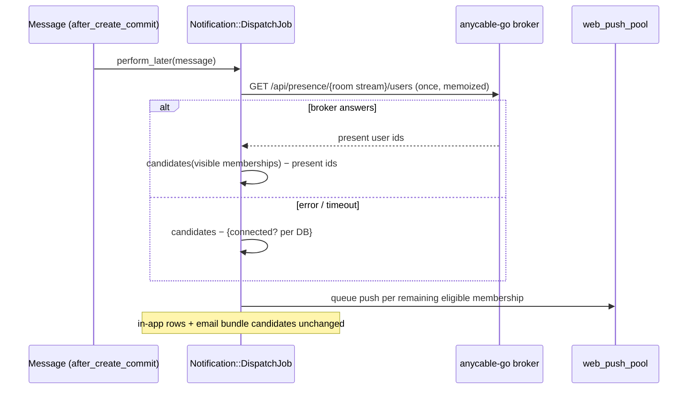
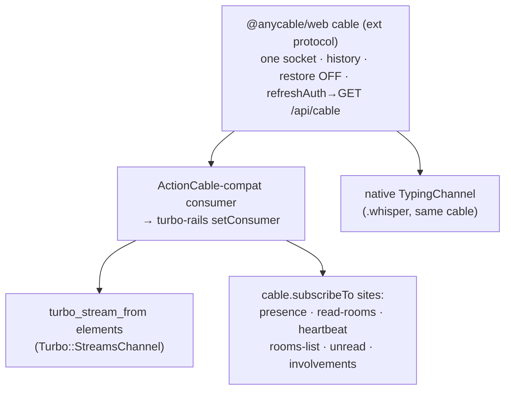

# perf: Presence-gated push and a unified AnyCable client

## Summary

Finish the AnyCable-OSS scale work for the self-hosted single-node target, in two tracks. Track 1 moves push-notification gating from the DB `connected_at` freshness check onto anycable-go's broker presence set and demotes the 50-second heartbeat to a throttled, skip-if-fresh last-seen write — retiring the largest concurrency-scaled write source on the single SQLite writer, and fixing a last-seen bug it exposes. Track 2 replaces the stock ActionCable consumer with one `@anycable/web` cable for the whole app — one socket per user, missed-broadcast recovery on reconnect, and JWT refresh without a page reload. Session restore, originally part of Track 2, is dropped (KTD10).

---

## Status

**Track 1 (U1–U4) is written and open for review; Track 2 (U5–U7) is unstarted.**

| | |
| --- | --- |
| Branch | `perf-presence-gated-push` (12 commits off `main`) |
| PR | [#147 — Read presence from the AnyCable broker instead of the database](https://github.com/sabha-co/sabha/pull/147) — open, not merged, no review yet |
| Units shipped in it | U1 (broker read path), U2 (presence-gated dispatch), U3 (truthful last-seen), U4 (heartbeat demotion + deploy-path cleanup) |
| Units outstanding | U5, U6, U7 — independent of Track 1, nothing blocks them |
| Scope cut | **Session restore dropped (2026-07-16).** U7 slims to history replay; the restore gate is Outside scope and OQ1 is closed unanswered. See KTD10 — the obligation it leaves behind (pin restore off) moved to U5, because that is where the capability arrives. |

**R4 is measured, not asserted.** Test-harness measurement with a travelled clock: 144 → 14 membership writes per hour per watcher (10.3×), which extrapolates to ~400/s → ~39/s at 10k concurrent. Confirmed live against a real anycable-go 1.6.15 on 2026-07-16: over a five-minute window with one member watching, two heartbeat RPCs arrived, one wrote and one skipped as fresh, and the write was a single UPDATE carrying `connected_at` and `last_read_at` together — the shape KTD5 specifies. On `main` the same window would have been ~6 refreshes and ~12 writes.

**Two riders that were not in the plan.** Both were found while verifying Track 1 and are on the same PR:

- Making `ANYCABLE_SECRET` a boot-time requirement is a **breaking change**, not the hardening U1 assumed. `AnyCable::Config#http_rpc_secret!` returns early without a secret, so neither side derives an RPC auth key and they match — a self-hosted install with a blank secret works today, unauthenticated. That install now aborts on boot. No Kamal or CI work is needed (the GitHub secret exists and both `.kamal/secrets*` already read it), but an operator must set it before upgrading.
- A pre-existing JWT mismatch: `config/anycable.yml` spelled out a `jwt_secret` ERB fallback that resolved to the literal dev secret rather than to `ANYCABLE_SECRET`, so a dev with `ANYCABLE_SECRET` set and `ANYCABLE_JWT_SECRET` unset had every socket closed `unauthorized` in Go before any RPC. Deleting the ERB restores the fallback chain anycable-go itself walks. Unrelated to presence gating and cherry-pickable if the PR wants to stay scoped.

**Known gaps at review time.** The client-side visibility fix has no regression test (there is no JS test infrastructure in the repo). The timing constants are reasoned from their dependencies and pinned by an ordering test, but not tuned against a load run — OQ2 and OQ6 both stay open, and until OQ6 is answered R4 remains a write-reduction result rather than a capacity one.

---

## Problem Frame

Every visible room tab sends a `refresh` every 50 seconds; each one is a Rails RPC that performs two unconditional UPDATEs (`touch :connected_at` + `advance_cursor_to_head`). This load scales with connected users rather than activity and queues on the same single SQLite writer as message traffic: extrapolated, ~200 RPCs/s and ~400 writes/s at 10k concurrent. Peers gate "is this user online?" from in-memory connection state and write last-seen conditionally at minute-plus granularity (Zulip: skip unless >55s stale; Mattermost: 2-minute minimum; Discourse: 60s Redis rate limit). Sabha already populates a broker presence set (`PresenceChannel` joins it, keyed by user id) but nothing consumes it.

**What the measurements actually say, and what this plan claims.** The heartbeat is not a measured wall, and this plan should not be read as removing one. `docs/performance/load-testing.md` puts the current ceiling at ~3,400 connections on one box, **establishment**-bound — Rails RPC for connect/subscribe, thread/IO-bound at ~65% web CPU, with `RAILS_MAX_THREADS` as the named lever and "SQLite write contention on presence/subscribe" named as a contributor. The 10k figure is a stated target for self-hosted single-node, not an observed number; the repo's own sizing table says 5,000+ warrants dedicated nodes and revisiting the SQLite story. So: the subscribe-time write contention this plan reduces is implicated in the measured ceiling, and the steady-state writes it retires grow with concurrency and would bind eventually — but the lever the measurement names most directly (`RAILS_MAX_THREADS`) sits in the prior plan's follow-ups, and no measurement here establishes the heartbeat as today's binding constraint. Treat R4 as a write-reduction outcome, not a proven capacity outcome, and see Open Questions for the baseline that would connect the two.

Separately, the main web client is still the stock ActionCable consumer: typing whisper opens a second physical socket per room page, reconnects replay nothing (missed messages need the HTTP catch-up or a reload), and a socket that outlives `jwt_ttl` reconnects with an expired token until a full page load — a recorded follow-up from the realtime-at-scale plan.

The prior plan (docs/plans/2026-07-08-001-perf-realtime-delivery-at-scale-plan.md) shipped R0–R6 but its KTD4 deliberately kept the `connected_at` lifecycle untouched; this plan supersedes KTD4's push-gating half and completes the client follow-up.

---

## Key Technical Decisions

- KTD1. **Push gating reads the broker presence set; membership stays the candidate source of truth.** Candidates still derive from `room.memberships.visible` (minus creator, involvement filters); the presence set is only subtractive — present users are removed from delivery. One `GET <api_path>/presence/:stream/users` per dispatch job, memoized on the message, never per candidate. Tolerates presence ids with no membership row (membership-less post viewers) and vice versa. Supersedes the prior plan's KTD4 push half — that plan chose "presence is live-only; it replaces the real-time driver, not the persisted model" deliberately, so its dated log entry must record what changed in the reasoning (the persisted column stays, but it stops being the live signal), not merely that it changed.
- KTD2. **When the presence query fails, fall back to the DB signal.** An errored or timed-out fetch degrades to `connected?` on the already-loaded candidate rows — today's gate at a coarser TTL, costing no extra queries. The fallback threshold must be `CONNECTION_TTL`, not an independent constant: under KTD5 a watching member's `connected_at` is only refreshed every write-threshold, so its age spreads across that whole interval and any shorter fallback window would miss most watchers. A restarted broker is a different case — it answers successfully with an empty set, so this branch never fires for it (see Risks).
- KTD3. **The dispatch fetch is one rescue-wrapped call, and delivery is two-phase.** `notify_recipients` runs up to three activity types; the presence set is fetched once and shared, with the rescue inside the fetch so failure fails open consistently across types. "Nothing raises after the first push is posted" needs a mechanism, not a promise: `web_push_pool.queue` posts as it iterates subscriptions, and email work follows it, so a later raise re-runs the job and re-sends the pushes already out. Complete every DB and email decision and materialize all push payloads first; only then enter a posting phase that cannot raise.
- KTD4. **`connected?` becomes connections-aware and `connected_at` becomes a truthful last-seen.** `connected?` = `connections > 0 && connected_at` fresh within `CONNECTION_TTL`; `disconnected` stops nil-ing the timestamp. Closing the browser then preserves last-seen, so email gating honors the 1-hour away tier instead of treating the user as instantly away (an existing bug). The `read`/`unread`/`with_message_unseen` scopes get the same connections-aware rewrite so a widened TTL doesn't leave departed users read-as-read. Making `connected?` depend on the refcount raises an unsolved problem this plan must close before U3 ships: the refcount ratchets. A broker restart fires no `depart`, so `connections` stays 1 with `connected_at` seconds old; the client reconnects, `present` sees `connected?` as true and increments to 2, and that member's last tab close then decrements to 1 without ever reaching the `connections < 1` branch that advances the cursor — resurfacing watched messages as unread, which R6 forbids. Freshness cannot bound this (the reconnect is fast, so the timestamp is fresh precisely when the ratchet happens), and KTD6 removes `disconnect_all`, today's only repair. See OQ4.
- KTD5. **The heartbeat is demoted, not removed.** Server-side skip-if-fresh: `refresh_connection` writes only when `connected_at` is older than a threshold, as a single UPDATE statement that also advances the read cursor (skipped when already at head), and never resurrects a membership whose `connections` is 0. Client cadence lengthens only as far as RPC volume requires. Repair stays event-driven, and the repair action is **`present`, not `refresh`** — `present` is the only action that joins the presence set (`refresh` writes to the DB and nothing else), so a member who only refreshes stays absent from presence and gets pushed for the room they are reading. But `present` must fire exactly once per (re)established subscription: `on_subscribe :present` already runs server-side on every fresh connect and ordinary resubscribe, so a client that also sends `present` on its `connected` event double-increments the refcount — the same ratchet as OQ4, self-inflicted. The client therefore sends `present` only where `subscribed` does not re-run: on tab-visible, rejoining after `absent` left the set. *(Two clauses here were overtaken. This originally added a cable-level `restored: true` hook and rejected `connected:` as unable to distinguish the three cases — OQ3 then found `@anycable/core` maps fresh, reconnect, and restore alike onto `connected:`, so it is the only attachment point available and the shipped `presence_controller.js` uses it. KTD10 has since dropped restore entirely, so the restored path never fires either way.)* `CONNECTION_TTL` is repurposed by this plan: today it is the 60-second push-suppression window; it becomes the freshness bound for `connected?` at ~5 min, while push suppression moves to `presence_ttl` (KTD7). Constants are config-tunable under pinned inequalities: client cadence < write threshold < `CONNECTION_TTL` (~5 min) < active tier (10 min).
- KTD6. **`Membership.disconnect_all` is removed from puma's `before_fork` hook.** It runs at boot ("reset ActionCable connections... when deploying new versions"), not at shutdown, and its premise is false since the AnyCable cutover: sockets terminate at the anycable-go accessory and survive a web deploy, so a booting release wipes the connected state of members whose sockets are still live, with no client event to trigger repair. It is also the only thing that currently resets a ratcheted refcount (KTD4/OQ4), so removing it and fixing the ratchet are one decision, not two.
- KTD7. **The push-suppression grace window becomes `presence_ttl`, set explicitly and valid before Track 2.** Today a disconnected user is suppressed for up to 60s (`CONNECTION_TTL`); under presence gating the window is the broker's presence TTL. Set `--presence_ttl` explicitly rather than inheriting the 15s default, and keep the client's reconnect backoff maximum below it so a blip doesn't push someone who is still watching. The stock consumer clears that bound today, so Track 1 sets the real value without waiting on Track 2: ActionCable's `ConnectionMonitor` caps its backoff exponent (`Math.min(reconnectAttempts, 10)`) and ships `staleThreshold = 6`, `reconnectionBackoffRate = 0.15`, giving a worst-case poll of ~28s plus a 6s stale-detection window — ~34s, under 45s. U5's jittered backoff improves the margin rather than unlocking it.
- KTD8. **Track 2 swaps the consumer once via turbo-rails' exported `setConsumer`.** `@anycable/web`'s ActionCable-compat consumer is installed at module top level before any subscription is created; all `cable.subscribeTo` call sites and every `turbo_stream_from` element ride it unchanged. Typing keeps a native `Channel` for `.whisper` on the same cable — the second socket and its teardown are deleted.
- KTD9. **Token refresh rides the existing `GET /api/cable` JSON contract** — not `/cable`, which is the WebSocket path proxied to anycable-go. The hook fetches the workspace-prefixed `/api/cable` and hands the token to the transport's `setToken`, which rewrites only the token param and leaves the URL and SaaS `?wid=` intact. A 401 (dead Rails session) ends reconnection and surfaces signed-out instead of looping.
- KTD10. **Session restore is not pursued. U5 pins it off, deliberately and provably.** *(Decided 2026-07-16, superseding a verify-then-enable gate.)* The original decision was to verify that `close_remote_connections` purges the broker's session cache and enable restore if it held. Dropped on risk appetite, not on evidence — nothing was tested and found wanting. The payoff is a faster reconnect; the exposure is that a kicked member's subscriptions get rebuilt without re-authorization. That trade doesn't earn a verification pass.
  
  What the gate got right outlives it, and now attaches to U5: **restore is a client capability, so the exposure arrives with U5's extended-protocol consumer, not with U7.** Dropping U7 removes the check, not the risk. Restored sessions skip `Connection#connect` and channel re-authorization, and room-membership revocation is the sharp case rather than ban — destroying or deactivating a membership calls `close_remote_connections(reconnect: true)`, which actively invites the client back, so under restore it would rebuild the exact subscriptions the kick meant to drop. (Ban uses `reconnect: false` and is bounded by `jwt_ttl`.)
  
  Whether `@anycable/core` restores on its own once a `sid` is available is **unresolved**: the protocol spec says a client *"MAY* use this ID during re-connection", which commits to nothing, and the client's own default isn't documented — settling it needs a read of the library source, which U5 vendors. So U5 pins restore off explicitly and proves no `sid` leaves on reconnect, rather than trusting a default it hasn't read. Server-side the session cache stays live regardless (anycable-go's `--sessions_ttl`, default 300s, with the memory broker; the `restore_from_cache`/`cache_ttl` keys in `config/anycable.yml` are inert — see U1). Only the client's silence keeps restore unused, which is precisely why that silence has to be deliberate rather than inherited.
- KTD11. **Long-gap recovery stays the existing HTTP catch-up.** History replay is opportunistic: a `reject_history` or overflow (beyond 100 msgs/300s per stream) triggers the `refresh_room` catch-up that already handles reconnects today, so the migration never loses the current recovery path.
- KTD12. **Presence invariants from prior work hold.** Presence ids are strings (fork-pinned cast fix); `leave_presence` fires only from the explicit `absent` action, never on unsubscribe/teardown; the `depart`/`absent` split stays.
- KTD13. **House style for the new HTTP call, authenticated with the derived API secret.** Plain `Net::HTTP` with a short timeout, URL derived from the existing broadcast-URL config (same host/port); webmock in tests; no new gems. The API secret is not `ANYCABLE_SECRET` itself — anycable-go derives it as `HMAC-SHA256(ANYCABLE_SECRET, "api-cable")` unless `--api_secret` is set explicitly, and Rails must compute the same value for the `Authorization: Bearer` header. No new env var: the API is already enabled and authorization-required in every environment precisely because a secret is configured.
- KTD14. **Last-seen stays on the membership row.** Peers keep a per-user last-seen (Zulip `UserPresence`, Mattermost `Status`, Discourse `users.last_seen_at`), and every *remaining* DB reader here is user-scoped — activity tiers, online counts, and email away-ness all aggregate with `group(:user_id).maximum(:connected_at)`. The membership row still wins: the `read`/`unread` scopes need room-scoped connectedness that a per-user column cannot answer, and the `connections` refcount is inherently per-membership (tabs per room) and must pair with the timestamp it gates. A per-user column would also cost a migration plus the repo's two-release column retirement for marginal savings — members typically hold one or two rooms open, so the per-user write saving is small. Accepted trade-off: user-scoped reads keep their aggregate over a member's handful of rows.

---

## High-Level Technical Design

Push dispatch under presence gating:



Membership presence/last-seen lifecycle (writes annotated):

```mermaid
stateDiagram-v2
  [*] --> Watching: subscribe → present\n(write: connections+1, last-seen, cursor→head)
  Watching --> Watching: refresh (throttled)\nwrite ONLY if last-seen stale\n(single UPDATE, cursor rides along)
  Watching --> Hidden: tab hidden → absent\n(write: connections−1; presence leave)
  Hidden --> Watching: tab visible → present
  Watching --> Departed: unsubscribe/disconnect → depart\n(write: connections−1; last-seen KEPT)
  Hidden --> Departed: close tab → depart\n(idempotent: no double decrement)
  Departed --> Watching: reconnect (subscribe → present, server-side)
```

Unified client topology:



---

## Requirements

**Push gating**

- R1. On a successful broker fetch, message dispatch performs no per-candidate `connected_at` gating; delivery suppression for connected users derives from that one presence fetch per dispatch job. The unavailable-broker fallback is R2's explicit exception.
- R2. When the presence query fails, gating degrades to the DB `connected?` signal rather than raising or dropping pushes; in-app notification rows and email candidacy are unaffected by presence-fetch failures.
- R3. Presence queries and gating are tenant-scoped in SaaS mode; a presence fetch for one workspace never sees another workspace's users.
- R15. Across the deployment configurations this repo ships, the presence API is reachable only with the derived API secret: Rails fails fast at boot on a blank base secret, and no launch point enables a dedicated API port or public mode. Rails cannot assert this about a separately-launched Go process, so the guarantee is scoped to the bundled configs rather than claimed universally.

**Last-seen and unread**

- R4. Steady-state presence DB writes drop by roughly an order of magnitude at fixed concurrency: heartbeat writes are skip-if-fresh, single-statement, and idle refreshes write nothing.
- R5. Last-seen is truthful: fully disconnecting preserves `connected_at`, and missed-message email honors the 1-hour away tier measured from real last activity.
- R6. A member watching a room never sees it flip unread; staleness after a silent transport death is bounded by `CONNECTION_TTL`; messages watched live still count as seen on disconnect.
- R7. A web (puma) deploy leaves connected members' state intact — no mass cursor snap, no unread/status flicker. Self-hosted production only; the hook is already guarded off in SaaS.
- R8. Activity tiers, status dots, online counts, and the member-directory sort read from the persisted last-seen, with their post-disconnect semantics resolved deliberately (OQ5) rather than inherited from the nil-ing behavior KTD4 removes.

**Unified client**

- R9. Each browser page holds exactly one WebSocket; typing whisper rides it.
- R10. After a reconnect, missed broadcasts are recovered — via history replay within the window, via the existing HTTP catch-up beyond it — with no duplicate rendered messages, replayed sounds, or stale typing indicators.
- R11. A socket outliving `jwt_ttl` refreshes its token without a page load; a dead Rails session ends reconnection and surfaces signed-out.
- R12. Ban, deactivation, or kick terminates stream delivery within the enforcement window today's behavior provides. With restore dropped (KTD10) this is today's behavior held, not extended: every reconnect re-runs `subscribed` and re-authorizes. The requirement is therefore that restore stays off — no `sid` is presented on reconnect — which U5 owns and pins.
- R13. The client stays importmap-only with vendored pins — no bundler, no CDN dependency at runtime.

**Verification**

- R14. Both suites pass (`bin/rails test`, `SAAS=true bin/rails test saas/test/`); broker-dependent behavior is log-verified against real anycable-go in dev; write/RPC reduction is measured with the existing perf harness (which still speaks the v1 protocol — valid for storm and write-load measurement). R14 is a plan-level release gate satisfied cumulatively by every unit's Verification, not traced to a single unit.

---

## Implementation Units

### U1. Broker presence read path

- **Goal:** Rails can ask anycable-go "who is present on this room's stream?" — tenant-scoped, authenticated, fast, and degrading safely when the broker can't answer.
- **Requirements:** R1, R2, R3, R15
- **Dependencies:** none
- **Files:** `app/models/room/presence_set.rb` (new; name directional), `Procfile.dev`, `config/deploy.yml`, `config/deploy.multitenant.yml`, `AGENTS.md`, `test/models/room/presence_set_test.rb` (new)
- **Approach:** A small query object resolves the room's presence stream name exactly as `PresenceChannel.broadcasting_for(room)` does (tenant-scoped via the Room GID; URL-encode the stream segment), calls `GET <api_path>/presence/:stream/users` on the broker host derived from the existing broadcast-URL config, authenticates with the derived API secret (KTD13), and returns a Set of user ids. Short open/read timeouts; any error returns a sentinel the caller treats as "broker unavailable" (KTD2/KTD3). Do not add an API-URL key to `config/anycable.yml`: that file is loaded by `AnyCable::Config < Anyway::Config`, which materializes only its own declared attrs and silently discards anything else — `restore_from_cache` and `cache_ttl` sit there dead today, proving it. Parse the broker's scheme/host/port from the declared `http_broadcast_url` instead (the API rides the same port, since `--api_port` defaults to 0), and if a knob is genuinely wanted put it on `Rails.configuration.x` as the app already does for `web_push_pool`. Config plumbing here is limited to setting `--presence_ttl` explicitly in `Procfile.dev` and both deploy accessories (KTD7). Confirm on the startup log line that anycable-go reports the API as `authorization required` in every environment, and check whether the Kamal proxy's `/cable` prefix rewrite leaves `<host>/cable/api/*` publicly routable — if it does, the derived secret is the only thing standing in front of `/api/publish` too, which is worth knowing regardless of this plan. The exposure worry cuts the other way from the obvious reading: with no secret, no dedicated API port, and no public mode, anycable-go **disables** the API rather than serving it unauthenticated — so a missing `ANYCABLE_SECRET` doesn't leak presence, it silently turns every presence fetch into the unavailable sentinel and fails push open. That is the failure worth guarding. Add an initializer that validates the base secret before deriving from it, keep the deploy configs free of `--api_port`/public mode, and scope R15 to the bundled configurations — Rails cannot prove anything about how someone else launched the Go process.
- **Patterns to follow:** `Net::HTTP` usage in `app/models/webhook.rb`; config shape of `http_broadcast_url` in `config/anycable.yml`; webmock stubbing as in existing webhook tests.
- **Test scenarios:**
  - Present users returned as an id Set; response `records[].id` string values map correctly.
  - Broker returns 404/501/timeout/connection-refused → sentinel, no exception escapes.
  - Empty presence set (`{"total": 0}`) returns an empty Set, distinct from the unavailable sentinel.
  - Stream name matches `PresenceChannel.broadcasting_for(room)` byte-for-byte, including URL encoding.
  - Covers R15: the request carries `Authorization: Bearer <HMAC-SHA256(secret, "api-cable")>`; a 401 response maps to the unavailable sentinel rather than an empty set.
  - Covers R15: boot fails fast when the base secret is blank, rather than deriving from nothing and degrading every presence fetch to the unavailable sentinel (which would fail push open silently).
  - Covers R15: the shipped launch points (`Procfile.dev`, both deploy accessories) set a secret and set neither a dedicated API port nor public mode — assert against the config files so drift is caught in CI.
  - Covers R3: SaaS — two workspaces with the same numeric room id produce different stream names; the fetch for tenant A never returns tenant B's users (SaaS suite).
- **Verification:** Unit tests green; a dev log-verified run shows a real fetch against anycable-go returning the ids of subscribed users, and the startup log reports the API as authorization-required.

### U2. Presence-gated push dispatch

- **Goal:** Push delivery is suppressed by broker presence instead of DB `connected_at`, degrading to the DB signal when the broker can't answer.
- **Requirements:** R1, R2, R3
- **Dependencies:** U1
- **Files:** `app/models/message.rb`, `app/models/membership/notifiable.rb`, `docs/features/NOTIFICATIONS.md`, `docs/plans/2026-07-08-001-perf-realtime-delivery-at-scale-plan.md` (dated supersession log entry), `test/models/message_test.rb`, `saas/test/` (tenancy scenario)
- **Approach:** `push_candidate_memberships_for` drops the `.disconnected` scope; candidates stay membership-derived with all involvement/creator/@everyone-ceiling filters intact. The dispatch path fetches the presence set once per job (memoized on the message, rescue inside per KTD3) and subtracts present user ids; `receives_push_for?` loses its `connected?` arm (delivery gating is the caller's job now) but keeps block/health/settings gates. An unavailable broker falls back to subtracting `connected?` members instead (KTD2). The capped-@everyone path is untouched. Update NOTIFICATIONS.md's gating section (push = broker presence; email unchanged).
- **Execution note:** Characterization-first — pin the current four activity-type candidate sets before changing the gate.
- **Test scenarios:**
  - Watching member (in presence set) receives no push; absent member does, for each activity type (mention, DM, thread reply, @everyone under the ceiling).
  - Covers R2: presence fetch raises/times out → gating falls back to `connected?`; a member with `connections: 0` is pushed, a member connected within `CONNECTION_TTL` is not; `Notification` rows and email bundle items identical to the success case.
  - Fetch succeeds with an empty set → every candidate pushed (the documented restart behavior), proving the fallback does not fire on a successful response.
  - Presence set contains a user id with no membership row (post viewer) → ignored without error.
  - Two tabs on one room, one goes hidden and sends `absent` → the user remains in the presence set via the live tab and is not pushed (presence dedupes by user id, so this rests on per-session leave semantics worth pinning).
  - One HTTP fetch total for a message that triggers multiple activity types.
  - Failure injection (KTD3's two-phase guarantee): raise during payload construction for the third of five recipients → no push posted at all, job retries cleanly. Raise during the posting phase → assert the phase cannot raise, or that a retry re-sends nothing already delivered.
  - @everyone above the ceiling: no presence fetch, no push fan-out (existing behavior pinned).
  - Covers R3: SaaS cross-tenant scenario from U1 exercised through the dispatch job.
- **Verification:** Both suites green; dev log-verified run shows one presence GET per message and pushes only to non-present members.

### U3. Truthful last-seen and connections-aware unread

- **Goal:** `connected_at` becomes a preserved last-seen; connectedness derives from the refcount plus freshness; unread scopes stay honest under a widened TTL.
- **Requirements:** R5, R6, R8
- **Dependencies:** U2 (push no longer reads `connected?`). Blocked on OQ4 (refcount recovery) and OQ5 (post-disconnect dot semantics) — both change what this unit implements.
- **Files:** `app/models/membership/connectable.rb`, `app/models/membership/unreadable.rb`, `app/channels/presence_channel.rb`, `test/models/membership_test.rb`, `test/channels/presence_channel_test.rb`, `test/controllers/accounts/users_controller_test.rb`
- **Approach:** Redefine `connected?` as `connections > 0 && connected_at >= CONNECTION_TTL.ago`; `disconnected` decrements but never nils `connected_at`. Rewrite the `connected`/`disconnected` scopes and the `read`/`unread`/`with_message_unseen` arms to the connections-aware form. `refresh_connection` must not resurrect a membership at `connections: 0` (the in-flight-refresh-after-depart race). Make `absent`/`depart` idempotent so a hidden-then-closed tab doesn't double-decrement a second tab's refcount — an ordinary instance variable will not do it: channel objects are ephemeral across AnyCable RPCs, so the "already departed" flag needs `state_attr_accessor` (cleared on `present`) to survive from `absent` to `depart`, and proving it needs an RPC-lifecycle test, not just the Action Cable test adapter. Implement OQ4's answer for the refcount ratchet — freshness cannot bound it (KTD4), so `present` needs to stop being a blind `connections + 1`. `Membership::Connectable#connected` has no app callers but ~20 in `test/models/membership_test.rb` as connection-state setup; rewrite those to `present` as part of this unit's characterization pass before removing it.
- **Execution note:** Characterization-first — pin today's `read`/`unread` scope behavior and the email-gating outcomes before the rewrite.
- **Test scenarios:**
  - Covers R5: member active at T, browser closed at T (depart), mention at T+5m → no bundle item is created at all, because `receives_missed_email_for?` gates at enqueue and preserved last-seen means the member isn't away yet. A fresh mention after T+60m does create one and delivers. (The same T+5m mention can never become eligible later — eligibility is decided once, at enqueue.)
  - Two tabs same room: hide tab B, close tab B → `connections == 1`, `connected_at` fresh, tab A's unread state unaffected.
  - Departed member with fresh `connected_at` (within TTL) reads as disconnected for scopes once `connections == 0`.
  - In-flight `refresh` landing after `depart` does not resurrect the row.
  - Refcount drift, stale path: `connections: 2` with stale `connected_at` → `present` resets to 1.
  - Refcount ratchet, fresh path (OQ4's regression pin): `connections: 1`, `connected_at` 5s old, no `depart` fired (broker restart) → `present` must not reach 2, and the member's last tab close must still advance the cursor.
  - Activity-tier boundaries remain unchanged for fresh/stale/never-seen timestamps; `online_user_count` after disconnect matches OQ5's chosen semantics.
  - Covers R8 end-to-end (not just `activity_status` against a raw timestamp): member departs at T → assert the rendered dot state at T+1m, T+11m, and T+2h matches whatever OQ5 decides.
  - Unsubscribe still never calls `leave_presence` (regression pin stays green).
- **Verification:** Both suites green; the pinned characterization outcomes hold except the two documented intentional changes (preserved last-seen; connections-aware scopes).

### U4. Heartbeat demotion and deploy-path cleanup

- **Goal:** Idle presence maintenance writes approach zero; repair is event-driven; deploys stop clobbering connected state.
- **Requirements:** R4, R6, R7
- **Dependencies:** U3
- **Files:** `app/javascript/controllers/presence_controller.js`, `app/models/membership/connectable.rb`, `app/models/membership/unreadable.rb` (cursor-advance merge), `config/puma.rb`, `test/models/membership_test.rb`, `test/channels/presence_channel_test.rb`, `docs/features/NOTIFICATIONS.md`
- **Approach:** Server: `refresh_connection` becomes skip-if-fresh (write only when `connected_at` older than the threshold) and emits a single UPDATE covering last-seen + conditional cursor advance (skip when cursor already at head). Client: lengthen the refresh interval (constant, env-overridable via a meta/data value if warranted); keep sending `present` on tab-visible exactly as today, and never on the subscription's `connected` event, which would double-present against the server's `on_subscribe :present` (KTD5); send `absent` right after (re)subscribe while hidden so a hidden tab's reconnect doesn't wrongly suppress push; add the `pageIsTurboPreview` guard the other cable controllers already have. Note the repair path is not a cheap write: `present` routes through `Membership.connect`, which snaps the cursor to head and zeroes `unread_notifications_count` — fold that into the staleness-budget note. Remove `Membership.disconnect_all` from `config/puma.rb` and delete the method with its raw-SQL cursor snap (KTD6). Tune constants under KTD5's inequalities; document the new staleness budget (a reload after minutes of watching may mark up to one write-threshold of watched messages as "new since last visit" — accepted, bounded).
- **Test scenarios:**
  - Refresh with fresh `connected_at` and cursor at head → zero UPDATEs (assert query count).
  - Refresh past the threshold → exactly one UPDATE; cursor advances only if the room head moved.
  - Covers R6: silent transport death (no depart) → membership reads unread only after `CONNECTION_TTL`, never while heartbeats continue.
  - Covers R7: no `disconnect_all` caller remains; a simulated deploy (job/process restart) leaves `connections`/`connected_at`/cursor untouched.
  - Hidden tab resubscribes (broker restart) → `absent` follows subscribe; member not in presence set; next mention pushes.
  - No double-present: a fresh connect and an ordinary resubscribe each increment `connections` exactly once (server-side `on_subscribe :present` only); the client adds `present` on tab-visible only, never on the subscription's `connected` event. *(As shipped, the client's `connected:` hook re-reports visibility — sending `absent` when hidden — and never sends `present`.)*
  - `absent` then `depart` across separate RPCs decrements once, not twice (pins the `state_attr_accessor` flag, not an instance variable).
  - Turbo preview render does not churn present/depart writes.
  - Push-grace boundary: socket dropped, messages at +10s and +presence_ttl+5s → first suppressed, second pushed (pins KTD7's window).
- **Verification:** Dev log-verified soak: with N idle watching clients, membership UPDATE rate falls from 2 per client per 50s to ≤1 per client per write-threshold; RPC rate falls proportionally to the new cadence.

### U5. Unified @anycable/web consumer

- **Goal:** One extended-protocol cable powers turbo-rails, every `subscribeTo` site, and token refresh.
- **Requirements:** R9, R11, R13
- **Dependencies:** none (parallel to Track 1). Shares the `presence_controller.js` reconnect hook with U4.
- **Files:** `config/importmap.rb`, `vendor/javascript/` (downloaded pins), `app/javascript/lib/cable.js` (new), `app/javascript/application.js`, `app/javascript/controllers/refresh_room_controller.js`, `app/javascript/controllers/presence_controller.js` (its `connected:` hook, already shipped in U4, must keep firing across the consumer swap)
- **Approach:** Vendor `@anycable/web` (and `@anycable/core` transitives) via `importmap pin --download`, replacing the esm.sh CDN pin. Build the consumer with `createConsumer(url, { protocol, tokenRefresher })` and take the shared cable off its `.cable` property — do not `new ActionCableConsumer(cable)`, which the package's types advertise but its runtime does not export. Install it via turbo-rails' `setConsumer` from a **static** import chain off `application.js`: turbo defines `turbo-cable-stream-source` in its module body and upgrade reactions run in a microtask, so a static chain sets the consumer first and wins, while a dynamic import or a controller-only import loses — `getConsumer()` runs first and its pending stock-ActionCable promise silently clobbers the AnyCable consumer, yielding two sockets on any page with a `turbo_stream_from`. Wire the token-refresh hook to `GET /api/cable` (the JSON endpoint; `/cable` is the socket path), handing the token to `setToken` so the URL and SaaS `?wid=` survive; on 401 stop reconnecting and surface signed-out. Replace `refresh_room_controller`'s reach into `channel.consumer.connection.monitor` with a supported API and audit for other `.consumer.connection.*` uses. Map the compat layer's `connected` callback behavior explicitly (execution-time discovery) — OQ3 found fresh connect, reconnect, and restore all arrive as a bare `connected:`, so controllers keying off it already cover every case. **Pin session restore off (KTD10), and treat this as U5's job rather than a footnote:** the capability arrives here, with the extended-protocol consumer, and the library's default is undocumented — the protocol only says a client *"MAY"* restore. Read the vendored source for the option that controls it, disable it explicitly rather than relying on a default, and verify no `sid` is presented on reconnect (query param `?sid=` or an `X-ANYCABLE-RESTORE-SID` header — check both, since the protocol permits either).
- **Test scenarios:**
  - Exactly one WebSocket per page (room page with typing, sidebar, inbox subscriptions all live).
  - Turbo preview/cache navigation neither tears down the live page's subscriptions nor double-subscribes identifiers.
  - Covers R11: expired `jid` on reconnect → one `GET /api/cable`, fresh token, successful reconnect, no page load; dead session → signed-out state, reconnection stops.
  - SaaS: refreshed URL keeps `?wid=`; tokenless login pages still connect via the connect-RPC fallback.
  - `refresh_room` staleness detection still fires its HTTP catch-up after the consumer swap.
  - Covers R12: kill the socket and reconnect → no `sid` query param and no `X-ANYCABLE-RESTORE-SID` header on the new connection; the Rails log shows a fresh `Connection#connect` and a re-run `subscribed` for every channel, not a restore.
- **Verification:** Log-verified dev runs (network tab: one socket, and no `sid` on reconnect; anycable-go logs: ext protocol negotiated, no session restored); both test suites green (server-side contracts unchanged).

### U6. Whisper on the unified socket

- **Goal:** Typing indicators ride the shared cable; the second socket dies.
- **Requirements:** R9
- **Dependencies:** U5
- **Files:** `app/javascript/controllers/typing_notifications_controller.js`, `app/views/layouts/application.html.erb` (retire the `anycable-whisper` meta flag), `test/channels/typing_notifications_channel_test.rb` (unchanged contract pin)
- **Approach:** The controller takes a native `Channel` from the shared cable module (`.whisper` needs the native API, not the compat consumer) and drops the dynamic import, per-navigation `createCable()`, and `cable.disconnect()` teardown. The stock-consumer fallback path and meta flag retire — AnyCable is required. During rollout, cached old JS may still open the transient second socket; server config already tolerates both.
- **Test scenarios:**
  - Whisper round-trips between two browsers on the unified socket; server receives no typing RPC actions.
  - Channel teardown on navigation leaves the shared cable connected (no full-cable disconnect).
  - Server channel contract unchanged (existing channel tests stay green).
- **Verification:** Dev run: typing between two sessions with one socket each; zero `TypingNotificationsChannel#start/stop` RPCs in Rails logs on the whisper path.

### U7. Reconnect recovery: history replay and catch-up wiring

- **Goal:** Reconnects recover missed broadcasts exactly once, replaying within the window and falling back to today's HTTP catch-up beyond it.
- **Requirements:** R10
- **Dependencies:** U5
- **Files:** `app/javascript/lib/cable.js`, `app/javascript/controllers/refresh_room_controller.js`
- **Approach:** Enable history requests on reconnect for the message and state streams; on `reject_history`/overflow, trigger the existing `refresh_room` HTTP catch-up (KTD11). The bulk of this unit is verifying replay side effects, not enabling replay: Turbo appends dedupe by DOM id but must not replay sounds, resurrect unread styling, or duplicate `broadcast_reactivation`'s `after`/`prepend` nodes; check whether whispers enter broker history (stale typing flashes must be absorbed by the tracker's expiry). Every failure mode here is cosmetic and per-stream, so a stream that misbehaves opts out of history and keeps the catch-up — the fallback is today's behavior, which is why this unit can't regress recovery, only fail to improve it.
- **Scope note:** The restore gate that was originally the second half of this unit is dropped (KTD10, 2026-07-16), and its one surviving obligation — pinning restore off — moved to U5, where the capability actually arrives. R12 went with it.
- **Test scenarios:**
  - Covers R10: reconnect within the history window after (a) normal appends, (b) a reactivation broadcast → each message rendered exactly once, no sound replay, no duplicate unread separator.
  - Reconnect after >100 missed messages → exactly one HTTP catch-up, list consistent with the server.
  - Stale "X is typing" never persists past the tracker expiry after a replayed whisper (or whispers verified absent from history).
- **Verification:** Log-verified dev matrix — kill socket (blip), restart anycable-go, expire JWT — each recovers per the scenarios above, with no duplicate renders or replayed sounds.

---

## Scope Boundaries

**In scope:** everything under Implementation Units, including the docs updates they name.

### Deferred to Follow-Up Work

- RPC-less Turbo Stream subscriptions (`ANYCABLE_TURBO_STREAMS=true` + secret alignment) — independent server-side win; do after the client migration settles.
- k6 harness extended-protocol variant (and the token-carrying auth variant the prior plan noted) — the v1-protocol harness stays valid for storm/write measurements this plan needs.
- Shortening `jwt_ttl` — unblocked by KTD9's refresh, separate rollout decision.
- A visible "who's here" presence UI (`@anycable/turbo-stream`'s presence source element) — product surface, belongs with the native-clients track.
- Membership-less post viewers joining presence — current early-return behavior kept; they receive no push either way.
- The prior plan's carried follow-ups (`unread_at` column drops, `docs/features/UNREAD_AND_MENTION_INDICATORS.md` rewrite, `RAILS_MAX_THREADS` measurement) — stay with that plan.
- The email path's per-candidate `workspace_locally_away?` (one `group(:user_id).maximum` query per candidate in `receives_missed_email_for?`) — a pre-existing N+1 this plan leaves in place; batch it when the email fan-out is next touched.

### Outside scope

- **Session restore** (KTD10) — dropped 2026-07-16 on risk appetite. Reviving it means reopening OQ1 and proving the kick path (`close_remote_connections(reconnect: true)`) purges the broker's session cache *before* enabling it, not after. U5 pins it off so that revival is a deliberate act.
- SSE fallback and the Prometheus metrics endpoint (explicit decision).
- Multi-node anycable-go, Redis/NATS brokers, AnyCable Pro features.
- Presence or unread schema migrations — no column changes are needed.

---

## Open Questions

- OQ1. **Closed unanswered (2026-07-16): not pursued.** Did `close_remote_connections` purge anycable-go's session-restore cache for the kick path (`reconnect: true`) as well as ban? The question only had force if restore shipped; KTD10 dropped restore, so it stops being a question this plan owes an answer to. Note the shape of the closure — the fallback (ship without restore) was always the safe branch, so choosing it up front costs a verification pass and buys nothing back. Anyone reviving restore has to reopen this first, and U5's `sid` pin is what makes reviving it a deliberate act rather than an accident.
- OQ2. Exact constants — client cadence, write threshold, `CONNECTION_TTL`, `presence_ttl` — are tuned during U4/U7 under KTD5/KTD7's pinned inequalities; the plan fixes the relationships, not the numbers.
- OQ3. Resolved: `@anycable/core`'s ActionCable channel maps every connect — fresh, reconnect, and restore alike — to `notify('connected')` with no arguments, so there is no per-subscription `restored:` callback. The hook attaches to `connected:` and covers all three. (The cable-level `cable.on('connect', ({ restored }) => …)` escape hatch this originally named for restore-specific work is moot under KTD10 — nothing restore-specific remains.)
- OQ4. **Resolved (2026-07-16, U3): the ratchet needed no recovery mechanism — it needed its teeth pulled.** All three candidates were rejected on evidence. *Derive the count from the presence set*: impossible, the API returns one record per user with no session count. *Clamp on `present` against the broker*: correct but backwards on cost — it puts an HTTP call on the connection-establishment path, which `docs/performance/load-testing.md` names as the measured ceiling, and it fires hardest exactly during a post-restart reconnect storm (every reconnecting member looks ambiguous, so 10k reconnects buy 10k fetches to learn the set is empty). *Zero on a restart signal*: no signal exists — verified against a live 1.6.15 broker, the epoch appears only in the startup log, `/health` returns a fixed string and there is no `/info`.
  
  The premise was the thing to attack. KTD4 assumed the ratchet's harm is a **skipped cursor advance** ("that member's last tab close then decrements to 1 without ever reaching the `connections < 1` branch"), which is permanent and violates R6. But that branch gates the cursor advance for no reason: `advance_cursor_to_head` is idempotent, `refresh_connection` already advances on every heartbeat regardless of refcount, and the member was watching right up to the moment they departed — so everything up to now is genuinely seen whether or not another tab is still open. Advancing on **every** `depart`/`absent` (still guarded by `marked_unread?`) is correct on its own terms and makes the refcount irrelevant to R6's "messages watched live still count as seen."
  
  What's left of an over-counted refcount is that the member reads as connected for up to `CONNECTION_TTL` after they actually left — which is **exactly, and indistinguishably, a silent transport death**, a case R6 already accepts and bounds at `CONNECTION_TTL`. It also self-limits: the magnitude never matters (only `> 0` vs `0`), the harm is capped at one TTL regardless of how many restarts stacked up, and any absence longer than a TTL heals it on the next `present`. Over-counting also errs in the safe direction for R6's first clause — it keeps a watching member's room read, where an under-count would flip it unread mid-read. Accepted with no new mechanism; U3 pins it with a regression test.
- OQ5. **Resolved (2026-07-16, U3): `activity_status` becomes connections-aware; the online counts stay last-seen.** Chosen because it is the option with *no* product-visible change — a member who closes their browser goes grey immediately, exactly as today. Accepting the tier semantics would have shown a green dot for ten minutes after someone left, and "don't change what users see" wins a question the plan itself couldn't call either way.
  
  This is KTD4's split applied one level up: a dot answers two questions with one word, and each half now reads the signal that actually knows. "Are they here?" is the refcount plus freshness (the same test `connected?` runs). "How long ago were they here?" is the preserved last-seen, which is what the away tier reads.
  
  `online?` and `online_user_count` deliberately stay last-seen-based, and are not inconsistent with the dot — they answer a different question ("how many people have been around in the last N"), which is why `online_user_count`'s live caller passes a 24-hour tier. A `connections > 0` filter there would collapse a day's activity count to whoever is holding a socket this second. Preserving the timestamp makes that count *more* accurate than today, since today's nil-ing silently drops every clean disconnect from it. The pair must also agree with each other: `accounts_helper` adds one to the count when `online?(Current.user)` is false, so splitting their signals would double-count a member who left minutes ago. The residual is that a member who left can be absent from the dot but still inside the ten-minute count — accepted, and the honest reading of two different questions.
- OQ6. Still open, and U1–U4 landed without it: is the heartbeat's steady-state write cost worth measuring against the establishment ceiling? The harness reaches ~3,400 connections, where the heartbeat is ~136 writes/s — a run on either side of this branch would tie R4's write reduction to a capacity outcome instead of leaving it a write count. Answering it after the fact is now the cheaper option (both sides are runnable) but also the less useful one, since a regression would surface after review rather than before. Until it is answered, the Problem Frame's headroom framing stands on its own and R4 stays a write-reduction claim.

---

## System-Wide Impact

- **Push timing semantics change deliberately:** suppression grace after disconnect moves from 60s (`CONNECTION_TTL`) to `presence_ttl` (~45s, explicit); hidden-tab reconnects stop wrongly suppressing push; users gone >presence_ttl get push sooner than today. NOTIFICATIONS.md is updated in U2/U4.
- **Deploy behavior changes:** web deploys no longer snap cursors or zero connections (KTD6); "watched live counts as seen" now rides normal disconnect paths. An anycable-go restart (rare, operator-triggered) briefly pushes to watchers until clients re-present (see Risks).
- **Email gating gets stricter-correct:** preserved last-seen means fewer premature missed-message emails (existing bug fixed); `BundleDeliveryJob`'s delivery-time re-check keeps working against staleness bounded well under the 1-hour tier.
- **Status dots and online counts change with it:** the same preserved timestamp that fixes email makes a departed member read `:active` for up to 10 minutes and sort as recently-active, where today they flip to `:offline` immediately. OQ5 decides whether to accept that or make the tiers connections-aware; either way the dot's meaning is now a recorded decision rather than a side effect.
- **Degraded-broker notification gap widens:** KTD2's fallback suppresses push for members `connected?` within `CONNECTION_TTL` (~5 min, up from today's 60s). It fires only when anycable-go is unreachable — which is also when those members are receiving no live messages — so the window is a total notification gap five times wider than today's. Accepted: it requires Rails up and the broker down, and no better signal exists in that state.
- **SaaS:** all gating and presence queries stay tenant-scoped through Room-GID stream names; both suites are release gates.
- **Ops:** Rails-down windows lose heartbeat commands (not retried) — repair latency is one client cadence; anycable-go disconnect events are queued and retried. The `AGENTS.md` realtime section gains the presence-API and `presence_ttl` notes.

---

## Risks & Dependencies

- **Broker restart push burst:** a restarted anycable-go answers presence queries successfully with an empty set, so KTD2's fallback cannot catch it — every watcher looks absent until clients reconnect and re-present. Accepted rather than mitigated: restarts are operator-triggered (deploys no longer reboot the accessory), the window is the jittered reconnect (seconds, bounded below `presence_ttl` per KTD7), and the cost is a few redundant pushes. The broker's epoch changes on restart but is only exposed to clients in message and history payloads, not on the presence API, so Rails has no cheap restart signal. Treating "empty set" as untrustworthy was rejected: it would wrongly suppress push for the common silent-death case (the case presence exists to improve) to serve a rare one.
- **Compat-layer behavioral gaps** (the `connected` mapping OQ3 resolved, ActionCable internals like `connection.monitor`): audited in U5; the k6 harness and log-verified runs catch regressions.
- **History replay side effects** (sounds, reactivation duplicates, whispers): U7 verifies before enabling per-stream history; catch-up fallback preserves today's behavior if any stream must opt out.
- **The broker enforces no per-tenant access control:** one HMAC-derived secret authorizes every API call, so R3's tenant scoping holds because Rails always builds the tenant-embedded GID stream name — not because anycable-go checks anything. Any holder of that secret can read presence for, or publish to, any room in any tenant. Inherent to the single-secret single-broker topology; recorded because this plan makes the API load-bearing for the first time.
- **Fork pin:** `anycable-rails-core` remains pinned to the fork for the presence-id cast fix; revert when upstream ships it. New presence code must keep ids as strings regardless.
- **Rollout overlap:** cached old JS opens the legacy second socket until assets refresh — harmless, expires with the cache.
- **Dependency: anycable-go >= 1.6.9, and falling below it fails silently.** Corrected during U1 against real binaries, not source reading: the `api/` package does not exist at v1.6.8 and does exist at v1.6.9, so the HTTP API — the whole read path — is absent before 1.6.9. A 1.6.7 binary logs no API line and 404s every presence request, which degrades to the DB fallback and pushes members who are reading, with nothing raising. "1.6.x" was too loose a constraint. Mitigated three ways rather than assumed away: `Room::PresenceSet` logs non-success responses (a bare 404 was silent in the first draft), the minimum is recorded in `AGENTS.md` and both deploy accessories, and the floating `anycable/anycable-go:1.6` tag resolves to 1.6.15 today so production is already above the floor. Homebrew's `anycable-go` was 1.6.7 locally — dev was below the floor and would have shown no benefit while looking correct.

---

## Sources & Research

- AnyCable docs (https://docs.anycable.io, full text llms-full.txt): presence API (`GET /api/presence/:stream/users`, memory/Redis broker requirement), REST API auth (Bearer token; `api_secret` derived as `HMAC-SHA256(secret, "api-cable")` when not set explicitly; the API is enabled and authorization-required whenever a secret is configured), extended protocol (`history`, `sid` restore, `restored_ids`, per-restart `epoch` on the memory backend), `--presence_ttl`/`--history_limit`/`--history_ttl`/`--api_path` defaults, turbo-rails signed-streams and `@anycable/turbo-stream`.
- anycable-go v1.6.15 source (`api/server.go`): presence endpoint path pattern and auth — confirms availability in the pinned image line.
- Peer designs (local clones): Zulip `zerver/actions/presence.py` (skip-unless->55s-stale single-row write; push gating via in-memory event queues), Mattermost `app/platform/status.go` (cache-first status, 2-minute DB write floor), Discourse `lib/presence_channel.rb` + `User#update_last_seen!` (Redis presence; 60s-rate-limited last-seen write).
- Prior plan: docs/plans/2026-07-08-001-perf-realtime-delivery-at-scale-plan.md (KTD4 superseded here; carried follow-up on `refreshAuth`; log-verified measurement style).
- Load context: docs/performance/load-testing.md — the measured ~3,400-connection ceiling, establishment-bound, `RAILS_MAX_THREADS` as the named lever, presence/subscribe SQLite contention as a contributor, and the sizing table's "5,000+ → revisit SQLite vs scaling story" line. Read it before accepting this plan's headroom framing.
- The four-way realtime-scale comparison (whose R3 recommendation this plan completes) lives in the separate `sabha_docs` collection, not this repo: `performance/2026-07-09-chat-realtime-scale-comparison-four-way.md` there.
- Current code: `app/models/membership/connectable.rb`, `app/models/membership/unreadable.rb`, `app/channels/presence_channel.rb`, `app/models/message.rb:294-325`, `app/models/membership/notifiable.rb`, `config/puma.rb:55`, `app/javascript/controllers/presence_controller.js`, `app/javascript/controllers/typing_notifications_controller.js`, `app/controllers/api/cables_controller.rb`.
