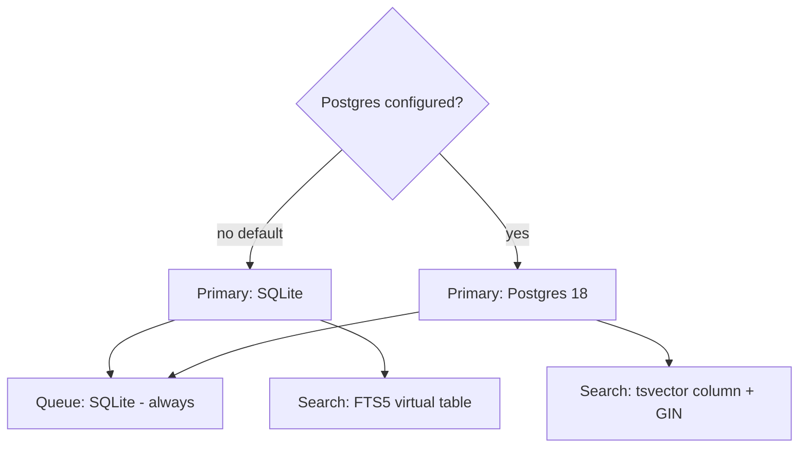
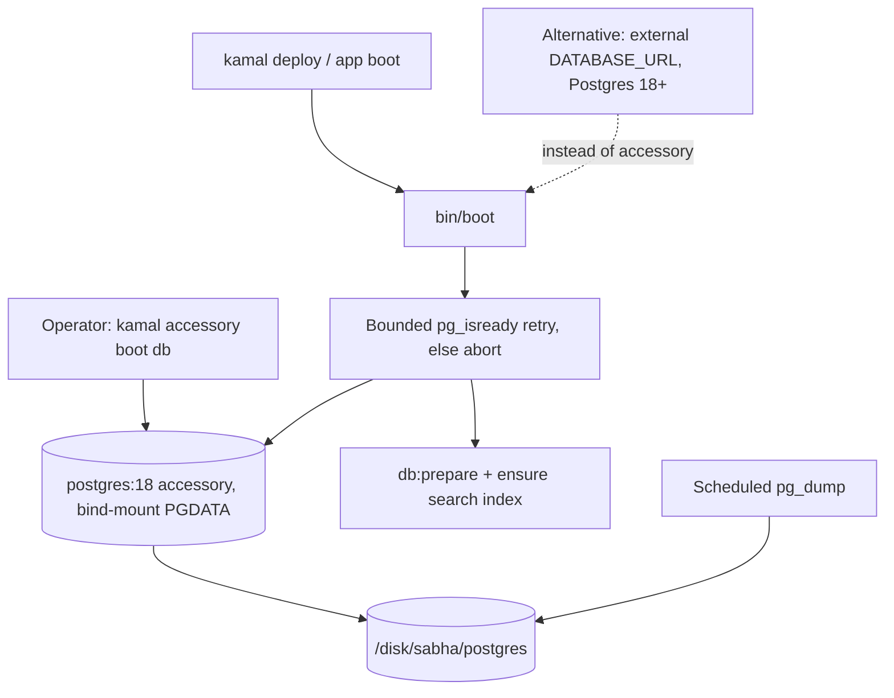

# feat: Self-hosted PostgreSQL 18 option

## Summary

Make PostgreSQL 18 a selectable, CI-verified, deployable alternative to SQLite for a self-hosted install: the driver and client libraries, adapter selection, a self-hosted Postgres CI leg, a bundled `postgres:18` Kamal accessory, a first-party `pg_dump` backup, and operator docs. SQLite stays the zero-config default; an operator who does nothing keeps SQLite.

The application and schema *code* is already Postgres-compatible — that shipped as the foundation `docs/plans/2026-07-21-002-feat-postgres-compatibility-foundation-plan.md` (portable dialect SQL and a dual FTS5/tsvector search backend, verified against a live Postgres 18 during development). This plan is everything that turns that dormant compatibility into a running, operable engine choice — the parts deliberately trimmed from 002 so that self-hosted stayed SQLite-only for now.

---

## Problem Frame

The self-hosted deployment runs everything on SQLite — the right default for the community/hobbyist audience: one file, no server, trivial to operate. But SQLite has a single-writer wall: under concurrent write load on a single node, throughput is bounded by one writer at a time. Operators pushing past that ceiling need a supported escape hatch.

The foundation (002) made the application *able* to run correctly on Postgres — but that ability is currently **dormant**: there is no adapter selection to reach the Postgres code paths, and no CI leg exercising them (they were verified once against a live Postgres 18 in development, not on an ongoing basis). This plan restores that reachability and puts it under CI (U1–U3), then packages and operates Postgres for self-hosters (U4–U6): a batteries-included `postgres:18` sidecar in the Kamal deploy (or an external `DATABASE_URL`), with the backup and restore story a stateful database requires. Because SQLite stays the default, everything here is additive — nothing changes for an operator who doesn't opt in.

Scope is the fresh-install setup choice. Migrating an existing SQLite install's data to Postgres is a separate, harder problem and is deferred (see Open Questions for whether this ordering reaches the audience actually in pain).

---

## Requirements

- R1. `pg` is declared once (base Gemfile, `>= 1.6` for Postgres 18) with both lockfiles in sync; the image and `bin/setup` provide the Postgres client libraries.
- R2. The primary database is selectable — SQLite (default) or Postgres via configuration — with the background-job queue always on SQLite.
- R3. CI runs the self-hosted test suite against Postgres 18 in addition to SQLite.
- R4. The self-host Kamal deploy runs a bundled `postgres:18` accessory with a persistent volume and injected credentials.
- R5. An external `DATABASE_URL` pointing at Postgres ≥18 is supported as an alternative to the bundled accessory.
- R6. The bundled Postgres has a scheduled `pg_dump` backup and a documented restore path.
- R7. SQLite stays the zero-config default; existing SQLite installs are unaffected, and the backup schedule is absent unless the bundled Postgres is in use.
- R8. Operators have documentation covering the setup choice, the Postgres 18 minimum, the bundled-vs-external options, and backup/restore.

---

## Prerequisite (already shipped)

The application-compatibility foundation `docs/plans/2026-07-21-002-feat-postgres-compatibility-foundation-plan.md` is in place: portable dialect SQL (`ILIKE`, `strpos`, `jsonb`, boolean `TRUE`, a `CASE` clamp for `MAX`, and a `DISTINCT`-free `sharing_rooms_with`), the dual full-text-search backend (`Message::SearchIndex` owns the FTS5 shadow table on SQLite and the `tsvector` column on Postgres), and schema-load compatibility (the search index is provisioned outside `db/schema.rb` with a `SchemaDumper` filter, and the SaaS tenant-provisioning hook runs it too). This plan adds no query-portability work — it makes that foundation **reachable** (U2), **proven on an ongoing basis** (U3), and **shippable** (U4–U6).

---

## Key Technical Decisions

- KTD1. **SQLite stays the default; Postgres is strictly opt-in.** Postgres is selected via a configuration signal (`DATABASE_ADAPTER=postgresql` / a `postgres://` `DATABASE_URL`); an operator who does nothing keeps SQLite, and no backup job is scheduled.

- KTD2. **`pg` moves from `Gemfile.saas` into the base `Gemfile`, pinned `>= 1.6`.** `Gemfile.saas` does `eval_gemfile "Gemfile"` and then declares `gem "pg"`; adding `pg` to the base without removing it there double-declares the gem and breaks Bundler, so it moves (not adds). The `>= 1.6` floor is required for Postgres 18's protocol 3.2 (extended cancel-key) — older `pg` breaks against an 18 server. Install `postgresql-client-18` from PGDG in the runtime image (Debian's default client lags server 18, and `pg_dump`/`pg_isready` must not be older than the server they talk to).

- KTD3. **The Postgres primary needs its own schema-cache path.** The committed `db/schema_cache.yml` is dumped from SQLite; its column objects are `ActiveRecord::ConnectionAdapters::SQLite3::*` classes that fail Psych deserialization against a Postgres connection (`db:schema:load`/boot crashes). Point the Postgres primary at a separate, gitignored cache path that is absent by default, so Rails skips it rather than loading the SQLite dump. (Discovered by running the suite against a live Postgres 18.)

- KTD4. **Bundled sidecar pinned to `postgres:18`; minimum 18 everywhere.** The bundled path ships `postgres:18`; an external `DATABASE_URL` must also be ≥18 (the project standardizes on a single major — see 002's untenanted upgrade). The operator either uses the sidecar we ship or brings a current Postgres.

- KTD5. **Backups use `pg_dump` to the persisted volume.** Litestream (the SQLite durability tool used elsewhere in the product) cannot replicate Postgres, so the bundled sidecar needs its own dump-based backup and restore. Because we operate the container, this durability is first-party. For the external `DATABASE_URL` path, the operator's managed Postgres owns its own backups.

- KTD6. **The production database is a stateful accessory with durable, bind-mounted storage.** PGDATA lives on a host bind-mount under the existing durable disk so it survives container replacement and `kamal deploy`, and so it sits where the operator already backs up. Ephemeral PGDATA is silent data loss, guarded against at boot.

---

## High-Level Technical Design

### Connection topology per configuration

The primary adapter is the only thing the choice changes. The queue is always SQLite; the search index target follows the primary (provisioned by the 002 foundation).

### Deploy topology and first-boot ordering

The bundled path adds one stateful accessory alongside the existing app container and AnyCable sidecar. Ordering is operator-sequenced (Kamal accessories have no `depends_on`); the app-side retry backstops the reboot race.

---

## Implementation Units

Two layers. **Enablement** (U1–U3) makes Postgres reachable and CI-verified. **Deployment** (U4–U6) ships and operates it. U1–U3 were built and verified against a live Postgres 18 during 002's development, then reverted to keep self-hosted SQLite-only; they are re-landed here.

### U1. Postgres gem and native client libraries

- Goal: make Postgres installable in dev, CI, and the production image without breaking the SaaS build. (R1)
- Dependencies: none (the 002 dialect fixes are already in place).
- Files:
  - `Gemfile` — add `gem "pg", ">= 1.6"` under Drivers.
  - `Gemfile.saas` — remove the now-duplicate `gem "pg"` (it becomes inherited from the base via `eval_gemfile`).
  - `Gemfile.lock`, `Gemfile.saas.lock` — resync via `bundle install` and `BUNDLE_GEMFILE=Gemfile.saas bundle install`. (The SaaS lock's resolved graph is unchanged — only the declaration moves.)
  - `Dockerfile` — add `libpq-dev` to the build stage and `libpq5` + the PGDG `postgresql-client-18` to the runtime stage.
  - `bin/setup` — install the libpq client libraries in the non-SaaS path too (currently SaaS-gated); route the `--reset` Postgres branch through `db:drop db:create db:schema:load db:ensure_search_index`, not `db:migrate:reset` — a from-scratch migrate fails on Postgres at the initial FTS5 migration, and the storage `rm -rf` only clears SQLite files.
- Approach: `pg` becomes a base dependency shared by self-hosted and SaaS. Keep boot (`bin/boot`) and CI (U3) on `db:prepare` so `db:migrate` from scratch is never invoked against Postgres.
- Patterns to follow: the existing SaaS libpq install lines in `bin/setup`; the SaaS Dockerfile's Postgres client handling.
- Test scenarios: none — dependency/build wiring, exercised by the Postgres CI leg in U3.
- Verification: `bundle install` and `BUNDLE_GEMFILE=Gemfile.saas bundle install` both succeed with no duplicate-gem error; the image builds; `bin/rails runner "require 'pg'"` loads the driver.

### U2. Database adapter selection

- Goal: resolve the primary database to SQLite (default) or Postgres from configuration, with the queue always on SQLite. (R2)
- Dependencies: U1.
- Files:
  - `lib/sabha.rb` — add `Sabha.postgresql?`: true when `DATABASE_ADAPTER=postgresql`, or (convenience) when `DATABASE_ADAPTER` is unset and `DATABASE_URL` is `postgres://…`; false in SaaS mode. If both are set, `DATABASE_ADAPTER` wins. Not memoized (tests flip the env).
  - `config/database.yml` — add an `elsif Sabha.postgresql?` branch selecting the Postgres config file.
  - `config/database.postgresql.yml` — new. Primary on `postgresql` (from `DATABASE_URL`) with a `schema_cache_path` pointing at a gitignored Postgres-only cache (KTD3); `queue` on `sqlite3` at the queue file with `migrations_paths: db/queue_migrate`. Omits the SQLite-only pool keys (`timeout`, `retries`, `default_transaction_mode`).
  - `.gitignore` — ignore the Postgres schema-cache file.
  - `test/config/database_selection_test.rb` — render each mode's config and assert the resolved adapters.
- Approach: the `queue` connection is copied verbatim from the SQLite config so the queue stays a local file in both modes. The Postgres primary reads `DATABASE_URL` and carries the distinct `schema_cache_path` so the SQLite-dumped `db/schema_cache.yml` is never deserialized against Postgres.
- Patterns to follow: `config/database.yml`'s existing SaaS-vs-self-hosted file switch; the untenanted Postgres block in `saas/config/database.yml`.
- Test scenarios:
  - With no Postgres signal, the resolved primary adapter is `sqlite3` (default preserved).
  - `DATABASE_ADAPTER=postgresql` alone, and a `postgres://` `DATABASE_URL` alone, each resolve the primary to `postgresql` while the `queue` adapter stays `sqlite3`.
  - `DATABASE_ADAPTER` wins over a conflicting `DATABASE_URL`.
  - The Postgres config contains none of the SQLite-only pool keys.
  - Test file: `test/config/database_selection_test.rb`.
- Verification: `DATABASE_ADAPTER=postgresql bin/rails runner "puts ActiveRecord::Base.connection.adapter_name"` prints `PostgreSQL`; the resolved `queue` config stays `sqlite3`; a fresh `db:prepare` succeeds against Postgres 18 (no schema_cache crash).

### U3. Self-hosted Postgres 18 CI leg

- Goal: prove the self-hosted suite passes on Postgres 18, not just SQLite — turning the foundation's dormant Postgres paths into continuously verified ones. (R3)
- Dependencies: U1, U2.
- Files:
  - `.github/workflows/test.yml` — add a self-hosted job with a `postgres:18` service, `DATABASE_ADAPTER=postgresql` + a `DATABASE_URL` pointed at it, running `db:prepare` then the suite.
  - `config/ci.rb` — the Postgres leg is GitHub-Actions-only. Do not add a hard Postgres step to the local `bin/ci` runner (it has no service containers and would break contributors without a local Postgres); if surfaced there at all, gate it to skip when no local Postgres is reachable.
- Approach: keep the existing SQLite self-hosted leg and add a parallel Postgres leg. Reuse the Postgres service-container pattern already present in the SaaS CI job. This leg is what enforces the 002 dialect/search fixes against real Postgres on every change; without it those Postgres branches ship untested.
- Patterns to follow: the SaaS job's Postgres service definition in `.github/workflows/test.yml`.
- Test scenarios: none — CI configuration; it runs the existing suite against Postgres.
- Verification: both self-hosted CI legs (SQLite and Postgres 18) run and pass on a pull request.

### U4. Bundled postgres:18 Kamal accessory

- Goal: run Postgres 18 as a self-host deploy accessory with durable storage and injected credentials; support an external `DATABASE_URL` as the alternative. (R4, R5)
- Dependencies: U1, U2.
- Files:
  - `config/deploy.yml` — add a `db` accessory on `postgres:18`: a **host bind-mount** for PGDATA under the durable disk (e.g. `/disk/sabha/postgres:/var/lib/postgresql/18/docker`), `POSTGRES_USER`/`POSTGRES_DB` (clear) + `POSTGRES_PASSWORD` (secret), an explicit `shm_size` (the 64MB `/dev/shm` default triggers "could not resize shared memory segment" under parallel query), a network alias, and **no published host port** (reachable only on the docker network). Derive the web role's `DATABASE_URL` from the same `POSTGRES_PASSWORD` secret so the two can't drift.
  - `bin/boot` — when the primary is Postgres, wait for it with a **bounded** connection retry (`pg_isready`/connect, capped attempts) that still `abort`s on exhaustion so a real misconfig fails the deploy instead of hanging; mirror the SaaS `mountpoint -q` guard to refuse booting if PGDATA is not a real mount (ephemeral PGDATA is silent data loss).
  - Secrets/`.env` and the deploy runbook (U6).
- Approach: mirror the `anycable` accessory shape. Ordering is operator-sequenced, not `depends_on`: on a fresh install the operator runs `kamal accessory boot db` before `kamal deploy`; the app-side bounded retry only backstops the accessory-reboot race. The `postgres` image binds only a unix socket during `initdb` and opens TCP only after init completes, so a connect retry can never reach a half-initialized DB. Pre-create the bind-mount directory empty and owned for the image's uid/gid (999) or `initdb` refuses to start. Constrain a co-located Postgres's memory since it shares the single node with Rails and AnyCable. The external path is the operator setting `DATABASE_URL` (Postgres ≥18) and not booting the accessory; require `sslmode=require` (or `verify-full`) on an off-box `DATABASE_URL` — libpq defaults to `prefer`, which silently allows a plaintext, unverified connection.
- Rollback:
  - Setup-time failure (bad volume/creds/OOM, no live data yet): remove the Postgres signal, leave the `db` accessory unbooted, redeploy on SQLite — zero data loss because it's a fresh install.
  - Post-data failure (Postgres has held live data): there is no fall-back to SQLite (that path is deferred and no reverse path exists). Recovery is fix-the-accessory or restore from a `pg_dump` (U5) into a fresh volume. State this so an operator doesn't read "opt-in" as "reversible."
- Patterns to follow: the `anycable` accessory and `/disk/sabha` bind-mount in `config/deploy.yml`; `bin/boot`'s `db:prepare` abort and SaaS `mountpoint` guard.
- Test scenarios: none — deploy configuration. Application behavior on Postgres is covered by the U3 CI leg; the accessory is validated by a manual deploy smoke.
- Verification: `kamal accessory boot db` starts Postgres 18 on the bind-mount; `kamal app boot` runs `db:prepare` against it; a real DB probe succeeds (`pg_isready`, or `bin/rails runner "ActiveRecord::Base.connection.select_value('SELECT 1')"`) — `/up` is liveness-only and stays green even when Postgres is down, so it is not proof; PGDATA survives an accessory reboot and a `kamal deploy`.

### U5. First-party pg_dump backup and restore

- Goal: give the bundled Postgres a scheduled backup and a documented restore. (R6, R7)
- Dependencies: U4.
- Files:
  - New `bin/backup-postgres` (or a rake task under `lib/tasks/`) that runs `pg_dump` to the durable bind-mount and prunes beyond a retention window. It authenticates via `PGPASSWORD`/`.pgpass` (never a password in argv, visible via `ps`) and writes each dump `0600`, owned by the deploy user.
  - `config/recurring.yml` — schedule the backup, gated (ERB, like the file's existing `Sabha.saas?` guards) to run only when the primary is the bundled Postgres. Skip it for SQLite and for the external `DATABASE_URL` path, where managed Postgres owns its own backups — otherwise the SQLite default runs a perpetually-failing job.
  - Restore steps documented in U6.
- Approach: `pg_dump` (client shipped by U1) writes a compressed dump to the durable bind-mount, then **self-verifies** it before counting success — assert the dump is non-empty and that `pg_restore --list` parses it — and exits non-zero + logs on failure, mirroring `bin/backup-databases`'s `PRAGMA quick_check`-then-nonzero-exit pattern. Old dumps are pruned by count/age; record a last-success timestamp so staleness is detectable. The dump holds message bodies, user PII, and password digests in readable form, so it stays owner-only on the bind-mount; consider at-rest encryption where the disk isn't already encrypted. Restore is `pg_restore`/`psql` into a target database.
- Restore drill: the default is a **documented runbook** restore into a scratch database with a row-count check (this satisfies R6). An automated scheduled drill is optional; if added, it must **drop the throwaway database immediately** after the check so it never leaves a second full copy of production data around.
- Patterns to follow: `bin/backup-databases` (integrity-check then non-zero exit); `config/recurring.yml` for scheduling.
- Test scenarios:
  - The backup wrapper builds the correct dump path and invokes the dump for the configured database (shell call stubbed).
  - A dump that fails the integrity check (empty or unparseable) makes the task exit non-zero and log, not silently succeed.
  - Retention pruning deletes dumps beyond the configured window and keeps the newest.
  - Test file: `test/lib/backup_postgres_test.rb` (path/retention/integrity-branch logic with the external command stubbed).
- Verification: running the backup produces a verified dump on the bind-mount and records success; a runbook restore reproduces the data into a scratch database with matching row counts; the backup schedule is present only under the bundled-Postgres path (absent on a SQLite install).

### U6. Operator and setup documentation

- Goal: document the setup choice, the version minimum, the deploy options, and backup/restore. (R8)
- Dependencies: U4, U5.
- Files:
  - `README.md` and/or a new `docs/self-hosting/postgres.md` — the operator-facing guide.
  - A brief note in `CLAUDE.md`/`AGENTS.md` recording that self-hosted now supports Postgres (kept factual and short).
- Approach: cover how to select Postgres at setup, the Postgres 18 minimum, the bundled sidecar vs external `DATABASE_URL`, the credentials/secrets to set, and backup/restore. Include the deploy sequence (`kamal accessory boot db` before `kamal deploy`), the password-rotation caveat (`ALTER ROLE`, not just editing the secret — `postgres:18` honors `POSTGRES_PASSWORD` only at first `initdb`), the required `sslmode` for an external `DATABASE_URL`, how to check Postgres health (a real DB probe, since `/up` stays green when the DB is down), and the one user-visible search difference (a stopword-only query matches on SQLite but not Postgres). State explicitly that migrating an existing SQLite install's data to Postgres is not covered here (deferred).
- Patterns to follow: the existing self-hosting/deploy documentation shape.
- Test scenarios: none — documentation.
- Verification: a fresh install following the doc reaches a working Postgres 18 instance with backups scheduled.

---

## Open Questions

- OQ1. **Does the fresh-install scope relieve the actual pain?** The Problem Frame locates the single-writer wall in *grown* installs, but this feature serves *fresh* installs, and the SQLite→Postgres data-migration path is deferred. So the audience in pain can't reach the feature, and fresh installers — the SQLite-default hobbyist audience — are unlikely to foresee the need and opt into Postgres at day zero. Decision: reframe this as engine-choice groundwork that doesn't relieve today's pain, or resequence so the migration/upgrade path (the real pain-reliever) isn't deferred behind it.
- OQ2. **Is the addressable audience large enough to justify the permanent cost?** The dual-adapter test/maintenance tax (dialect + dual search) already shipped in 002 and is a standing cost; this plan adds first-party Postgres durability and a CI leg on top. The addressable set is installs that both exceed SQLite's write ceiling *and* chose Postgres at fresh setup — plausibly small for this audience, and the write-ceiling is asserted rather than evidenced on target hardware. Decision: set an explicit adoption bar, or a concrete signal that the wall is hit in practice, before committing to the deployment surface.

---

## Risks & Dependencies

- **The foundation's Postgres paths ship untested until U3.** 002's dialect and dual-search code carries Postgres branches that are currently dormant (no adapter selection reaches them; no CI exercises them). U2 makes them reachable and U3 puts them under CI — until both land, a regression in the Postgres SQL would go unnoticed. This is the first thing to re-land.
- **Schema-cache adapter mismatch (KTD3).** The committed `db/schema_cache.yml` is SQLite-shaped and crashes a Postgres boot; U2's separate `schema_cache_path` is the fix and must not regress.
- **Durability is app-owned for the bundled sidecar.** A stateful container plus its verified backup is a new operational responsibility; U4 (bind-mount + mount guard) and U5 (self-verifying backup + restore drill) are the mitigations, and it is the single largest chunk of new work.
- **No reverse path once Postgres holds live data.** Opt-in is not reversible: there is no Postgres→SQLite (or SQLite→Postgres) data path in scope, so post-data recovery is fix-the-accessory or restore-from-`pg_dump`.
- **Password rotation footgun.** `postgres:18` honors `POSTGRES_PASSWORD` only at first `initdb`; changing the secret later breaks auth silently. Rotation requires `ALTER ROLE ... PASSWORD` inside Postgres — documented in U6.
- **OOM on a co-located node.** Postgres shares the single host with Rails and AnyCable; constrain its memory and set an explicit `shm_size` (U4) or it can fail under load.
- **Version compatibility.** The `pg` gem must work with the pinned Rails git ref and Postgres 18; `pg_dump`/`psql` must not be older than the server. U1 pins `pg >= 1.6` and installs `postgresql-client-18` from PGDG.

---

## System-Wide Impact

- **Test matrix doubles for self-hosted** — SQLite and Postgres legs both run (U3). Every schema/search/SQL change must pass on both.
- **Deploy topology gains a stateful accessory** — the bundled `postgres:18` container and its bind-mounted volume, with first-party backup/restore, where the self-host deploy previously had only the app container and the AnyCable sidecar.
- **Health signal stays liveness-only** — `/up` (Rails' default) does not touch the database, so it must not be repurposed as a Postgres readiness gate: a DB-gated `/up` would flap the container and proxy on any blip and could make the app undeployable during the first-boot race. Postgres readiness is surfaced separately (U4), not folded into `/up`.

---

## Scope Boundaries

### Non-goals

- The application Postgres-compatibility work (dialect fixes, dual search, schema-load compatibility) — that shipped as the foundation `docs/plans/2026-07-21-002-feat-postgres-compatibility-foundation-plan.md`.
- SaaS / multi-tenant mode and the `sabha_cloud` managed-hosting path (docker-compose, Litestream) — out of scope.
- Making Postgres the default — SQLite remains the default experience.

### Deferred to Follow-Up Work

- SQLite → Postgres data migration for an existing install — this plan ships the engine option for fresh installs, not a live-data move (its Postgres index step must be a Postgres-only migration with `disable_ddl_transaction!` + a concurrent GIN build + a batched backfill through `plain_text_body`, not the empty-table ensure step).
- First-party SQLite backup automation for self-hosted installs — a pre-existing gap (the in-repo backup script targets SaaS tenant paths only, and Litestream lives in `sabha_cloud`). Worth closing, but independent of this change.

---

## Alternatives Considered

- **External `DATABASE_URL` only, no bundled sidecar.** Cheaper (pure config, durability offloaded to the operator's managed Postgres), but rejected — bundling `postgres:18` gives self-hosters a batteries-included path that matches the codebase's precedent of running auxiliary services as Kamal accessories (the `anycable` accessory). The external URL remains supported (R5).
- **Leave adapter selection and the CI leg in the foundation (002).** They were originally there, but 002 was trimmed to keep self-hosted SQLite-only; parking the whole engine-choice surface (selection + CI + deployment) in one plan keeps the shipped foundation honest about what it actually did (portable code, not a runnable option).

---

## Sources / Research

- `Gemfile` / `Gemfile.saas` (`eval_gemfile "Gemfile"` + `gem "pg"`) — the double-declaration constraint behind KTD2.
- `config/database.yml`, `config/database.sqlite.yml`, `saas/config/database.yml` — the config switch and the untenanted Postgres block U2 mirrors.
- `db/schema_cache.yml` — the SQLite-dumped cache behind KTD3.
- `.github/workflows/test.yml` — the SaaS Postgres service pattern U3's self-hosted leg reuses.
- `config/deploy.yml` — the `anycable` accessory shape and the `/disk/sabha` bind-mount the `db` accessory mirrors.
- `bin/boot` — the `db:prepare` abort and the SaaS `mountpoint` guard the Postgres path reuses.
- `bin/backup-databases` — the integrity-check-then-non-zero-exit pattern U5 follows.
- `config/recurring.yml` — where the backup schedule lands and the `Sabha.saas?` ERB-guard precedent for gating it.
- `Dockerfile` — the `HEALTHCHECK` that curls `/up` (liveness-only), and where `postgresql-client-18` is installed.
- Foundation plan `docs/plans/2026-07-21-002-feat-postgres-compatibility-foundation-plan.md` — the portable dialect SQL and dual search backend this option makes reachable, verified, and shippable.
