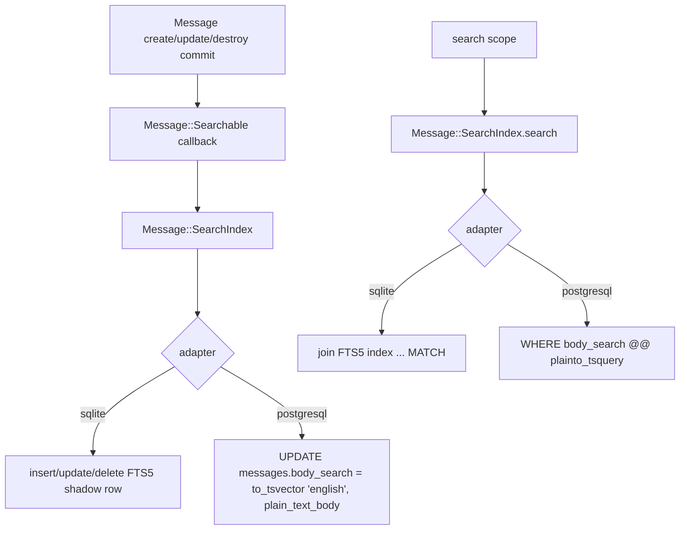
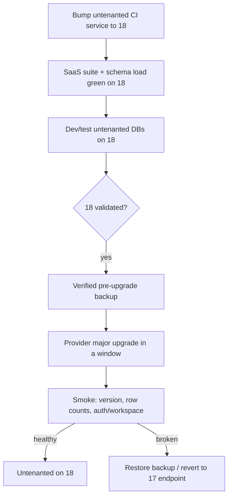

# feat: Make the app Postgres-compatible and standardize the SaaS untenanted DB on Postgres 18

## Summary

Make the application's schema and code run correctly on PostgreSQL — portable dialect SQL, a dual full-text-search backend, and schema-load compatibility — so a future Postgres option is a deployment change, not a code change. In the same effort, move the already-Postgres SaaS untenanted database from 17 to 18 so the whole project runs a single major.

SQLite stays the default engine, and self-hosted stays SQLite-only for now: this plan makes the code *able* to run on Postgres and keeps that ability current, but does not turn Postgres into a selectable/deployable engine. That enablement — the `pg` gem in the base bundle, adapter selection, the self-hosted Postgres CI leg, the bundled sidecar, and backups — lives in `docs/plans/2026-07-21-001-feat-selfhost-postgres-option-plan.md`.

**Status note:** the compatibility work shipped and was verified against a live Postgres 18 during development (the full self-hosted suite green on Postgres 18, plus the SaaS suite on the 18 untenanted service). But because the self-hosted adapter selection and CI leg were trimmed into 001, the Postgres code paths ship **dormant and without ongoing CI** — they will regress silently until 001's U2/U3 land.

---

## Problem Frame

Two tracks, one goal: the project should run correctly on a single Postgres major (18).

**Application compatibility.** The app runs on SQLite everywhere except the SaaS untenanted database. The real coupling to SQLite is small and specific: FTS5 full-text search, a handful of SQLite-dialect SQL sites, and the FTS5 virtual-table line in `db/schema.rb`. This plan makes those portable so the code is Postgres-ready. It does **not** add the machinery that selects or ships Postgres for self-hosted (that is 001) — so the Postgres paths are exercised by development-time verification here, and put under continuous CI only when 001's self-hosted Postgres leg lands.

**Standardizing on one major.** The one Postgres the project already runs in production — the SaaS untenanted database (global identities, workspaces, sessions) — sat on major 17. Moving it to 18 alongside the compatibility work means CI, dev, and production don't split across versions once the self-hosted Postgres option (001) ships on 18.

Migrating an existing SQLite install's *data* to Postgres is a separate, harder problem and is deferred; this plan makes the code compatible, not the data portable.

---

## Requirements

### Application Postgres compatibility

- R1. Application SQL behaves correctly on Postgres — no dialect errors and no silent case-sensitivity regressions in name/room/member matching.
- R2. `bin/rails db:prepare` succeeds against a fresh Postgres 18 (schema loads without the FTS5 virtual table aborting it).
- R3. Full-text search works on both engines, with each engine's index kept current on message create, update, and destroy.

### SaaS untenanted standardization on 18

- R4. CI runs the SaaS untenanted suite against Postgres 18 (service bumped from 17).
- R5. Local dev and test untenanted databases run Postgres 18 for parity.
- R6. Production untenanted Postgres is upgraded 17 → 18 with a verified pre-upgrade backup, a defined cutover, and a rollback path — no data loss.

---

## Key Technical Decisions

- KTD1. **Portability without enablement.** This plan makes the code *able* to run on Postgres; it does not add adapter selection, the `pg` gem in the base bundle, or a self-hosted Postgres CI leg — those live in 001. SQLite stays the default and the only self-hosted engine. Nothing here flips an existing install's engine.

- KTD2. **Dual, asymmetric full-text search, owned by `Message::SearchIndex`.** SQLite keeps its FTS5 virtual table. Postgres gets a `tsvector` column on `messages` plus a GIN index. Both are provisioned, maintained, and queried through one object — `Message::SearchIndex` — so every engine-specific piece of search (the `#postgresql?` branch, the `to_tsvector('english', …)` write, the FTS5 `MATCH` vs `@@ plainto_tsquery` query) lives in one place; `Message::Searchable` just declares the callbacks and the scope and delegates. Use the two-argument `to_tsvector('english', …)` form (it is `IMMUTABLE` and safe for indexing). Every search caller pre-strips non-word characters before calling `search`, so FTS5 operators and quoted phrases never reach either engine and `plainto_tsquery` is equivalent to `websearch_to_tsquery` for that input. The one surviving behavioral divergence is stopwords: FTS5's porter tokenizer keeps them, Postgres's `english` config strips them, so a stopword-only query matches on SQLite and returns nothing on Postgres.

- KTD3. **The search index is provisioned by an idempotent, adapter-aware step — not by a dated migration and not by the shared `schema.rb`.** A single `db/schema.rb` cannot hold both an FTS5 virtual table and a Postgres `tsvector`/GIN column, so the FTS5 `create_virtual_table` line is removed from `schema.rb`. And a normal dated migration would never run on a fresh install: `db:schema:load` stamps `schema_migrations` up to `schema.rb`'s version, so any index migration at or below it is marked already-applied and silently skipped. Instead an `Message::SearchIndex.ensure!` step (adapter-branched, a strict no-op when the index already exists) runs wherever a self-hosted database is provisioned — enhanced onto `db:prepare`, `db:schema:load`, `db:setup`, and `db:reset` (covering boot, CI, and the reset/schema-load commands a developer runs directly), and in the test schema load. The global `db:*` hooks are **gated off in SaaS**: its models are tenanted, so there is no `Message` connection during a global task and production has no default tenant (`default_tenant` is set only in dev/test), which would crash boot; SaaS instead provisions each tenant's index in `Workspace.create_with_database!`, since each tenant DB is schema-loaded from the same `schema.rb`. A `SchemaDumper` filter strips the engine-specific search DDL from every `schema.rb` dump so an ordinary `db:migrate` cannot push either engine's index back into the shared schema.

- KTD4. **Dialect fixes are minimal and adapter-conditional, not a query-abstraction layer.** Arel `matches(case_sensitive: false)` (renders `ILIKE` on Postgres, `LIKE` on SQLite — a bare `LIKE` is case-sensitive on Postgres, a silent under-match), `strpos`/`instr` per adapter, a `jsonb` accessor for the one JSON read, boolean `TRUE` literals, a portable `CASE` clamp in place of the scalar `MAX(x, 0)` (SQLite has no `GREATEST`; Postgres has no scalar `MAX`), and a subquery in place of `DISTINCT` + `ORDER BY LOWER(name)` (Postgres rejects an ordered expression missing from the `SELECT DISTINCT` list). No new abstraction for a handful of call sites.

- KTD5. **The production untenanted Postgres is external/managed, so its 17→18 upgrade uses the provider's major-version path — not a Kamal image bump.** `config/deploy.multitenant.yml` runs no Postgres accessory; the database is reached through `UNTENANTED_DATABASE_URL`. Prove 18 in CI and staging before the production cutover (see Open Questions for the provider-dependent mechanism).

---

## High-Level Technical Design

### Dual search backend — write and query paths

Both paths go through `Message::SearchIndex`; only the index target and the query operator differ by adapter.

### Untenanted 17 → 18 rollout

Validate on 18 everywhere non-production, then cut production over behind a backup and a rollback gate.

---

## Implementation Units

Two tracks. **Application compatibility** (U1–U3) makes the app run correctly on Postgres. **Untenanted standardization** (U4–U6) moves the existing Postgres to 18. They are independent and can proceed in parallel.

### U1. SQLite-dialect SQL fixes for Postgres correctness

- Goal: eliminate the dialect-specific SQL that errors or silently under-matches on Postgres. (R1)
- Dependencies: none.
- Files:
  - `app/models/user.rb` — `by_first_name` (`instr`→`strpos` per adapter); `filtered_by` (`LIKE`→Arel `matches`); `sharing_rooms_with` (`joins.distinct`→`where(id: subquery)`).
  - `app/models/room.rb` — `matching` (`LIKE`→Arel `matches`).
  - `app/controllers/accounts/users_controller.rb` — people/bots search (`LIKE`→Arel `matches`).
  - `app/models/inbox/threads_query.rb` — raw `active = 1`→`active = TRUE`.
  - `app/models/notification.rb`, `app/models/message/unreadable.rb` — scalar `MAX(x, 0)`→portable `CASE` clamp.
  - `lib/slack/users_importer.rb` — `json_extract`→`jsonb` accessor over the `preferences` text column, per adapter.
  - Tests: `test/models/user_test.rb`, `test/models/room_test.rb`, `test/models/inbox/threads_query_test.rb` (new), `test/lib/slack/importer_test.rb`.
- Approach: prefer adapter-agnostic Arel/AR constructs; branch on `connection.adapter_name` only where no portable form exists. The `MAX`→`CASE` and `DISTINCT`→subquery fixes were surfaced by running the full suite against a live Postgres 18 (not enumerated up front) — the value of the dual-adapter run.
- Patterns to follow: `app/models/membership/unreadable.rb` already uses `active = TRUE`.
- Test scenarios: case-insensitive member/room search matches mixed-case names; `by_first_name` groups multi-word names under the first token and single-word names with no split; the Slack importer finds a user by `slack_user_id`; the inbox threads query excludes deactivated threads.
- Verification: the search/scope tests pass on both SQLite and (development-verified) Postgres 18; ongoing Postgres coverage arrives with 001's CI leg.

### U2. Adapter-aware search-index provisioning and schema-load compatibility

- Goal: make `db:prepare` succeed on both engines and ensure each engine's search index exists — without a dated migration and without breaking existing SQLite installs (self-hosted or SaaS tenant). (R2, R3)
- Dependencies: none.
- Files:
  - `db/schema.rb` — remove the FTS5 `create_virtual_table "message_search_index", …` line so a fresh Postgres `db:schema:load` completes.
  - `app/models/message/search_index.rb` — `Message::SearchIndex.ensure!`, adapter-branched and idempotent (catalog-guarded: `sqlite_master` for the FTS5 table, `column_exists?`/`if_not_exists` for the Postgres column + GIN index). No data backfill — a fresh install's `messages` is empty, and a populated-table cross-engine migration is deferred (it must go through `plain_text_body` in Ruby, not raw HTML in SQL).
  - `lib/tasks/search_index.rake` — a `db:ensure_search_index` task, enhanced onto the self-hosted schema-setup entry points (`db:prepare`/`db:schema:load`/`db:setup`/`db:reset`) and gated off in SaaS (tenant-less `Message.connection` would crash boot; SaaS provisions per tenant).
  - `config/initializers/search_index_schema_dumper.rb` — a `SchemaDumper` filter stripping the engine-specific search DDL from dumps.
  - `test/test_helper.rb` — invoke the ensure step after `maintain_test_schema!` (which reloads via `load_schema`, not `db:prepare`).
  - `saas/app/models/workspace.rb` — run the ensure step inside `create_with_database!`'s tenant context, since each new tenant SQLite DB is schema-loaded from the same `schema.rb` (which no longer carries the FTS5 line).
  - `test/models/message/search_index_test.rb` (new).
- Approach: the search index is intentionally out of the shared `schema.rb` and not a version-gated migration (KTD3). The ensure step is the single source of truth and a strict no-op when the index already exists — this is what protects existing SQLite installs (recreating the FTS5 table errors).
- Execution note: the SaaS tenant-provisioning hook was surfaced by the SaaS suite failing on `no such table: message_search_index` after the `schema.rb` change — schema edits are shared across self-hosted and SaaS tenants.
- Test scenarios: fresh `db:prepare` completes on Postgres 18 (no `fts5` access-method error); after provisioning a Postgres install has `body_search` + a GIN index and a SQLite install has the FTS5 table; re-running the ensure step is a no-op (no double-index); `git diff db/schema.rb` shows no search DDL after `db:migrate` on either engine.
- Verification: `bin/rails db:prepare` succeeds on a fresh Postgres 18 and on SQLite; SaaS tenant creation provisions the index; the SchemaDumper filter strips the DDL on both engines.

### U3. Dual-backend Message::Searchable

- Goal: make the search query and index-maintenance callbacks correct on both engines. (R3)
- Dependencies: U2.
- Files:
  - `app/models/message/searchable.rb` — the concern declares the three `after_*_commit` callbacks (named, separate) and the `search` scope, and delegates the mechanics to `Message::SearchIndex`.
  - `app/models/message/search_index.rb` — `add`/`refresh`/`remove` (maintenance) and `search(relation, query)` (query) alongside the provisioning from U2.
  - `test/models/message/searchable_test.rb`.
- Approach: on SQLite keep today's behavior (FTS5 shadow table + `MATCH`); on Postgres the callbacks write `to_tsvector('english', plain_text_body)` into `body_search` and the scope filters `body_search @@ plainto_tsquery('english', ?)`. The `remove` step is a no-op on Postgres (the tsvector dies with the row). Keep the `.ordered` result contract.
- Patterns to follow: AGENTS.md's rule that `after_*_commit` callbacks stay named and separate.
- Test scenarios: create/update/destroy round-trips are reflected in search on both adapters; stemming (`run` matches `running`); the documented stopword divergence (a stopword-only query matches on SQLite, not Postgres — asserted per adapter); results honor `.ordered`.
- Verification: the searchable test suite passes on SQLite and (development-verified) Postgres 18.

### U4. SaaS untenanted Postgres 18: CI and app compatibility

- Goal: prove the SaaS application runs on Postgres 18 by running the full untenanted suite against it. (R4)
- Dependencies: none.
- Files:
  - `.github/workflows/test.yml` — change the untenanted `services.postgres.image` from `postgres:17` to `postgres:18`; the `UNTENANTED_TEST_DATABASE_URL` values are unchanged.
- Approach: the SaaS CI job's Postgres service is the compatibility harness — bumping the image and running the existing suite exercises schema load, migrations, and every untenanted query against 18. `online_migrations` continues to run in the migration path; watch for new advisories on 18.
- Test scenarios: the SaaS suite (`SAAS=true bin/rails test saas/test/`) passes against the Postgres 18 service; `db:schema:load` of `saas/db/untenanted_schema.rb` succeeds on a fresh Postgres 18.
- Verification: the SaaS CI leg is green on `postgres:18`; no `online_migrations` advisories introduced by the version change.

### U5. SaaS untenanted developer and local environment parity

- Goal: bring local dev and test untenanted databases to Postgres 18 so contributors match CI and production. (R5)
- Dependencies: U4.
- Files:
  - `docs/multi-tenant/postgres-untenanted.md`, `docs/multi-tenant/DEVELOPMENT.md` — state the Postgres 18 standard for the local untenanted database.
- Approach: the untenanted dev/test databases run on the developer's local Postgres server, so parity is a documentation change. Call out that a developer on Postgres 17 locally should upgrade to match.
- Verification: a fresh SaaS dev setup on Postgres 18 runs `SAAS=true bin/rails db:migrate:primary` and the suite cleanly.

### U6. SaaS untenanted production upgrade

- Goal: upgrade the managed production untenanted Postgres from 17 to 18 safely, with backup and rollback. (R6)
- Dependencies: U4, U5.
- Files:
  - `docs/multi-tenant/postgres-18-upgrade.md` (new) — the cutover steps, verification queries, and rollback, written provider-agnostic (managed in-place upgrade or dump + restore into a fresh 18 instance).
  - `docs/multi-tenant/DEPLOYMENT.md` — link the runbook.
  - No application code change; `UNTENANTED_DATABASE_URL` may repoint if the provider issues a new endpoint.
- Approach: take and verify a pre-upgrade backup, run the upgrade in a maintenance window, run post-upgrade smoke checks before removing the fallback, and keep the 17 instance/backup available until 18 is confirmed healthy. Because the app is already 18-validated in CI (U4), the production step carries only data and availability risk.
- Execution note: the runbook is written; the actual cutover mechanism depends on the provider (Open Questions) and the cutover itself is an operations task, not a code change.
- Verification: `SELECT version()` reports 18; row counts for `global_identities`, `workspaces`, `workspace_memberships`, `global_sessions` match the pre-upgrade snapshot; a login → workspace-membership → session smoke path works in production; the 17 instance/backup is retained until this passes.

---

## Open Questions

- OQ1. **Production untenanted provider and upgrade mechanism.** Where does `UNTENANTED_DATABASE_URL` point — a managed service with an in-place major upgrade, or a self-run Postgres instance needing `pg_upgrade` or dump + restore? This determines U6's exact cutover, downtime window, and rollback shape. `docs/multi-tenant/DEPLOYMENT.md` mentions PlanetScale Postgres illustratively; confirm the real provider before scheduling.
- OQ2. **When does 001's self-hosted Postgres CI leg land?** Until it does, the U1–U3 Postgres branches ship dormant and unverified by CI (verified once against a live Postgres 18 in development). Decide whether that CI leg is a near-term follow-up or waits for the full 001 deployment.

---

## Scope Boundaries

### Non-goals

- The self-hosted Postgres *option* — the `pg` gem in the base bundle, adapter selection, the self-hosted Postgres CI leg, the bundled sidecar, backups, and operator docs. That is `docs/plans/2026-07-21-001-feat-selfhost-postgres-option-plan.md`.
- Making Postgres the default — SQLite remains the default experience.
- The per-workspace tenanted SQLite databases — the search-index provisioning (U2) touches their creation, but they stay SQLite; the untenanted track here is the shared Postgres only.
- MySQL or any adapter other than SQLite and Postgres.

### Deferred to Follow-Up Work

- SQLite → Postgres data migration for an existing install. When built, its Postgres index step must be a Postgres-only migration using `disable_ddl_transaction!` + a concurrent GIN build + a batched backfill through `plain_text_body` — the U2 ensure step is empty-table-only.
- Wiring `online_migrations` (Postgres migration safety) into the self-hosted path; it is currently SaaS-only.
- Adopting Postgres 18-specific features — this plan lands on 18, it does not optimize for it.

---

## Alternatives Considered

- **Generated `tsvector` column instead of callback-maintained.** A `GENERATED ALWAYS AS (to_tsvector('english', plain_text_body)) STORED` column would let Postgres self-maintain the index, but `plain_text_body` is derived in Ruby from the Action Text rich body and is not a column on `messages`; the generated form would require adding and callback-maintaining a plain-text column. Reusing the existing callback seam is the smaller change.
- **A query-abstraction layer over the dialect differences.** Rejected as over-engineering for a handful of call sites (KTD4).
- **Keep the search index in `schema.rb` behind an adapter conditional.** Rejected: `db:schema:dump` regenerates the file and clobbers the conditional, and the shared file still can't declare both engines' index without one breaking the other's load (KTD3).

---

## Risks & Dependencies

- **Postgres paths ship dormant and CI-unverified (until 001).** The dialect and dual-search Postgres branches are reachable only through adapter selection (001's U2) and exercised only by the self-hosted Postgres CI leg (001's U3), both deferred. Development-time verification against a live Postgres 18 is the only proof they work today; a regression would go unnoticed until 001 lands. This is the sharpest coordination risk.
- **Shared `schema.rb` change affects SaaS tenants.** Removing the FTS5 line from `schema.rb` (U2) affected tenant-database provisioning, not just self-hosted — caught by the SaaS suite. Any future schema-shape change must consider both.
- **Dual search is permanent maintenance surface.** Two index representations behind one `search` scope; the stopword divergence is the one user-visible difference.
- **`to_tsvector` immutability.** The two-argument `to_tsvector('english', …)` form must be used (it is `IMMUTABLE`); the one-argument form cannot be indexed.
- **Untenanted major-version upgrade is not reversible in place (U6).** Rollback means restoring the pre-upgrade backup or re-pointing at the retained 17 instance. Provider-dependent mechanics are unresolved (OQ1).

---

## System-Wide Impact

- **Search behavior is engine-dependent and user-visible** — a stopword-only query is the one difference an end user could notice between a SQLite and a Postgres install.
- **Untenanted upgrade downtime affects auth SaaS-wide (U6)** — untenanted records gate every request, so the cutover window briefly affects login and workspace resolution across all workspaces.
- **The dialect and search code is dormant on the default (SQLite) path** — it runs the SQLite branch everywhere today; the Postgres branches only activate when 001 makes Postgres selectable.

---

## Sources / Research

- `app/models/message/searchable.rb`, `app/models/message/search_index.rb` — the dual backend and the object that owns it.
- `app/controllers/searches_controller.rb` — the `gsub(/[^[:word:]]/, ' ')` sanitizer that makes `plainto_tsquery` sufficient and stopwords the only divergence.
- `db/schema.rb`, `config/initializers/search_index_schema_dumper.rb`, `lib/tasks/search_index.rake` — the out-of-schema provisioning and the dump filter.
- `saas/app/models/workspace.rb` — the tenant-provisioning ensure hook.
- `.github/workflows/test.yml` — the SaaS Postgres service (bumped 17→18 in U4).
- `config/deploy.multitenant.yml` (`UNTENANTED_DATABASE_URL`, no Postgres accessory) — the evidence that the production untenanted database is external/managed (KTD5).
- Deployment plan `docs/plans/2026-07-21-001-feat-selfhost-postgres-option-plan.md` — the self-hosted Postgres option (selection, CI, deployment) that consumes this foundation.
