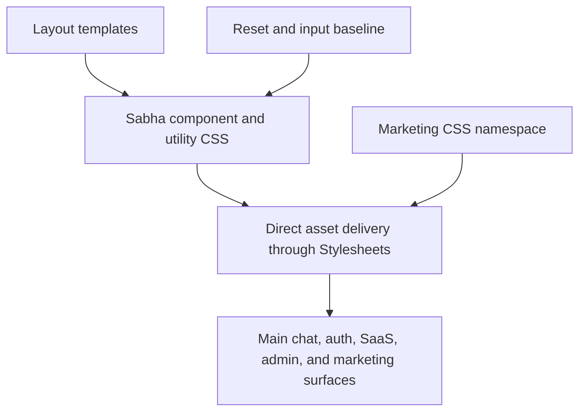

# Full CSS Migration - Plan

## Goal Capsule

- **Objective:** Community members can use every Sabha surface with the same responsive, accessible visual behavior while Sabha has a smaller dependency stack and no CSS build dependency.
- **Means:** Replace the remaining Tailwind layer with Sabha-owned component and utility CSS while retaining the existing direct asset pipeline. (KTD1, KTD2, KTD3)
- **Authority:** Preserve the confirmed scope: migrate every layout, including marketing; use Once Campfire and Fizzy as implementation references only; keep Sabha’s tokens and visual language.
- **Stop conditions:** Do not introduce a CSS bundler, redesign product surfaces, or broaden the migration into unrelated component cleanup.

---

## Product Contract

### Summary

Remove Tailwind CSS from Sabha. Keep the application’s existing file-per-component CSS and semantic utility model. Preserve the current layout, theme, accessibility, and form behavior across self-hosted and SaaS surfaces.

### Problem Frame

Sabha carries two overlapping CSS systems. Most chat UI already uses its own components and utilities, but Tailwind still supplies a global reset, form defaults, a few layout utilities, the `--font-size-*` token scale, and the CSS build pipeline. The overlap obscures ownership, duplicates utility rules, and keeps Node and pnpm in the stack to compile CSS.

Verified against the tree on 2026-09-06: about 40 distinct Tailwind-only class names remain, across roughly 110 uses. They cluster in the marketing layout, the five SaaS auth and workspace pages, the session and SaaS layouts, and the sidebar view. Landing and static marketing pages carry none. The `@tailwindcss/typography` plugin and the `tw-animate-css` package are already unused.

### Requirements

- R1. All user-facing layouts must render without loading a generated Tailwind asset or requiring Tailwind packages.
- R2. Sabha must retain its existing token hierarchy, stylesheet ordering, component names, light/dark behavior, and accent variants.
- R3. Sabha-owned CSS must explicitly cover the reset and form-control behavior that Tailwind Preflight and Forms currently supply where local CSS does not already own it.
- R4. Replace every remaining Tailwind-native class with either an existing Sabha utility or a semantic component rule; do not mass-rewrite valid existing Sabha utility call sites.
- R5. Migrate main chat, self-hosted authentication, SaaS authentication and administration, and public marketing pages in the same change.
- R6. Remove Tailwind-specific development, container, CI, package, and documentation setup after all runtime call sites are gone.
- R7. Verify responsive, theme, accessibility, and form behavior across the migration’s affected shells before completion.

### Success Criteria

- No runtime layout requests `tailwind.css`, and no source or build configuration depends on Tailwind, pnpm, or Node solely for CSS compilation.
- The JavaScript package manifest keeps only dependencies with a consumer other than CSS. Today that is the Herb ERB linter (`@herb-tools/linter`, run via `pnpm run lint:erb`), so `package.json` and the lockfile stay as a dev-only manifest; Node is no longer required to build or run the app.
- The main chat, session, SaaS, admin, and marketing shells retain their current visual hierarchy at desktop and mobile breakpoints.
- Forms retain usable focus states, control sizing, autofill behavior, and iOS-safe text input sizing.

### Scope Boundaries

- Keep the current OKLch token design and the separate marketing token namespace.
- Keep `Stylesheets.from` as the component stylesheet loader and preserve its ordering contract.
- Do not replace direct CSS delivery with Propshaft manifests, cssbundling, Sass, or another framework.
- Do not rewrite historical changelog entries that describe Tailwind when they accurately document past releases.
- Do not remove the Herb linter's Node setup; only the Tailwind packages, scripts, and build steps go.

---

## Planning Contract

### Key Technical Decisions

- KTD1. **Retain direct component stylesheet delivery.** Remove the explicit Tailwind asset from each layout while retaining `Stylesheets.from` and vendor stylesheet loading. Sabha already matches Once Campfire’s file-per-component ownership model, so a replacement build layer would add no value. (R1, R2, R6)
- KTD2. **Use semantic CSS first and existing Sabha utilities second.** Map the small set of Tailwind-native classes to component selectors or current `utilities.css` names. Keep Sabha’s native custom-property pattern, including inline fallback values where a component exposes a variant, and do not rename the established `.flex`, `.gap`, `.txt-*`, or spacing vocabulary merely because Tailwind once generated overlapping selectors. (R2, R4)
- KTD3. **Make reset and form behavior explicit before deleting Tailwind.** Extend Sabha’s reset, base, and input styles only for browser defaults that were previously inherited from Preflight or Forms. Sabha’s own reset is the thin modern-css-reset, so the gap is concrete: Preflight currently owns `[hidden] { display: none !important }`, the list reset, heading size and weight inheritance, anchor color inheritance, the universal `border: 0 solid`, the button background and padding reset, `textarea` resize, and placeholder color. Use Once Campfire’s reset and code-input ownership and Fizzy’s focused form-state patterns as references, not as source material to copy wholesale. (R3, R7)
- KTD4. **Keep marketing isolated.** Put marketing-shell and toast rules in marketing CSS and retain its local token namespace. Do not couple public pages to application tokens solely to remove utility classes. (R2, R5)
- KTD5. **Move the font-size scale out of the Tailwind entrypoint first.** The `--font-size-x-small` through `--font-size-xx-large` tokens are defined only in the `@theme` block of `app/javascript/entrypoints/application.css`, yet they are consumed by the `.txt-*` utilities and by sidebar, nav, messages, forum, and SaaS stylesheets. They must be declared in `base.css` before the entrypoint is deleted. The colour tokens are already authoritative in `colors.css`; the spacing theme variables are unused and can simply go. (R2)

### High-Level Technical Design

The migration removes the Tailwind source and generated layer from the path. The existing stylesheet loader remains the delivery boundary. Shared foundation CSS loads before component files, while marketing keeps its own scoped foundation.

### Implementation Constraints

- Preserve alphabetical component stylesheet loading and keep `overrides.css` last where it is currently loaded separately.
- Preserve the established `--border-radius-*` names. They must not be replaced by Tailwind-style radius variables.
- Keep component-specific focus, disabled, checkbox/radio, select, search, file-input, autofill, and mobile text-size behavior intact.

### Risks and Mitigation

| Risk | Mitigation |
| --- | --- |
| Removing Preflight changes browser defaults outside the obvious class replacements. | Establish and compare an owned reset and form baseline first; inspect headings, lists, images, controls, focus outlines, and dialogs. |
| Elements hidden with the `hidden` attribute reappear because a `.flex` or `.grid` class outranks the browser default once Preflight’s `!important` rule is gone. Views use the attribute about 84 times and Stimulus toggles it about 42 times. | Add an owned `[hidden] { display: none !important }` rule in the reset before any layout loses the Tailwind asset, and smoke every toggled panel. |
| Unclassed `ul`/`ol` elements regain bullets and indentation. Views have 37 lists, 21 without a class, and Sabha CSS declares `list-style` only six times. | Own the list reset in `_reset.css` and check the sidebar, roster, settings, and marketing lists. |
| The `.txt-*` scale and several component sizes silently fall back to inherited sizes because the font-size tokens were only ever declared in the Tailwind theme block. | Declare the scale in `base.css` as the first step of U1 and diff computed font sizes before and after. |
| Removing Forms alters focused controls or custom controls. | Cover text, search, checkbox, radio, select, file, autofill, and disabled states in the app and SaaS shells. |
| A generic session-shell rule breaks the deliberate `body.session` grid escape hatch. | Add a named centered session main rule and exercise password, OTP, join, first-run, and SaaS auth flows at the existing mobile breakpoint. |
| Marketing silently inherits app assumptions after Tailwind removal. | Add marketing-specific shell and toast rules and exercise landing, legal/static, and both flash branches independently. |
| Build cleanup leaves Docker or CI still provisioning Node. | Remove the dependency chain only after layouts and CSS no longer reference generated output; run image/asset smoke checks. |

### Sources and Research

- `app/assets/stylesheets/application/utilities.css` and `app/assets/stylesheets/application/colors.css` establish Sabha’s current owned utility and token model.
- `lib/stylesheets.rb` defines the direct, alphabetical component stylesheet delivery contract.
- `docs/plans/2026-08-12-001-redesign-v2-integration-plan.md` records cascade, auth-shell, marketing, and visual-regression constraints from the prior reskin.
- `app/assets/stylesheets/application/_reset.css`, `app/assets/stylesheets/application/inputs.css`, and `app/assets/stylesheets/application/auth.css` are the current Sabha foundation to extend.
- [37signals: Modern CSS patterns and techniques in Campfire](https://dev.37signals.com/modern-css-patterns-and-techniques-in-campfire/) grounds the retained OKLch primitives, semantic aliases, custom-property variant pattern, and capability-based responsive CSS approach.
- [Rob Zolkos: Vanilla CSS is all you need](https://www.zolkos.com/2025/12/03/vanilla-css-is-all-you-need.html) confirms the practical no-build, file-per-concept architecture across Campfire and Fizzy; it is supporting context, not an authority over Sabha’s existing cascade.
- The local Once Campfire checkout’s reset, utilities, and inputs stylesheets provide the closest semantic-CSS reference, including plain CSS ownership of `.input--code`.
- The local Fizzy checkout’s reset and input stylesheets provide useful reset, focus, disabled, and control-state patterns.

---

## Implementation Units

### U1. Establish owned CSS foundation

- **Goal:** Make Sabha’s reset, base, and input CSS fully own the browser and form behavior required after Tailwind is removed.
- **Requirements:** R2, R3, R7.
- **Dependencies:** None.
- **Files:** `app/assets/stylesheets/application/_reset.css`, `app/assets/stylesheets/application/base.css`, `app/assets/stylesheets/application/inputs.css`, `app/assets/stylesheets/application/utilities.css`, `app/assets/stylesheets/application/dialogs.css`, `app/javascript/entrypoints/application.css`.
- **Approach:**
  1. Declare the `--font-size-*` scale in `base.css`; it currently exists only in the Tailwind theme block (KTD5).
  2. Audit the current Preflight and Forms effects against existing Sabha rules, working through the list in KTD3. Add `[hidden] { display: none !important }` and the list reset to `_reset.css` first; they are the two with the widest blast radius.
  3. Add only the remaining missing baseline rules to the owning reset, base, or inputs file.
  4. Move `.input--code` and the `main#main-content:focus` rule from the Tailwind entrypoint into `inputs.css` and `base.css`.
  5. Remove Tailwind-specific comments and the duplicated colour re-exposure; the colour tokens stay authoritative in `colors.css`.
- **Execution note:** Start with a browser smoke comparison of controls and focus states; this unit replaces global styling behavior, not a model-level feature.
- **Patterns to follow:** Once Campfire’s `_reset.css` and `inputs.css`; Fizzy’s `reset.css` and `inputs.css`; Sabha’s existing logical-property and custom-property conventions.
- **Test scenarios:**
  - Text, search, textarea, select, checkbox, radio, and file controls render with the current sizing, borders, and disabled treatment.
  - Keyboard focus remains visible on standard controls and remains intentionally suppressed only where the owning component supplies a replacement affordance.
  - Autofilled fields and `input--code` retain their custom presentation.
  - Dark theme and each supported accent continue to resolve semantic token values without a Tailwind theme layer.
  - Every `.txt-*` size and the sidebar, nav, message, and forum sizes that read `--font-size-*` compute to the same pixel value as before.
  - Panels toggled through the `hidden` attribute stay hidden when they also carry `.flex` or `.grid`.
  - Unclassed lists render without bullets or indentation.
- **Verification:** Foundation CSS owns the audited reset and control states, with no residual `@apply`, `@theme`, `@source`, or Tailwind plugin directives.

### U2. Migrate application and session shell utilities

- **Goal:** Replace Tailwind-only application-shell and sidebar classes without changing the main chat or authentication layout.
- **Requirements:** R2, R4, R5, R7.
- **Dependencies:** U1.
- **Files:** `app/views/layouts/application.html.erb`, `app/views/layouts/session.html.erb`, `app/views/users/sidebars/show.html.erb`, `app/views/rooms/show/_block_notice.html.erb`, `app/views/messages/actions/_bookmark_indicator.html.erb`, `app/views/rooms/browse/_room.html.erb`, `app/assets/stylesheets/application/auth.css`, `app/assets/stylesheets/application/sidebar.css`, `app/assets/stylesheets/application/utilities.css`, `test/system/sidebar_drawer_test.rb`, `test/system/sidebar_rail_test.rb`, `test/system/sidebar_navigation_test.rb`, `test/system/otp_input_test.rb`, `test/system/search_palette_test.rb`.
- **Approach:**
  1. Give the centered session main element an owned semantic selector that preserves full-viewport, column, responsive padding, and centering behavior.
  2. Replace sidebar-only Tailwind column, alignment, spacing, and font-weight utilities with existing Sabha utilities or sidebar component rules.
  3. Replace the single stray utilities in the block notice, bookmark indicator, and browse room partials with component rules.
  4. Keep existing shared utilities unchanged where they already express the required behavior.
- **Execution note:** Use existing system tests as behavioral protection, then inspect desktop rail and mobile drawer rendering at the established 833px breakpoint.
- **Patterns to follow:** `body.session` in `application/auth.css`; existing sidebar component selectors; Once Campfire’s semantic utility vocabulary.
- **Test scenarios:**
  - Sidebar Favorites, Rooms, Forums, and Direct Messages remain aligned when expanded, collapsed, and empty/hidden.
  - Mobile sidebar toggle, Escape handling, and room navigation retain their current behavior.
  - Desktop rail remains visible and structurally aligned.
  - Password and OTP session pages center their content, show flashes, preserve keyboard focus, and do not trigger mobile input zoom.
  - Block notices retain their intended compact vertical gap.
- **Verification:** Existing sidebar, OTP, composer, and search-palette system coverage passes, supported by before/after screenshots for light/dark and mobile/desktop shell states.

### U3. Migrate SaaS workspace and administration shells

- **Goal:** Replace Tailwind-only classes in SaaS authentication, workspace, and administration surfaces with reusable Sabha CSS.
- **Requirements:** R2, R4, R5, R7.
- **Dependencies:** U1.
- **Files:** `saas/app/views/layouts/saas.html.erb`, `saas/app/views/layouts/admin.html.erb`, `saas/app/views/saas/registrations/new.html.erb`, `saas/app/views/saas/sessions/new.html.erb`, `saas/app/views/saas/workspace_invites/show.html.erb`, `saas/app/views/saas/workspaces/new.html.erb`, `saas/app/views/saas/workspaces/show.html.erb`, `app/assets/stylesheets/application/auth.css`, `app/assets/stylesheets/application/settings.css`, `app/assets/stylesheets/application/utilities.css`, `saas/test/controllers/saas/authentication_test.rb`, `saas/test/controllers/saas/registrations_controller_test.rb`, `saas/test/controllers/saas/sessions_controller_test.rb`, `saas/test/controllers/saas/workspaces_controller_test.rb`, `saas/test/controllers/admin/stats_controller_test.rb`.
- **Approach:**
  1. Reuse the owned session-shell rule for tenant authentication where its behavior matches self-hosted auth.
  2. Introduce a semantic auth-brand image rule for the repeated SaaS logo treatment.
  3. Retain existing application utility classes in SaaS/admin pages and add only missing owned rules.
- **Patterns to follow:** Existing `.auth-card` and session CSS; SaaS workspace settings component classes; Once Campfire’s small semantic utility model.
- **Test scenarios:**
  - SaaS sign-in, registration, invite, and workspace creation pages retain centered layout, logo sizing, and form spacing at narrow and wide widths.
  - Workspace selector and admin lists retain alignment and readable text hierarchy.
  - Auth-code redirects and workspace navigation remain unchanged because the templates and controllers retain their contracts.
- **Verification:** SaaS authentication, registration, session, workspace, admin, and workspace selector flows pass their existing controller/integration coverage and receive visual smoke checks in both themes.

### U4. Make the marketing shell self-contained

- **Goal:** Move public-page Tailwind-only shell and flash styling into scoped marketing CSS. The landing and static templates already carry no Tailwind classes; the work is the marketing layout’s seven class attributes.
- **Requirements:** R2, R4, R5, R7.
- **Dependencies:** U1.
- **Files:** `saas/app/views/layouts/marketing.html.erb`, `app/assets/stylesheets/marketing/landing.css`, relevant public marketing/static page templates, `saas/test/controllers/saas/landing_controller_test.rb`.
- **Approach:**
  1. Replace the marketing layout’s utility clusters with semantic marketing shell and toast classes.
  2. Keep dark colors, typography, fixed toast stacking, alert variant, icon size, page height, and overflow behavior inside the marketing namespace.
  3. Update the marketing CSS comments so they no longer assume Tailwind is present.
- **Patterns to follow:** Existing `.landing` scope and marketing token namespace; Sabha flash/accessibility conventions.
- **Test scenarios:**
  - Anonymous landing requests render normally and authenticated redirects remain unchanged.
  - Success and alert flashes remain visible, stacked, and readable on narrow viewports.
  - Landing and legal/static pages render with their local dark and light behavior without inheriting application tokens.
- **Verification:** Landing controller coverage passes and browser screenshots cover public pages, both flash branches, desktop, and a narrow mobile viewport.

### U5. Remove the Tailwind delivery and build chain

- **Goal:** Delete Tailwind runtime references and eliminate Node/pnpm provisioning that exists only to compile CSS. The package manifest itself stays, trimmed to the Herb linter.
- **Requirements:** R1, R5, R6.
- **Dependencies:** U1, U2, U3, U4.
- **Files:** `app/views/layouts/application.html.erb`, `app/views/layouts/session.html.erb`, `saas/app/views/layouts/saas.html.erb`, `saas/app/views/layouts/admin.html.erb`, `saas/app/views/layouts/marketing.html.erb`, `lib/stylesheets.rb`, `package.json`, `pnpm-lock.yaml`, `Procfile.dev`, `bin/setup`, `Dockerfile`, `saas/Dockerfile`, `.github/workflows/test.yml`, `app/javascript/entrypoints/application.css`, `app/assets/builds/tailwind.css`.
- **Approach:**
  1. Remove the generated asset from all five layout asset lists only after their replacement CSS is in place.
  2. Delete the Tailwind source and build output, then remove the Tailwind packages (including the already-unused typography plugin and `tw-animate-css`), build scripts, watcher, setup step, container stages, and CI steps. Leave the Herb dependency and its lint scripts in place; CI may still install Node for linting but no longer for asset builds.
  3. Remove the two `next if` skips in `Stylesheets.load_vendor_stylesheets` that exclude the builds and javascript asset paths, and update its comments.
- **Execution note:** This is packaging and deployment work; prefer asset and image build smoke verification over adding unit tests for deleted configuration.
- **Patterns to follow:** Once Campfire’s direct stylesheet loading; Sabha’s existing `Stylesheets.from` cache behavior.
- **Test expectation:** none -- this unit removes configuration and generated output; behavioral coverage belongs to U2-U4 and deployment smoke checks.
- **Verification:** A clean setup, development start, and both container images complete without Node, pnpm, Tailwind, or a missing stylesheet asset error. The test workflow no longer runs a CSS build step.

### U6. Update documentation and run migration verification

- **Goal:** Align developer documentation with the direct CSS pipeline and prove that the migration did not regress supported surfaces.
- **Requirements:** R6, R7.
- **Dependencies:** U5.
- **Files:** `README.md`, `docs/DEVELOPMENT.md`, `docs/ARCHITECTURE.md`, `AGENTS.md`, `CLAUDE.md`, test files identified by U2-U4 where regression coverage is missing.
- **Approach:**
  1. Remove Tailwind, pnpm, Node CSS-build, and generated-output references from active setup and architecture documentation.
  2. Describe the maintained direct stylesheet ownership and development workflow.
  3. Add narrowly scoped regression assertions only where the existing system/controller suites do not protect a migration-critical behavior.
- **Patterns to follow:** Existing README and architecture documentation style; current self-hosted and SaaS test organization.
- **Test scenarios:**
  - The full self-hosted suite continues to exercise the chat, sidebar, composer, settings, and authentication contracts.
  - The full SaaS suite continues to exercise landing, authentication, registration, workspaces, workspace settings, and administration contracts.
  - Manual visual audit covers light/dark mode, supported accents, keyboard focus, desktop/mobile breakpoints, and native-wrapper-sensitive shells.
- **Verification:** Active documentation contains no inaccurate Tailwind workflow guidance, and all listed automated and manual verification gates have recorded passing evidence.

---

## Verification Contract

| Scope | Evidence |
| --- | --- |
| Self-hosted behavior | `bin/rails test`, followed by focused system coverage for sidebar, authentication/OTP, composer, dialogs, search palette, settings, and navigation. |
| SaaS behavior | `SAAS=true bin/rails test saas/test/`, including landing, authentication, registration, sessions, workspaces, workspace settings, and administration. |
| CSS removal | Static search finds no active Tailwind import, directive, build script, layout asset reference, package dependency, or generated-output dependency. |
| Delivery | A fresh local setup and development boot work without a CSS watcher; self-hosted and SaaS container asset builds succeed without Node/pnpm stages. |
| Visual and accessibility smoke | Capture light/dark screenshots for main chat/composer/dialog, desktop and mobile sidebar, self-hosted auth/OTP, SaaS auth/workspace/admin, and marketing landing/static/flash states. Exercise keyboard focus and the 833px mobile breakpoint. |

---

## Documentation and Operational Notes

- Update active developer guidance only. Keep historical changelog entries that accurately describe past Tailwind releases.
- The migration removes the CSS build dependency. The Node/pnpm layer shrinks to the Herb linter rather than disappearing, so onboarding instructions should describe Node as optional tooling for `pnpm run lint:erb`, not a build prerequisite.
- No data migration, feature flag, or staged rollout is needed. The work is a CSS and build-dependency refactor, but the visual smoke matrix is a release gate.

---

## Definition of Done

- All six implementation units meet their verification criteria.
- The direct stylesheet loader is the only CSS delivery path for Sabha, and marketing remains independently scoped.
- No active source, configuration, package, container, CI, or documentation path requires Tailwind, pnpm, or Node for CSS. The package manifest holds only the Herb linter.
- Existing token semantics, theme/accent behavior, form accessibility, and responsive shell behavior are preserved.
- Self-hosted and SaaS suites pass, and the visual smoke matrix has been reviewed.
- The final diff contains no abandoned generated CSS, temporary compatibility rules, or unrelated worktree changes.

---

## Execution Log

### Method: measuring what Tailwind still supplies

The gap was measured rather than inferred. A Ferrum script signs in, visits 41 self-hosted pages (rooms, forum, thread, DM, browse, settings, account, inbox, search, and the four session-layout pages), records the computed styles of every element, removes the Tailwind `<link>` in place, records again, and diffs. Two lessons from getting it right:

- Everything has to happen inside one `page.evaluate` call. Reading the snapshot out of the page and diffing in Ruby silently truncated the result to the first few hundred elements, so the first two runs missed the message stream entirely and looked far cleaner than reality.
- Wait for the element count to settle rather than for network idle. The WebSocket keeps the network busy, and message pagination and lazy frames arrive after load.

The script lives outside the repo (session scratchpad). It is worth keeping the idea: before U5 removes the asset, run it once more and expect only marketing and SaaS pages to differ.

### U1 findings (done, commit 6181318f)

Before U1 the diff reported 427 distinct change groups. The ones that mattered, in order of blast radius:

- `--font-size-*` was only declared in the Tailwind theme block. Every `.txt-small` and `.txt-x-small` (3,462 elements across 30 pages) fell back to 16px, dragging em-based padding, radii, gaps, and heights with it. Declared in `base.css`.
- Headings: `h3.message__heading` and the sidebar section `h1`s relied on Preflight's `font-size: inherit; font-weight: inherit`. Without it they jumped to 17.55px bold.
- Links and controls relied on Preflight's `color: inherit`. Classed links (sidebar rows, buttons rendered as `<a>`) turned browser blue and underlined; bare `<button>`s without `.btn` (reaction remove buttons) gained UA padding and black text.
- `[hidden]` needs `!important`: the Lexxy toolbar dropdown menus and the message edit frame set `display` at the same specificity later in the cascade and reappeared.
- Lists in the settings pages and the PWA instructions regained bullets, numbers, and 40px indents; `hr` regained its inset margins and grey; `img` lost `vertical-align: middle`.
- The Forms plugin was doing real work in three places: the search palette input had no padding of its own (now `8px 12px` in `dialogs.css`), every `<select>` got `appearance: none` and the chevron from it (now owned in `inputs.css`), and checkboxes and radios took `flex-shrink: 0` and `user-select: none` from it. Placeholder colour was the plugin's fixed grey; it is now `--color-text-muted`.
- Smaller carries: `tab-size: 4`, transparent tap highlight, `code`/`kbd`/`samp` in the mono face, `textarea { resize: vertical }`, the webkit date and search pseudo-elements.

Decisions made while doing it:

- The reset block is a real cascade layer, `@layer base`, at the top of `_reset.css`. Layered rules lose to every unlayered rule regardless of specificity, which is exactly the relationship Preflight had with Sabha's CSS, so nothing that used to win stops winning. The name matters: a first attempt called `reset` was declared after Tailwind's layers while both were loaded, outranked the `@layer components` block in `tooltips.css`, and stripped the tooltip padding. `base` merges into Tailwind's layer for now and sits beneath `components` once Tailwind is gone. `tooltips.css` is the only other layered file; keep the reset layer first in load order.
- The `#main-content:focus` rule went to `layout.css` beside the `#main-content` block, not `base.css`.
- The select chevron keeps the plugin's grey SVG literally; a data-URI image cannot read a token, and the grey reads on both themes.
- The Forms and typography plugins and the theme block were removed from the entrypoint in U1. Preflight stays until U4 because the marketing layout loads only `marketing/landing.css` and has no reset of its own.
- After U1 the diff showed changes only on elements carrying a Tailwind utility class, which is U2's scope. 44 system tests (sidebar, composer, inbox, settings, avatars, unread, OTP, palette, boosts, popups) passed.

### U2 findings (done, pending commit)

- Session and SaaS layouts: the `<main>` utility cluster became `.session-main` in `auth.css` with the same values (16px padding, 24px from 640px up).
- Sidebar: `flex-col`, `items-center`, and `justify-between` mapped one-to-one onto `flex-column`, `align-center`, and `justify-space-between`. `font-semibold` on the four section `h1`s became `font-weight: 600` on `.sidebar__label`, which no other view uses.
- The block notice's `gap-1` (4px) is a `.block-notice` rule under `#system_welcome`. The bookmark indicator's `opacity-50` is Sabha's existing `.translucent`.
- `align-baseline` on the browse room row was inert: Tailwind's class sets `vertical-align`, which does nothing on a flex container. Removed rather than translated.
- The one `class="hidden"` in the app (the welcome message's reply source) became the `hidden` attribute; the reply controller reads the element by target, not by class.
- `container` in the two mailer layouts is their own inline style, not Tailwind.
- 28 system tests (sidebar navigation, drawer, rail, OTP, palette, composer, bookmarks, unread) and 36 SaaS controller tests (sessions, registrations, authentication) passed.

### U3 findings (done, pending commit)

- The five SaaS pages shared one logo block. It is `.auth-brand` in `auth.css` with the same 72px mark, 8px radius, and 24px gap. The admin layout carried no Tailwind classes.
- The same computed-style diff, run against a SaaS server, shows sign-in, registration, new workspace, workspace show, settings, and the tenant chat pages unchanged when the Tailwind asset is removed.

### U4 findings (done, pending commit)

- The marketing layout had no reset of its own; box-sizing, body margin, paragraph and list defaults, image sizing, button appearance, and the mono face on `<code>` all came from Preflight. It now links `application/_defaults` (see below) ahead of the marketing folder.
- The layout's utility clusters became `.marketing`, `.marketing-page`, `.marketing-main`, and `.marketing-toast*` in a new `marketing/shell.css`, with every value copied from the compiled theme. The old `dark:` variants keyed on the OS setting even though the page pins the light theme, so the ground behind `.landing` still follows the OS; that is preserved, and easy to drop.
- First attempt linked `_reset.css` itself, and the owner spotted the pages looking different. Pixel comparison against a served copy of the pre-migration commit found why: the modern-css-reset rules in that file are opinions, not neutral defaults, and marketing had never had them. `word-break: break-word` on headings and paragraphs wrapped "Company" mid-word in the phone footer, and `text-rendering: optimizeSpeed` shifted kerning through the changelog copy. The layered browser defaults now live in `application/_defaults.css`, which sorts first and is the only application file marketing links. `_reset.css` keeps the modern-css-reset opinions for the app.
- After the split, full-page screenshots of the landing, about, privacy, terms, changelog, and openclaw pages at 1440px and 390px in both colour schemes match the pre-migration build to within the pulsing hero badge dot (under 110 pixels). The auth pages differ only in placeholder colour.
- A cheap way to get the "before" build for comparison: `git archive <commit>` into a scratch directory, symlink `storage` and `node_modules`, copy `.env` and `config/master.key`, build its Tailwind, and run it on spare ports. Both modes ran alongside the working tree's servers without conflict.

### Still open after U4

- U5: Preflight leaves with the entrypoint; nothing in either mode depends on it now. Remove the asset from the five layouts, delete the entrypoint and build output, drop the Tailwind packages and scripts, and take Node out of `bin/setup`, `Procfile.dev`, both Dockerfiles, and the test workflow (Herb keeps `package.json`).
- U6: docs still describe the Tailwind pipeline in `README.md`, `docs/DEVELOPMENT.md`, `docs/ARCHITECTURE.md`, `AGENTS.md`, and `CLAUDE.md`; `.herb.yml` has a comment tying the interpolated-class-names rule to Tailwind.
