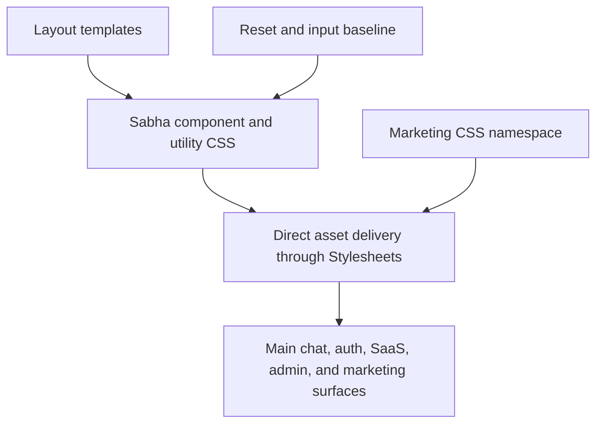

# Full CSS Migration - Plan

## Goal Capsule

- **Objective:** Community members can use every Sabha surface with the same responsive, accessible visual behavior while Sabha has a smaller dependency stack and no CSS build dependency.
- **Means:** Replace the remaining Tailwind layer with Sabha-owned component and utility CSS while retaining the existing direct asset pipeline. (KTD1, KTD2, KTD3)
- **Authority:** Preserve the confirmed scope: migrate every layout, including marketing; use Once Campfire and Fizzy as implementation references only; keep Sabha’s tokens and visual language.
- **Stop conditions:** Do not introduce a CSS bundler, redesign product surfaces, or broaden the migration into unrelated component cleanup.

---

## Product Contract

### Summary

Remove Tailwind CSS from Sabha. Keep the application’s existing file-per-component CSS and semantic utility model. Preserve the current layout, theme, accessibility, and form behavior across self-hosted and SaaS surfaces.

### Problem Frame

Sabha carries two overlapping CSS systems. Most chat UI already uses its own components and utilities, but Tailwind still supplies a global reset, form defaults, a few layout utilities, and the CSS build pipeline. The overlap obscures ownership, duplicates utility rules, and keeps Node and pnpm in the stack solely to compile CSS.

### Requirements

- R1. All user-facing layouts must render without loading a generated Tailwind asset or requiring Tailwind packages.
- R2. Sabha must retain its existing token hierarchy, stylesheet ordering, component names, light/dark behavior, and accent variants.
- R3. Sabha-owned CSS must explicitly cover the reset and form-control behavior that Tailwind Preflight and Forms currently supply where local CSS does not already own it.
- R4. Replace every remaining Tailwind-native class with either an existing Sabha utility or a semantic component rule; do not mass-rewrite valid existing Sabha utility call sites.
- R5. Migrate main chat, self-hosted authentication, SaaS authentication and administration, and public marketing pages in the same change.
- R6. Remove Tailwind-specific development, container, CI, package, and documentation setup after all runtime call sites are gone.
- R7. Verify responsive, theme, accessibility, and form behavior across the migration’s affected shells before completion.

### Success Criteria

- No runtime layout requests `tailwind.css`, and no source or build configuration depends on Tailwind, pnpm, or Node solely for CSS compilation.
- The application has no JavaScript package manifest or lockfile unless another independently justified frontend dependency remains.
- The main chat, session, SaaS, admin, and marketing shells retain their current visual hierarchy at desktop and mobile breakpoints.
- Forms retain usable focus states, control sizing, autofill behavior, and iOS-safe text input sizing.

### Scope Boundaries

- Keep the current OKLch token design and the separate marketing token namespace.
- Keep `Stylesheets.from` as the component stylesheet loader and preserve its ordering contract.
- Do not replace direct CSS delivery with Propshaft manifests, cssbundling, Sass, or another framework.
- Do not rewrite historical changelog entries that describe Tailwind when they accurately document past releases.

---

## Planning Contract

### Key Technical Decisions

- KTD1. **Retain direct component stylesheet delivery.** Remove the explicit Tailwind asset from each layout while retaining `Stylesheets.from` and vendor stylesheet loading. Sabha already matches Once Campfire’s file-per-component ownership model, so a replacement build layer would add no value. (R1, R2, R6)
- KTD2. **Use semantic CSS first and existing Sabha utilities second.** Map the small set of Tailwind-native classes to component selectors or current `utilities.css` names. Keep Sabha’s native custom-property pattern, including inline fallback values where a component exposes a variant, and do not rename the established `.flex`, `.gap`, `.txt-*`, or spacing vocabulary merely because Tailwind once generated overlapping selectors. (R2, R4)
- KTD3. **Make reset and form behavior explicit before deleting Tailwind.** Extend Sabha’s reset, base, and input styles only for browser defaults that were previously inherited from Preflight or Forms. Use Once Campfire’s reset and code-input ownership and Fizzy’s focused form-state patterns as references, not as source material to copy wholesale. (R3, R7)
- KTD4. **Keep marketing isolated.** Put marketing-shell and toast rules in marketing CSS and retain its local token namespace. Do not couple public pages to application tokens solely to remove utility classes. (R2, R5)

### High-Level Technical Design

The migration removes the Tailwind source and generated layer from the path. The existing stylesheet loader remains the delivery boundary. Shared foundation CSS loads before component files, while marketing keeps its own scoped foundation.

### Implementation Constraints

- Preserve alphabetical component stylesheet loading and keep `overrides.css` last where it is currently loaded separately.
- Preserve the established `--border-radius-*` names. They must not be replaced by Tailwind-style radius variables.
- Keep component-specific focus, disabled, checkbox/radio, select, search, file-input, autofill, and mobile text-size behavior intact.
- Treat the existing dirty worktree as user-owned. Do not overwrite or fold unrelated changes into this migration.

### Risks and Mitigation

| Risk | Mitigation |
| --- | --- |
| Removing Preflight changes browser defaults outside the obvious class replacements. | Establish and compare an owned reset and form baseline first; inspect headings, lists, images, controls, focus outlines, and dialogs. |
| Removing Forms alters focused controls or custom controls. | Cover text, search, checkbox, radio, select, file, autofill, and disabled states in the app and SaaS shells. |
| A generic session-shell rule breaks the deliberate `body.session` grid escape hatch. | Add a named centered session main rule and exercise password, OTP, join, first-run, and SaaS auth flows at the existing mobile breakpoint. |
| Marketing silently inherits app assumptions after Tailwind removal. | Add marketing-specific shell and toast rules and exercise landing, legal/static, and both flash branches independently. |
| Build cleanup leaves Docker or CI still provisioning Node. | Remove the dependency chain only after layouts and CSS no longer reference generated output; run image/asset smoke checks. |

### Sources and Research

- `app/assets/stylesheets/application/utilities.css` and `app/assets/stylesheets/application/colors.css` establish Sabha’s current owned utility and token model.
- `lib/stylesheets.rb` defines the direct, alphabetical component stylesheet delivery contract.
- `docs/plans/2026-08-12-001-redesign-v2-integration-plan.md` records cascade, auth-shell, marketing, and visual-regression constraints from the prior reskin.
- `app/assets/stylesheets/_reset.css`, `app/assets/stylesheets/application/inputs.css`, and `app/assets/stylesheets/application/auth.css` are the current Sabha foundation to extend.
- [37signals: Modern CSS patterns and techniques in Campfire](https://dev.37signals.com/modern-css-patterns-and-techniques-in-campfire/) grounds the retained OKLch primitives, semantic aliases, custom-property variant pattern, and capability-based responsive CSS approach.
- [Rob Zolkos: Vanilla CSS is all you need](https://www.zolkos.com/2025/12/03/vanilla-css-is-all-you-need.html) confirms the practical no-build, file-per-concept architecture across Campfire and Fizzy; it is supporting context, not an authority over Sabha’s existing cascade.
- The local Once Campfire checkout’s reset, utilities, and inputs stylesheets provide the closest semantic-CSS reference, including plain CSS ownership of `.input--code`.
- The local Fizzy checkout’s reset and input stylesheets provide useful reset, focus, disabled, and control-state patterns.

---

## Implementation Units

### U1. Establish owned CSS foundation

- **Goal:** Make Sabha’s reset, base, and input CSS fully own the browser and form behavior required after Tailwind is removed.
- **Requirements:** R2, R3, R7.
- **Dependencies:** None.
- **Files:** `app/assets/stylesheets/application/_reset.css`, `app/assets/stylesheets/application/base.css`, `app/assets/stylesheets/application/inputs.css`, `app/assets/stylesheets/application/utilities.css`, `app/assets/stylesheets/application/dialogs.css`, `app/javascript/entrypoints/application.css`.
- **Approach:**
  1. Audit the current Preflight and Forms effects against existing Sabha rules.
  2. Add only missing explicit baseline rules to the owning reset, base, or inputs file.
  3. Move `.input--code` from the Tailwind entrypoint into `inputs.css`.
  4. Remove Tailwind-specific comments and duplicated theme exposure while retaining the authoritative token definitions in `colors.css`.
- **Execution note:** Start with a browser smoke comparison of controls and focus states; this unit replaces global styling behavior, not a model-level feature.
- **Patterns to follow:** Once Campfire’s `_reset.css` and `inputs.css`; Fizzy’s `reset.css` and `inputs.css`; Sabha’s existing logical-property and custom-property conventions.
- **Test scenarios:**
  - Text, search, textarea, select, checkbox, radio, and file controls render with the current sizing, borders, and disabled treatment.
  - Keyboard focus remains visible on standard controls and remains intentionally suppressed only where the owning component supplies a replacement affordance.
  - Autofilled fields and `input--code` retain their custom presentation.
  - Dark theme and each supported accent continue to resolve semantic token values without a Tailwind theme layer.
- **Verification:** Foundation CSS owns the audited reset and control states, with no residual `@apply`, `@theme`, `@source`, or Tailwind plugin directives.

### U2. Migrate application and session shell utilities

- **Goal:** Replace Tailwind-only application-shell and sidebar classes without changing the main chat or authentication layout.
- **Requirements:** R2, R4, R5, R7.
- **Dependencies:** U1.
- **Files:** `app/views/layouts/application.html.erb`, `app/views/layouts/session.html.erb`, `app/views/users/sidebars/show.html.erb`, `app/views/rooms/show/_block_notice.html.erb`, `app/assets/stylesheets/application/auth.css`, `app/assets/stylesheets/application/sidebar.css`, `app/assets/stylesheets/application/utilities.css`, `test/system/sidebar_drawer_test.rb`, `test/system/sidebar_rail_test.rb`, `test/system/sidebar_navigation_test.rb`, `test/system/otp_input_test.rb`, `test/system/search_palette_test.rb`.
- **Approach:**
  1. Give the centered session main element an owned semantic selector that preserves full-viewport, column, responsive padding, and centering behavior.
  2. Replace sidebar-only Tailwind column, alignment, spacing, and font-weight utilities with existing Sabha utilities or sidebar component rules.
  3. Keep existing shared utilities unchanged where they already express the required behavior.
- **Execution note:** Use existing system tests as behavioral protection, then inspect desktop rail and mobile drawer rendering at the established 833px breakpoint.
- **Patterns to follow:** `body.session` in `application/auth.css`; existing sidebar component selectors; Once Campfire’s semantic utility vocabulary.
- **Test scenarios:**
  - Sidebar Favorites, Rooms, Forums, and Direct Messages remain aligned when expanded, collapsed, and empty/hidden.
  - Mobile sidebar toggle, Escape handling, and room navigation retain their current behavior.
  - Desktop rail remains visible and structurally aligned.
  - Password and OTP session pages center their content, show flashes, preserve keyboard focus, and do not trigger mobile input zoom.
  - Block notices retain their intended compact vertical gap.
- **Verification:** Existing sidebar, OTP, composer, and search-palette system coverage passes, supported by before/after screenshots for light/dark and mobile/desktop shell states.

### U3. Migrate SaaS workspace and administration shells

- **Goal:** Replace Tailwind-only classes in SaaS authentication, workspace, and administration surfaces with reusable Sabha CSS.
- **Requirements:** R2, R4, R5, R7.
- **Dependencies:** U1.
- **Files:** `saas/app/views/layouts/saas.html.erb`, `saas/app/views/layouts/admin.html.erb`, `saas/app/views/saas/registrations/new.html.erb`, `saas/app/views/saas/sessions/new.html.erb`, `saas/app/views/saas/workspace_invites/show.html.erb`, `saas/app/views/saas/workspaces/new.html.erb`, `saas/app/views/saas/workspaces/show.html.erb`, `app/assets/stylesheets/application/auth.css`, `app/assets/stylesheets/application/settings.css`, `app/assets/stylesheets/application/utilities.css`, `saas/test/controllers/saas/authentication_test.rb`, `saas/test/controllers/saas/registrations_controller_test.rb`, `saas/test/controllers/saas/sessions_controller_test.rb`, `saas/test/controllers/saas/workspaces_controller_test.rb`, `saas/test/controllers/admin/stats_controller_test.rb`.
- **Approach:**
  1. Reuse the owned session-shell rule for tenant authentication where its behavior matches self-hosted auth.
  2. Introduce a semantic auth-brand image rule for the repeated SaaS logo treatment.
  3. Retain existing application utility classes in SaaS/admin pages and add only missing owned rules.
- **Patterns to follow:** Existing `.auth-card` and session CSS; SaaS workspace settings component classes; Once Campfire’s small semantic utility model.
- **Test scenarios:**
  - SaaS sign-in, registration, invite, and workspace creation pages retain centered layout, logo sizing, and form spacing at narrow and wide widths.
  - Workspace selector and admin lists retain alignment and readable text hierarchy.
  - Auth-code redirects and workspace navigation remain unchanged because the templates and controllers retain their contracts.
- **Verification:** SaaS authentication, registration, session, workspace, admin, and workspace selector flows pass their existing controller/integration coverage and receive visual smoke checks in both themes.

### U4. Make the marketing shell self-contained

- **Goal:** Move public-page Tailwind-only shell and flash styling into scoped marketing CSS.
- **Requirements:** R2, R4, R5, R7.
- **Dependencies:** U1.
- **Files:** `saas/app/views/layouts/marketing.html.erb`, `app/assets/stylesheets/marketing/landing.css`, relevant public marketing/static page templates, `saas/test/controllers/saas/landing_controller_test.rb`.
- **Approach:**
  1. Replace the marketing layout’s utility clusters with semantic marketing shell and toast classes.
  2. Keep dark colors, typography, fixed toast stacking, alert variant, icon size, page height, and overflow behavior inside the marketing namespace.
  3. Update the marketing CSS comments so they no longer assume Tailwind is present.
- **Patterns to follow:** Existing `.landing` scope and marketing token namespace; Sabha flash/accessibility conventions.
- **Test scenarios:**
  - Anonymous landing requests render normally and authenticated redirects remain unchanged.
  - Success and alert flashes remain visible, stacked, and readable on narrow viewports.
  - Landing and legal/static pages render with their local dark and light behavior without inheriting application tokens.
- **Verification:** Landing controller coverage passes and browser screenshots cover public pages, both flash branches, desktop, and a narrow mobile viewport.

### U5. Remove the Tailwind delivery and build chain

- **Goal:** Delete Tailwind runtime references and eliminate Node/pnpm provisioning that exists only to compile CSS.
- **Requirements:** R1, R5, R6.
- **Dependencies:** U1, U2, U3, U4.
- **Files:** `app/views/layouts/application.html.erb`, `app/views/layouts/session.html.erb`, `saas/app/views/layouts/saas.html.erb`, `saas/app/views/layouts/admin.html.erb`, `saas/app/views/layouts/marketing.html.erb`, `lib/stylesheets.rb`, `package.json`, `pnpm-lock.yaml`, `Procfile.dev`, `bin/setup`, `Dockerfile`, `saas/Dockerfile`, `.github/workflows/test.yml`, `app/javascript/entrypoints/application.css`, `app/assets/builds/tailwind.css`.
- **Approach:**
  1. Remove the generated asset from all five layout asset lists only after their replacement CSS is in place.
  2. Delete the Tailwind source and build output, then remove packages, scripts, watcher, setup work, container stages, and CI steps that serve no other consumer.
  3. Simplify `Stylesheets` comments to describe the remaining direct asset paths accurately.
- **Execution note:** This is packaging and deployment work; prefer asset and image build smoke verification over adding unit tests for deleted configuration.
- **Patterns to follow:** Once Campfire’s direct stylesheet loading; Sabha’s existing `Stylesheets.from` cache behavior.
- **Test expectation:** none -- this unit removes configuration and generated output; behavioral coverage belongs to U2-U4 and deployment smoke checks.
- **Verification:** A clean setup, development start, test workflow, and both container images complete without Node, pnpm, Tailwind, or a missing stylesheet asset error.

### U6. Update documentation and run migration verification

- **Goal:** Align developer documentation with the direct CSS pipeline and prove that the migration did not regress supported surfaces.
- **Requirements:** R6, R7.
- **Dependencies:** U5.
- **Files:** `README.md`, `docs/DEVELOPMENT.md`, `docs/ARCHITECTURE.md`, `AGENTS.md`, `CLAUDE.md`, test files identified by U2-U4 where regression coverage is missing.
- **Approach:**
  1. Remove Tailwind, pnpm, Node CSS-build, and generated-output references from active setup and architecture documentation.
  2. Describe the maintained direct stylesheet ownership and development workflow.
  3. Add narrowly scoped regression assertions only where the existing system/controller suites do not protect a migration-critical behavior.
- **Patterns to follow:** Existing README and architecture documentation style; current self-hosted and SaaS test organization.
- **Test scenarios:**
  - The full self-hosted suite continues to exercise the chat, sidebar, composer, settings, and authentication contracts.
  - The full SaaS suite continues to exercise landing, authentication, registration, workspaces, workspace settings, and administration contracts.
  - Manual visual audit covers light/dark mode, supported accents, keyboard focus, desktop/mobile breakpoints, and native-wrapper-sensitive shells.
- **Verification:** Active documentation contains no inaccurate Tailwind workflow guidance, and all listed automated and manual verification gates have recorded passing evidence.

---

## Verification Contract

| Scope | Evidence |
| --- | --- |
| Self-hosted behavior | `bin/rails test`, followed by focused system coverage for sidebar, authentication/OTP, composer, dialogs, search palette, settings, and navigation. |
| SaaS behavior | `SAAS=true bin/rails test saas/test/`, including landing, authentication, registration, sessions, workspaces, workspace settings, and administration. |
| CSS removal | Static search finds no active Tailwind import, directive, build script, layout asset reference, package dependency, or generated-output dependency. |
| Delivery | A fresh local setup and development boot work without a CSS watcher; self-hosted and SaaS container asset builds succeed without Node/pnpm stages. |
| Visual and accessibility smoke | Capture light/dark screenshots for main chat/composer/dialog, desktop and mobile sidebar, self-hosted auth/OTP, SaaS auth/workspace/admin, and marketing landing/static/flash states. Exercise keyboard focus and the 833px mobile breakpoint. |

---

## Documentation and Operational Notes

- Update active developer guidance only. Keep historical changelog entries that accurately describe past Tailwind releases.
- The migration removes a build dependency and, if no independent JavaScript consumer remains, the complete Node/pnpm package layer. Verify onboarding instructions and CI cache/setup assumptions as part of the same change.
- No data migration, feature flag, or staged rollout is needed. The work is a CSS and build-dependency refactor, but the visual smoke matrix is a release gate.

---

## Definition of Done

- All six implementation units meet their verification criteria.
- The direct stylesheet loader is the only CSS delivery path for Sabha, and marketing remains independently scoped.
- No active source, configuration, package, container, CI, or documentation path requires Tailwind, pnpm, or Node for CSS; remove the Node/pnpm package layer entirely when it has no independent consumer.
- Existing token semantics, theme/accent behavior, form accessibility, and responsive shell behavior are preserved.
- Self-hosted and SaaS suites pass, and the visual smoke matrix has been reviewed.
- The final diff contains no abandoned generated CSS, temporary compatibility rules, or unrelated worktree changes.
