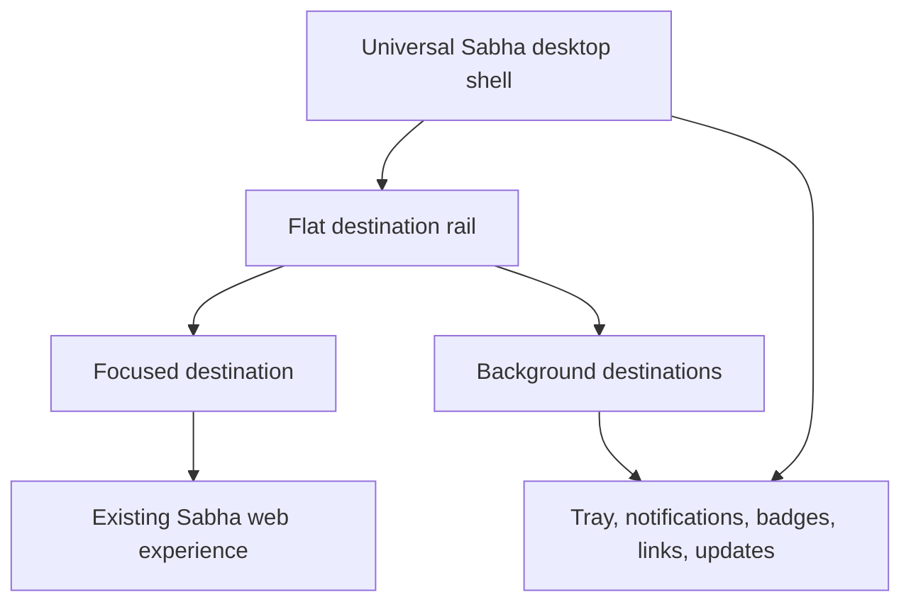

# Electron Desktop Foundation - Plan

## Goal Capsule

- **Objective:** Members can depend on Sabha for timely desktop notifications and move among their Sabha Cloud and self-hosted communities from one native desktop application on macOS, Windows, and Linux.
- **Means:** Build a trusted local Electron shell around isolated Sabha web destinations, backed by a narrow versioned server contract and dedicated desktop notification channel. (KTD1-KTD5)
- **Product authority:** This plan owns the desktop foundation only; desktop workflow tools, native huddle controls, and broader platform polish remain separate work.
- **Execution profile:** Deep, cross-repository implementation with contract-first server tests, desktop unit and integration tests, then signed-package acceptance on each operating system.
- **Tail ownership:** Sabha release engineering owns signing identities, release feeds, Linux repositories, and the final cross-platform acceptance matrix.
- **Stop conditions:** Do not release if the desktop channel bypasses existing notification eligibility, any remote renderer gains ambient native privileges, or any supported platform lacks a verified install/update path.
- **Open blockers:** None.

---

## Product Contract

### Summary

Build the full desktop foundation in a fresh Electron repository, plus the narrow Sabha server protocol needed for compatible destination discovery, secure sign-in handoff, exact notification delivery, and unread state.
The renamed Electrobun repository is reference-only; the implementation starts clean and preserves the existing web product and browser-based huddle boundary.

**Product Contract preservation:** Unchanged.

### Problem Frame

Sabha already provides an installable PWA with WebPush, badge counts, notification navigation, and an offline fallback.
The product hypothesis is that these browser-owned capabilities do not provide the dependable, integrated desktop experience expected from daily-use chat tools.
No concrete user failure data was supplied during discovery, so the first release must validate notification reliability through a cross-platform acceptance matrix rather than treating demand as proven.

### Key Decisions

- KD1. **Desktop foundation is the first release.** (session-settled: user-directed — chosen over workspace power tools, native communications, or platform polish first: reliable notifications and lifecycle form the smallest coherent release.) Governs R1-R5, R15-R34.
- KD2. **Electron is the required shell.** (session-settled: user-directed — chosen over leaving a lighter system-webview shell open to planning: bundled Chromium gives consistent behavior and mature OS integration across the three target platforms.) Governs R1, R15-R31.
- KD3. **Use one flat destination rail owned by the desktop shell.** (session-settled: user-directed — chosen over grouped destinations or a server-then-workspace hierarchy: Sabha SaaS already uses this interaction and self-hosted Sabha is single-workspace.) Governs R6-R13.
- KD4. **Support Sabha Cloud and self-hosted communities at launch.** (session-settled: user-directed — chosen over a SaaS-first or self-hosted-first release: one universal client must serve Sabha's two product modes.) Governs R6-R14.
- KD5. **Require secure remote origins.** (session-settled: user-directed — chosen over allowing private-network or unrestricted HTTP servers: arbitrary remote content must enter the desktop trust boundary over HTTPS.) Governs R7, R14, R27-R29.
- KD6. **Ship one Sabha-branded binary.** (session-settled: user-directed — chosen over operator-specific white-label binaries: community branding belongs inside the destination rail without multiplying installers and update channels.) Governs R2, R10.
- KD7. **Keep every signed-in destination connected while the app runs.** (session-settled: user-directed — chosen over active-only or per-destination background connections: complete cross-community notification coverage is the primary value.) Governs R12, R15-R25.
- KD8. **Closing the last window keeps Sabha in the tray.** (session-settled: user-directed — chosen over quitting when the last window closes: background delivery must continue until the user explicitly quits.) Governs R15-R17.
- KD9. **Reuse each server's authentication experience.** (session-settled: user-directed — chosen over browser-only or native credential screens: existing password and email-code flows should not be duplicated.) Governs R8-R9.
- KD10. **Treat huddles as web compatibility, not desktop scope.** (session-settled: user-directed — chosen over desktop-enhanced or fully native huddles: the separate huddle feature retains its established boundary.) Governs R32-R34.
- KD11. **Use Linux package-manager updates.** (session-settled: user-directed — chosen over a custom Linux updater or delaying Linux: launch remains cross-platform without inventing a second updater.) Governs R3-R5.

<!-- ce-section: work-relationships -->
### How This Work Fits Together

This plan owns the desktop foundation as one coherent release.
The surrounding breakdown is the current understanding, not a committed roadmap.

- **Huddles:** Depends on this shell preserving browser media capabilities; native huddle controls remain owned by the separate huddle work.
- **Desktop workflow tools:** Depend on the destination and lifecycle foundation; multi-window workflows, global shortcuts, and richer switching can be planned independently later.
- **Platform-native polish:** Shares the Electron shell but can proceed independently after the baseline menus and keyboard conventions ship.
- **Notification preferences:** Remain owned by Sabha's existing per-workspace routing model; new schedules, snooze, and DND behavior are separate product work.

### Actors

- A1. **Member:** Uses one desktop application to participate in multiple Sabha Cloud and self-hosted communities.
- A2. **Self-hosted operator:** Runs an HTTPS Sabha installation that members can add to the universal client.
- A3. **Sabha destination:** Authenticates its own members, renders its web experience, and supplies tenant-scoped real-time and notification state.
- A4. **Desktop operating system:** Owns application lifecycle, permissions, notifications, badges, protocol handling, and update installation behavior.

### Requirements

**Distribution and identity**

- R1. The same Sabha desktop product must be available for supported macOS, Windows, and Linux systems.
- R2. The installed application must use the Sabha name and icon while each destination retains its own community name, logo, and accent inside the app.
- R3. Production packages must use the signing and integrity mechanism expected by each supported operating system or package format.
- R4. macOS and Windows builds must notify the user of updates and support installation through the application.
- R5. Linux builds must notify the user when a release is available and direct installation through the supported package manager.

**Destinations and sessions**

- R6. A member must be able to use Sabha Cloud workspaces and arbitrary compatible self-hosted communities in the same application.
- R7. A remote self-hosted destination must use valid HTTPS; localhost development is the only HTTP exception.
- R8. Adding a destination must use that server's existing password, email-code, or configured authentication flow inside the application.
- R9. An authentication flow that requires an external identity provider must return to the intended destination through a secure application deep link.
- R10. Cloud workspaces and self-hosted communities must appear as equal peers in one flat rail using their community branding.
- R11. A member must be able to add, remove, sign out of, and reorder destinations without changing memberships on the remote servers.
- R12. Every signed-in destination must remain connected while the desktop application is running.
- R13. Switching destinations must preserve each destination's signed-in state and last visited location.
- R14. An unsupported or incompatible self-hosted server must produce actionable upgrade guidance instead of loading a partially functional session.

**Application lifecycle**

- R15. Closing the last visible window must keep the application running in the system tray or equivalent background surface.
- R16. An explicit Quit command must close every destination connection and stop desktop notifications.
- R17. Selecting the tray icon or activating a notification must restore the existing application instance instead of opening a duplicate instance.
- R18. Launch at login must be an opt-in preference that follows the operating system's conventions.
- R19. The application must restore the last active destination and valid window placement after a normal restart.

**Notifications and unread state**

- R20. Desktop notifications must reuse each destination's existing per-workspace notification settings and recipient rules.
- R21. An eligible event from any background destination must produce exactly one native OS notification while the application is running.
- R22. The focused visible room must continue suppressing its own push-style desktop notification.
- R23. Activating a notification must open its exact destination, room, thread, post, or other supported in-app target.
- R24. The dock, taskbar, and tray must show an aggregate unread signal across all connected destinations within each platform's capabilities.
- R25. Reading or clearing notification state in a destination must update the aggregate desktop signal without requiring an application restart.
- R26. If OS notification permission is unavailable or denied, the application must explain the limitation and provide a path to the relevant system setting.

**Security and native behavior**

- R27. Remote destination content must not receive direct Node.js, filesystem, shell, unrestricted IPC, or other ambient desktop privileges.
- R28. Camera, microphone, screen-capture, notification, and external-protocol permissions must be granted only for a connected destination and only through an intentional user action.
- R29. Same-destination Sabha links must remain inside the application while unrelated web links open in the system browser.
- R30. Menus and keyboard behavior must follow recognizable macOS, Windows, and Linux conventions without redesigning Sabha's in-app interface per platform.
- R31. A failed or unreachable destination must not block switching to or receiving notifications from other healthy destinations.

**Huddle compatibility**

- R32. When the separate huddle feature is available on a configured self-hosted destination, its browser-delivered audio, camera, and screen sharing must work inside the desktop application.
- R33. The desktop shell must preserve the huddle feature's ambient channel discovery and notification-without-ringing behavior for DMs.
- R34. Native call controls, native media overlays, and a separate desktop huddle lifecycle must not be introduced by this release.

### Key Flows

- F1. Add a destination
  - **Trigger:** A1 chooses to add a Cloud workspace or self-hosted community.
  - **Actors:** A1, A3, A4
  - **Steps:** The app accepts a destination, enforces R7, opens the server-owned authentication flow, and adds the authenticated community to the flat rail.
  - **Outcome:** The destination is signed in, connected, branded, and available for switching.
  - **Covered by:** R6-R14, R27-R29

- F2. Receive a background notification
  - **Trigger:** An eligible event arrives from a destination that A1 is not currently viewing.
  - **Actors:** A1, A3, A4
  - **Steps:** The destination applies its existing rules, the shell presents one OS notification, and the aggregate unread signal updates.
  - **Outcome:** A1 sees the alert and can enter the exact conversation from it.
  - **Covered by:** R12, R20-R26

- F3. Close and restore the application
  - **Trigger:** A1 closes the last visible window and later uses the tray or a notification.
  - **Actors:** A1, A4
  - **Steps:** The window hides while connections remain active, then the existing application instance restores at the intended destination.
  - **Outcome:** Notification coverage continues without duplicate application instances.
  - **Covered by:** R15-R19, R23

- F4. Switch destinations
  - **Trigger:** A1 chooses another Cloud workspace or self-hosted community in the rail.
  - **Actors:** A1, A3
  - **Steps:** The app activates the saved isolated session and returns to its last valid location while other destinations remain connected.
  - **Outcome:** A1 changes communities without signing in again or losing background coverage.
  - **Covered by:** R10-R13, R31

- F5. Join a huddle
  - **Trigger:** A1 joins a web huddle on a destination where the separate feature is available.
  - **Actors:** A1, A3, A4
  - **Steps:** The application requests only the required media permissions and lets the existing huddle experience use them.
  - **Outcome:** The huddle works as designed without acquiring a second desktop-specific lifecycle.
  - **Covered by:** R28, R32-R34

### Acceptance Examples

- AE1. **Covers R15-R17, R21.** Given two signed-in destinations and no visible window, when an eligible DM arrives from either one, then exactly one OS notification appears and Sabha remains available from the tray.
- AE2. **Covers R20-R22.** Given the member is focused on a room in one destination, when that room receives a message and another destination receives an eligible mention, then only the mention produces a desktop notification.
- AE3. **Covers R23.** Given Sabha is running only in the tray, when the member activates a thread-reply notification, then the existing app instance opens the originating destination and exact thread.
- AE4. **Covers R7, R14.** Given a member enters an insecure remote URL or an incompatible server, when the app validates it, then the app refuses the partial connection and explains the secure or supported path forward.
- AE5. **Covers R12-R13, R31.** Given one self-hosted destination is offline, when the member switches among other destinations, then healthy sessions and their notifications continue unaffected.
- AE6. **Covers R24-R25.** Given unread events exist in multiple destinations, when the member reads one destination, then the aggregate badge decreases without clearing unread state from the others.
- AE7. **Covers R28, R32-R34.** Given a configured self-hosted huddle, when the member intentionally joins and grants media access, then audio, camera, and screen sharing work while DM discovery remains a notification rather than a ring.
- AE8. **Covers R4-R5.** Given an update is available, when the member checks for updates, then macOS and Windows can install it through Sabha while Linux directs the member through the supported package manager.
- AE9. **Covers R27-R29.** Given a message contains an unrelated web link, when the member opens it, then it leaves the isolated Sabha destination for the system browser without granting the page desktop privileges.

### Success Criteria

- On each supported operating system, every scripted eligible event under a stable network produces one native notification within 10 seconds while the app is visible, hidden, or tray-only.
- The cross-platform acceptance matrix records no notification for the focused room, no duplicate notifications, and correct deep-link routing for every supported notification target.
- Aggregate unread signals converge with the connected destinations within 10 seconds after reading or clearing state.
- One destination's authentication, certificate, network, or rendering failure does not prevent healthy destinations from remaining usable.
- The existing browser and installed-PWA experiences continue working without requiring the Electron application.

### Scope Boundaries

**Deferred for later**

- Multiple desktop windows, pop-out conversations, and window-per-destination workflows.
- Global quick-switch and compose shortcuts beyond baseline platform menus.
- Offline message history, offline composition, and background send queues.
- Native huddle controls, media overlays, and richer OS-level huddle integration, as established by R34.
- New notification schedules, snooze, DND, or per-device routing rules.
- Operator-built white-label binaries and independent update channels, as established by R2.

**Outside this product's identity**

- A second native message UI or full native content client that duplicates Sabha's Hotwire product.
- Discord-style persistent voice rooms or telephony-style ringing, as established by R33.
- A general-purpose browser for arbitrary or insecure remote web applications.

### Dependencies and Assumptions

- Notification reliability is a product hypothesis rather than a measured user failure; the acceptance matrix is the initial evidence gate.
- Each supported destination exposes a desktop-compatible web experience, secure authentication, real-time connection metadata, and notification state.
- Code-signing identities and trusted release hosting are available for macOS and Windows.
- Supported Linux package repositories or formats can publish signed releases and update metadata.
- Explicit Quit ends notifications because this release does not install an independent background service, as established by R16.
- Huddle compatibility depends on the separate huddle feature and a configured media server; this plan does not make huddles available by itself.

### Sources and Research

- `CLAUDE.md` — current architecture, two deployment modes, real-time transport, audience, and design principles.
- `saas/app/views/shared/_workspace_selector.html.erb` — existing Discord-style SaaS workspace rail and tenant-boundary navigation.
- `app/views/pwa/manifest.json.erb` — current installable PWA contract.
- `app/views/pwa/service_worker.js` — current offline fallback, WebPush notification display, badge update, and notification navigation.
- `app/javascript/controllers/notifications_controller.js` — current push permission and subscription flow.
- `docs/features/NOTIFICATIONS.md` — existing routing authority, presence-aware push suppression, and per-workspace preferences.
- `app/controllers/api/cables_controller.rb` — native-ready real-time discovery credentials without a general content API.
- `docs/brainstorms/2026-08-15-huddles-requirements.md` — established huddle product boundary and browser media behavior.
- [Electron overview](https://www.electronjs.org/docs/latest/) — cross-platform Chromium and Node.js application model.
- [Electron security guidance](https://www.electronjs.org/docs/latest/tutorial/security) — secure remote-content isolation requirements.
- [Electron notifications](https://www.electronjs.org/docs/latest/tutorial/notifications) — platform notification behavior and signing constraints.
- [Electron deep links](https://www.electronjs.org/docs/latest/tutorial/launch-app-from-url-in-another-app) — application protocol handling across platforms.
- [Electron autoUpdater](https://www.electronjs.org/docs/latest/api/auto-updater/) — built-in macOS and Windows support and Linux package-manager guidance.
- [Electron 44 releases](https://releases.electronjs.org/) — current stable runtime and supported-major cadence.
- [Electron WebContentsView](https://www.electronjs.org/docs/latest/api/web-contents-view) — supported embedded-content primitive; `BrowserView` is deprecated.
- [Electron session partitions](https://www.electronjs.org/docs/latest/api/session) — persistent origin-scoped cookie and cache isolation.
- [Electron Forge packaging](https://www.electronjs.org/docs/latest/tutorial/forge-overview) — recommended packaging and publishing toolchain.
- [Electron Forge makers](https://www.electronforge.io/config/makers) — platform installer formats, including Squirrel.Windows, DMG, DEB, and RPM.
- [Electron Forge auto-update](https://www.electronforge.io/advanced/auto-update) — GitHub release and update-feed integration.
- [Playwright Electron automation](https://playwright.dev/docs/api/class-electron) — desktop integration-test support and native-dialog limitations.
