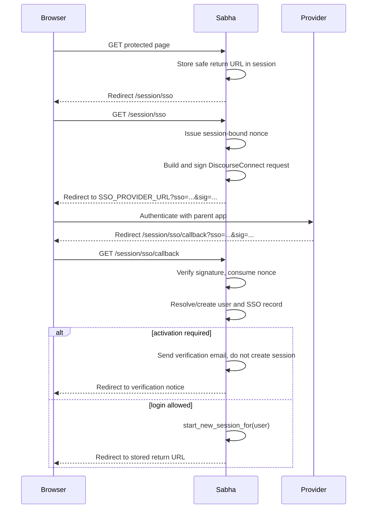
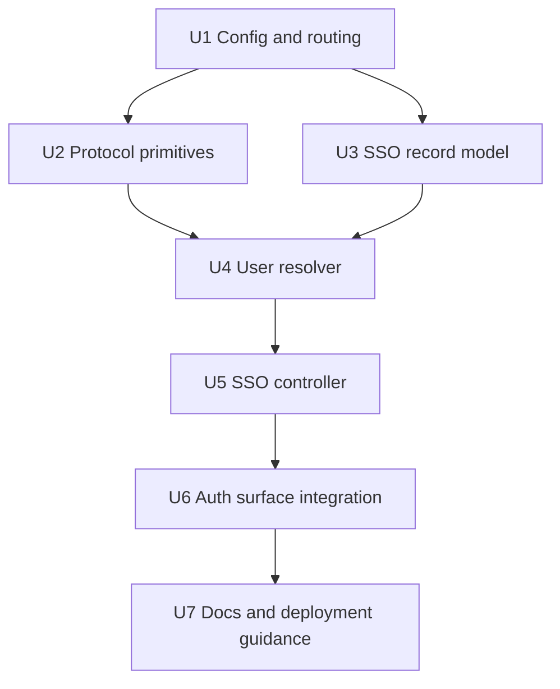

# Add DiscourseConnect SSO

## Summary

Add signed-token single sign-on for self-hosted Sabha by making Sabha a DiscourseConnect-compatible consumer. The implementation should be env-driven, preserve the existing local session model, keep bot bearer-token authentication working, and route password/OTP surfaces away when `AUTH_METHOD=sso`.

---

## Problem Frame

Self-hosted Sabha is often run as the chat surface for another product or community. Today that shape forces users through a second Sabha account and login flow, even though the parent app already knows who they are.

---

## Requirements

- R1. When `AUTH_METHOD=sso`, password and OTP login flows are disabled and unauthenticated self-hosted users are redirected into SSO.
- R2. Sabha implements DiscourseConnect as a consumer: signed request out, signed response in, session-bound nonces, single-use replay protection.
- R3. On a valid SSO callback, users are resolved by `external_id`, then by verified email when allowed, otherwise auto-provisioned.
- R4. `require_activation=true` creates or leaves the user unverified, sends Sabha's verification email, and does not open a session until verification completes.
- R5. A verified email already claimed by a different SSO `external_id` is rejected and logged.
- R6. Operators can opt into `name` and `avatar_url` override behavior via env flags; defaults preserve local edits.
- R7. Bot API authentication with `Authorization: Bearer ...` continues to work in SSO mode.
- R8. Configuration is environment-driven and consistent with the existing `AUTH_METHOD` convention.
- R9. Operator docs clearly describe the email-takeover risk and mitigations.

---

## Scope Boundaries

- Self-hosted mode only; SaaS mode keeps its existing `GlobalIdentity` / `GlobalSession` flow.
- Sabha is only the SSO consumer. Provider-side implementation in parent apps is out of scope.
- OIDC, SAML, Okta, Google Workspace, and other federated IdP integrations are out of scope.
- Role, group, locale, 2FA, profile background, bio, custom-field, and email override sync are out of scope for v1.
- Single sign-out is local only in v1. `SSO_LOGOUT_URL` and provider-initiated logout beyond the DiscourseConnect `logout=true` callback are deferred.
- Multi-secret key rotation is deferred.
- Admin UI configuration is deferred; env vars are the v1 interface.

### Deferred to Follow-Up Work

- Provider push-sync endpoints such as `/admin/users/sync_sso`.
- Lookup endpoints such as `users/by-external/:external_id.json`.
- Iframe-specific cookie configuration guidance beyond documentation.

---

## Context & Research

### Relevant Code and Patterns

- `app/models/account.rb` owns the `AUTH_METHOD` allowlist and fallback behavior.
- `app/controllers/concerns/authentication.rb` is the authentication chokepoint. `request_authentication`, `start_new_session_for`, `terminate_current_session`, `post_authenticating_url`, and `safe_redirect_url?` are the key integration points.
- `app/controllers/sessions_controller.rb`, `app/controllers/auth_tokens_controller.rb`, and `app/controllers/auth_tokens/validations_controller.rb` gate password and OTP flows through `Current.account` auth predicates.
- `app/controllers/email_verifications_controller.rb` already verifies email and opens a session after a valid email-verification token.
- `User#verify_email!` and `User#send_verification_email` provide the required activation behavior.
- `User` already has `avatar_url`, `email_address`, `name`, `verified_at`, and `last_authenticated_at`, plus a unique email index.
- `Session.start!` and `Authentication#authenticated_as` are the canonical local session creation path.
- `config.autoload_lib(ignore: %w[assets tasks rails_ext])` already autoloads `lib`, so `lib/sso/*` can be loaded without a new initializer.
- Tests use Minitest fixtures and reset `ENV["AUTH_METHOD"]` to password in `test/test_helper.rb`; SSO tests should preserve and restore env values inside each affected test.

### Institutional Learnings

- No `docs/solutions/` directory exists in this repo at plan time.
- Repo guidance emphasizes RESTful controllers, business logic in models, and avoiding service-layer bloat. The plan keeps protocol primitives under the SSO model namespace and user-resolution behavior on Rails records rather than putting it all in controllers.

### External References

- Discourse's official DiscourseConnect documentation describes the HMAC-over-base64 payload, required `nonce`, `email`, and `external_id`, the email-verification warning, the 30-minute nonce window, and email fallback behavior.
- Discourse's reference implementation in `lib/discourse_connect_base.rb` defines the canonical accessor list, boolean parsing behavior, custom-field parsing, Base64 validation, and `Base64.strict_encode64` payload generation.

---

## Key Technical Decisions

- Use DiscourseConnect wire compatibility, not JWT or OAuth: this matches the origin note and allows existing DiscourseConnect providers to work unchanged.
- Keep protocol code pure in `app/models/sso`: HMAC, base64, query parsing, and boolean coercion should not depend on `User`, `ApplicationRecord`, or controller state.
- Keep user resolution on `SingleSignOnRecord`: resolving or creating `User` and recording provider audit fields is Sabha domain behavior and should follow the repo's "business logic in models" standard.
- Store nonces in `SingleSignOnNonce` rows and bind them to the Rails session: the database record gives unique replay protection and auditability, while the session key preserves CSRF protection.
- Consume the nonce before user resolution after signature validation: a valid callback should be single-use even if user provisioning later fails.
- Treat `logout=true` as a signed callback branch only, not provider-initiated single sign-out. Sabha should accept it only with a valid `sso`/`sig` pair and a valid Sabha-issued nonce, then terminate the current local session without requiring `email` or `external_id`.
- Treat `require_activation=true` as a security boundary: do not email-match existing accounts when the provider says its email is unverified.
- Ignore role and group claims in v1: Sabha roles remain local to avoid accidentally granting admin or moderator rights from an external payload.
- Preserve local profile edits by default: use SSO claims on create, and only update `name` / `avatar_url` on subsequent logins when env override flags are true.

---

## Open Questions

### Resolved During Planning

- Should logout redirect to a provider URL in v1? Resolved as no; keep logout local unless a later operator need justifies `SSO_LOGOUT_URL`.
- Should key rotation be included in v1? Resolved as no; a single shared secret is enough for the first implementation.
- Should configuration be exposed in admin UI? Resolved as no; follow the existing env-driven `AUTH_METHOD` pattern.

### Deferred to Implementation

- Exact validation message copy and failure-page copy: decide during implementation to match existing session UI tone.
- Exact per-`external_id` lock primitive: prefer a small in-process lock first, but implementation should verify whether the repo already has an advisory-lock helper before adding anything new.
- Whether avatar URLs should be copied as remote Active Storage attachments or stored only in `users.avatar_url`: v1 should prefer the existing `avatar_url` column unless implementation reveals current avatar rendering requires attachment handling.

---

## Output Structure

This is the expected new-code shape. It is a scope declaration, not a constraint; implementation may adjust names if local conventions point to a clearer fit.

```text
lib/sso/
  payload.rb
app/models/
  single_sign_on_record.rb
  single_sign_on_nonce.rb
app/controllers/
  sso_controller.rb
app/views/sso/
  failed.html.erb
test/lib/sso/
  payload_test.rb
test/models/
  single_sign_on_record_test.rb
  single_sign_on_nonce_test.rb
test/controllers/
  sso_controller_test.rb
```

---

## High-Level Technical Design

> *This illustrates the intended approach and is directional guidance for review, not implementation specification. The implementing agent should treat it as context, not code to reproduce.*



---

## Implementation Units



### U1. Config and Routing

**Goal:** Teach Sabha that `sso` is a valid auth method and expose DiscourseConnect consumer endpoints.

**Requirements:** R1, R2, R8

**Dependencies:** None

**Files:**
- Modify: `app/models/account.rb`
- Modify: `config/routes.rb`
- Modify: `config/initializers/00_boot_mode.rb`
- Test: `test/models/account_test.rb`
- Test: `test/routes_test.rb`

**Approach:**
- Add `"sso"` to `Account::VALID_AUTH_METHODS` and update comments/docs that currently say password/otp only.
- Add routes for `GET /session/sso`, `POST /session/sso`, and `GET /session/sso/callback`, using REST-shaped `Sso::HandshakesController` and `Sso::CallbacksController` actions.
- Keep SaaS mode guardrails explicit. `AUTH_METHOD=sso` should be accepted for self-hosted mode and rejected at boot in SaaS mode according to the existing boot-mode pattern, because SaaS auth is out of scope.
- Define required env vars as `SSO_PROVIDER_URL` and `SSO_SECRET`; optional flags are `SSO_OVERRIDES_NAME` and `SSO_OVERRIDES_AVATAR`.

**Execution note:** Implement this test-first so the auth-method allowlist and routes are pinned before controller behavior is added.

**Patterns to follow:**
- `Account#auth_method` fallback behavior and auth predicate helpers in `app/models/account.rb`
- Existing route style around `resource :session` and `auth_tokens`
- SaaS boot guard in `config/initializers/00_boot_mode.rb`

**Test scenarios:**
- Happy path: `ENV["AUTH_METHOD"]="sso"` -> `Account#auth_method` returns `"sso"` and `Account#sso_auth?` is true.
- Edge case: invalid `AUTH_METHOD` still falls back to `"password"`.
- Error path: SaaS boot guard does not allow self-hosted SSO to replace SaaS auth.
- Integration: route helpers resolve `/session/sso` and `/session/sso/callback` to the intended controller actions.

**Verification:**
- The auth method is accepted in self-hosted tests, and route tests prove the endpoint names are stable.

---

### U2. Protocol Primitives

**Goal:** Add portable DiscourseConnect payload primitives and database-backed nonce state.

**Requirements:** R2

**Dependencies:** U1

**Files:**
- Create: `app/models/sso/payload.rb`
- Create: `app/models/single_sign_on_nonce.rb`
- Test: `test/models/sso/payload_test.rb`
- Test: `test/models/single_sign_on_nonce_test.rb`

**Approach:**
- `Sso::Payload` owns `encode` and `decode`: query-string construction, `Base64.strict_encode64`, pre-decode Base64 character validation, HMAC-SHA256, constant-time signature comparison, boolean coercion, custom-field collection, and protocol-specific exceptions.
- Compute signatures over the base64 payload string as received by Rack, not over decoded payload text.
- Mirror Discourse boolean semantics: `"true"` becomes `true`, `"false"` becomes `false`, and any other value for known booleans becomes `nil`.
- Reject banned external IDs (`none`, `nil`, `blank`, `null`, case-insensitive) with a specific exception.
- `SingleSignOnNonce` owns database-backed issue/consume behavior with a per-session nonce binding and unique nonce replay protection.
- Active nonce keys also live in the Rails session store so callbacks from another browser session are rejected without consuming the legitimate nonce.

**Patterns to follow:**
- Existing Rails token use in `AuthToken` and email verification, but keep this layer pure.
- Discourse's `DiscourseConnectBase` payload and boolean parsing behavior.

**Test scenarios:**
- Happy path: encoding a request payload and decoding it with the same secret returns `nonce` and `return_sso_url`.
- Happy path: response payload with `email`, `external_id`, `name`, `avatar_url`, and `require_activation=false` decodes to expected Ruby values.
- Edge case: boolean field values `"true"`, `"false"`, `"garbage"`, and missing values decode exactly as Discourse-compatible semantics require.
- Edge case: `custom.foo=bar` is captured under `custom_fields` without affecting supported v1 fields.
- Error path: mismatched signature raises an invalid-signature exception.
- Error path: `sso` containing characters outside Discourse's accepted Base64 alphabet is rejected before decode with a payload parse exception.
- Error path: malformed base64 or payload parse failure raises a protocol parse exception without opening a session.
- Error path: banned `external_id` values are rejected.
- Happy path: issued nonce consumes once and returns the stored return path.
- Error path: consuming the same nonce twice raises replay distinctly from invalid/expired nonce.
- Error path: consuming a nonce absent from the active session store raises invalid/expired, modeling CSRF-bound nonce behavior.

**Verification:**
- Protocol unit tests cover DiscourseConnect compatibility without needing a controller or database.

---

### U3. SSO Record Model and Schema

**Goal:** Persist the one-way mapping between parent-app identities and local Sabha users.

**Requirements:** R3, R5

**Dependencies:** U1

**Files:**
- Create: `db/migrate/*_create_single_sign_on_records.rb`
- Modify: `db/schema.rb`
- Create: `app/models/single_sign_on_record.rb`
- Modify: `app/models/user.rb`
- Test: `test/models/single_sign_on_record_test.rb`
- Test: `test/fixtures/single_sign_on_records.yml`

**Approach:**
- Add `single_sign_on_records` with `user_id`, `external_id`, `external_email`, `last_payload`, `last_seen_at`, timestamps, a unique index on `external_id`, and a unique index on `user_id`.
- Add `belongs_to :user` and `has_one :single_sign_on_record, dependent: :destroy` associations so identity mappings do not outlive deleted users.
- Store `external_email` as the latest provider email claim and `last_payload` as text containing the unsigned decoded SSO payload for auditability. `external_email` makes common support and incident-response queries possible without parsing payload text.
- Keep records self-hosted-compatible by inheriting from `ApplicationRecord`.

**Patterns to follow:**
- Standard migration style in `db/migrate`
- User association style in `app/models/user.rb`
- Fixture-based model tests under `test/models`

**Test scenarios:**
- Happy path: a record belongs to a user and persists `external_id`, `external_email`, `last_payload`, and `last_seen_at`.
- Error path: duplicate `external_id` is rejected by validation or database constraint.
- Error path: a second SSO record for the same user is rejected by validation or database constraint.
- Integration: destroying a user destroys the associated SSO record.

**Verification:**
- Schema and model tests prove mappings are unique on both sides.

---

### U4. User Resolution

**Goal:** Resolve, claim, or provision Sabha users from a validated SSO payload while enforcing takeover guards.

**Requirements:** R3, R4, R5, R6

**Dependencies:** U2, U3

**Files:**
- Modify: `app/models/single_sign_on_record.rb`
- Modify: `app/models/user.rb`
- Test: `test/models/single_sign_on_record_test.rb`

**Approach:**
- Put the resolution transaction on `SingleSignOnRecord` so the provider identity record owns lookup, claim, provisioning, and audit updates.
- Resolution order:
  1. Find `SingleSignOnRecord` by `external_id`; update `external_email`, audit payload, and optional profile fields.
  2. If `require_activation` is not true, find an existing active user by email with no SSO record and claim it by creating the SSO record with `external_email`.
  3. If a user with that email has a different SSO record, reject and log a security event.
  4. Otherwise create a new active user and SSO record; set `verified_at` unless `require_activation=true`.
- For `require_activation=true`, do not match existing users by email. If the callback is for an existing `external_id`, leave the linked user unverified and send Sabha verification. If there is no linked `external_id` and the email already exists, fail closed with a clear log entry rather than claiming the existing account.
- Apply `name` and `avatar_url` from SSO on create. For existing users, update those fields only when `SSO_OVERRIDES_NAME=true` or `SSO_OVERRIDES_AVATAR=true`.
- Keep roles local: ignore `admin`, `moderator`, and group claims.
- Wrap resolution in a per-`external_id` lock to prevent rapid duplicate callbacks from creating duplicate users or records.

**Technical design:** Directional result shape:

```text
resolve(payload) -> result

result.user                # present when a local user exists
result.session_allowed?    # false when activation is required or auth failed
result.activation_required?
result.failure?            # true for takeover guard or invalid domain state
result.message             # safe controller-facing message
```

**Patterns to follow:**
- `User.create!` and validation behavior from `UsersController#create_for_new_user`
- `User#send_verification_email` and `User#verify_email!`
- Security logging style used in `UsersController#cleanup_failed_join`

**Test scenarios:**
- Happy path: payload with new verified email creates a user, SSO record including `external_email`, audit payload, and verified timestamp.
- Happy path: payload with known `external_id` returns the existing user and updates `external_email`, `last_seen_at`, and `last_payload`.
- Happy path: payload with matching existing email and no SSO record claims that user when `require_activation` is false.
- Edge case: existing user local `name` and `avatar_url` are preserved when override flags are unset.
- Edge case: existing user `name` and `avatar_url` are updated when override flags are true.
- Error path: existing email claimed by another `external_id` is rejected and logged.
- Error path: `require_activation=true` with an email matching an existing user does not claim that existing user.
- Integration: `require_activation=true` for a new email creates an unverified user, creates the SSO record, sends verification email, and marks session as not allowed.
- Integration: `require_activation=true` for an already linked `external_id` leaves the user unverified, sends verification email, and does not open a session.
- Edge case: concurrent callbacks for the same `external_id` result in one user and one SSO record.

**Verification:**
- Resolver tests cover all identity-claim paths without needing full browser flow.

---

### U5. SSO Controller Flow

**Goal:** Add the DiscourseConnect entry and callback endpoints that wire protocol primitives to Sabha sessions.

**Requirements:** R1, R2, R3, R4, R5, R6

**Dependencies:** U2, U3, U4

**Files:**
- Create: `app/controllers/sso_controller.rb`
- Create: `app/views/sso/failed.html.erb`
- Test: `test/controllers/sso_controller_test.rb`

**Approach:**
- `new` issues a nonce, stores a safe return path, signs a payload containing `nonce` and `return_sso_url`, and redirects to `SSO_PROVIDER_URL`.
- `show` verifies the signed callback payload, consumes the nonce, handles `failed=true` and the precisely-scoped signed `logout=true` branch, delegates user resolution, and either opens a session or redirects to an email-verification notice.
- Both actions allow unauthenticated access. `show` should be rate limited, following the OTP validation surface.
- Missing `SSO_PROVIDER_URL` or `SSO_SECRET` should fail closed with an operator-facing error in logs and a generic user-facing error.
- Development may include expected signature details for debugging; production must not leak expected signatures.
- `logout=true` is accepted only when the callback has a valid signature and an unconsumed Sabha-issued nonce. In that branch, `email` and `external_id` are not required; the controller calls `terminate_current_session` if a local session exists and redirects locally without provisioning a user.
- `failed=true` renders the failure view and never opens a session.

**Patterns to follow:**
- `AuthTokens::ValidationsController#create` for externally supplied credential validation and session creation.
- `Authentication#start_new_session_for` and `post_authenticating_url`.
- Existing session layout and flash style for user-visible auth failures.

**Test scenarios:**
- Happy path: `GET /session/sso` stores a nonce and redirects to provider with signed `sso` and `sig`.
- Edge case: return path from `params[:return_to]` or stored session is accepted only when `safe_redirect_url?` allows it.
- Happy path: valid callback for an existing SSO record consumes nonce, creates a session, sets `session_token`, and redirects to stored return path.
- Happy path: valid callback for a new verified user creates user and opens a session.
- Error path: bad signature returns forbidden and does not consume an active nonce.
- Error path: replayed nonce returns forbidden with replay-specific behavior and does not open a session.
- Error path: expired or session-mismatched nonce returns forbidden.
- Error path: `failed=true` renders auth failure and does not create a session.
- Happy path: signed callback with `logout=true` and a valid nonce terminates the current local session and redirects without user provisioning, even when `email` and `external_id` are absent.
- Error path: `logout=true` without a valid signature or valid nonce is forbidden and does not terminate the current session.
- Integration: `require_activation=true` sends verification email, does not set `session_token`, and redirects or renders a verification notice.

**Verification:**
- Controller tests prove the full request/callback loop creates sessions only after signature and nonce validation.

---

### U6. Auth Surface Integration

**Goal:** Ensure SSO mode consistently replaces password and OTP entry points without breaking bots or existing token bootstrap behavior.

**Requirements:** R1, R7, R8

**Dependencies:** U5

**Files:**
- Modify: `app/controllers/concerns/authentication.rb`
- Modify: `app/controllers/sessions_controller.rb`
- Modify: `app/controllers/auth_tokens_controller.rb`
- Modify: `app/controllers/auth_tokens/validations_controller.rb`
- Modify: `app/controllers/users_controller.rb`
- Modify: `app/controllers/configurations_controller.rb`
- Modify: `app/views/sessions/new.html.erb`
- Modify: `app/views/users/new.html.erb`
- Test: `test/controllers/concerns/authentication_test.rb`
- Test: `test/controllers/sessions_controller_test.rb`
- Test: `test/controllers/auth_tokens_controller_test.rb`
- Test: `test/controllers/auth_tokens/validations_controller_test.rb`
- Test: `test/controllers/users_controller_test.rb`
- Test: `test/controllers/api/bots/registrations_controller_test.rb`

**Approach:**
- In self-hosted `Authentication#request_authentication`, redirect to `/session/sso` when `Current.account.sso_auth?`; keep SaaS behavior unchanged.
- Leave `bot_authentication` before `request_authentication` so bearer-token bot API calls continue to work.
- Redirect password login, OTP creation, and OTP validation entry points to SSO when SSO mode is active.
- Decide signup behavior explicitly: unauthenticated human join pages in SSO mode should route through SSO, not local password/OTP signup. After SSO login, existing join-code behavior can continue through normal authenticated paths if applicable.
- Update PWA/client configuration patterns if they hard-code login paths.
- Remove or hide local password/OTP-only UI when SSO mode is active.

**Patterns to follow:**
- Existing SaaS redirect guards in `SessionsController`, `AuthTokensController`, and `AuthTokens::ValidationsController`.
- `Authentication#bot_authentication` ordering.
- Conditional auth-method rendering in `app/views/users/new.html.erb`.

**Test scenarios:**
- Happy path: protected self-hosted page redirects to `sso_handshake_path` when `AUTH_METHOD=sso`.
- Integration: JSON bot API request with valid bearer token succeeds in SSO mode.
- Error path: password `POST /session` in SSO mode redirects to SSO and does not authenticate with password.
- Error path: OTP request in SSO mode redirects to SSO and does not send an auth token.
- Error path: OTP code validation in SSO mode redirects to SSO unless it is an explicitly allowed bootstrap token flow.
- Integration: unauthenticated join URL in SSO mode sends the user through SSO rather than rendering a local signup form.
- Edge case: SaaS-mode login redirects remain `/session/new` and are not replaced by self-hosted SSO.

**Verification:**
- Existing password and OTP tests continue to pass for their modes, and new SSO-mode tests prove there are no local-login backdoors.

---

### U7. Documentation and Operator Guidance

**Goal:** Document how operators configure SSO and the security tradeoffs they must understand.

**Requirements:** R8, R9

**Dependencies:** U1 through U6

**Files:**
- Modify: `docs/authentication.md`
- Modify: `docs/DEPLOYMENT.md`
- Modify: `docs/ARCHITECTURE.md`
- Test: none

**Approach:**
- Add SSO to the auth-method overview, configuration table, and deployment env-var examples.
- Document `SSO_PROVIDER_URL`, `SSO_SECRET`, `SSO_OVERRIDES_NAME`, and `SSO_OVERRIDES_AVATAR`.
- Include a short provider contract: accept `sso` and `sig`, validate HMAC, authenticate the parent-app user, return at least `nonce`, `external_id`, and `email`.
- Make the email-takeover risk prominent: email matching trusts the provider's email verification, and unverified provider emails must set `require_activation=true`.
- Document pre-seeding `SingleSignOnRecord` as the safer migration path for existing installs.
- Note iframe cookie requirements as operator guidance: embedded deployments may require `SameSite=None; Secure`, but v1 does not change the default cookie policy.

**Patterns to follow:**
- Existing auth docs structure in `docs/authentication.md`
- Deployment env-var list in `docs/DEPLOYMENT.md`
- Authentication overview in `docs/ARCHITECTURE.md`

**Test scenarios:**
- Test expectation: none -- documentation-only unit.

**Verification:**
- Docs explain configuration, expected provider behavior, takeover risk, mitigations, and explicitly unsupported v1 fields.

---

## System-Wide Impact

- **Interaction graph:** The request path crosses `Authentication`, `Sso::HandshakesController`, `Sso::CallbacksController`, `Sso::Payload`, `SingleSignOnNonce`, `SingleSignOnRecord`, `User`, and `Session`.
- **Error propagation:** Protocol errors should return forbidden from callback endpoints; domain conflicts should log security context and show generic user-facing failure; misconfiguration should log operator detail without leaking secrets.
- **State lifecycle risks:** Nonce consumption, session reset, SSO record creation, user creation, and verification email delivery can partially succeed. The resolver should make database writes transactional where possible and fail closed on ambiguous identity state.
- **API surface parity:** Bot API bearer-token authentication must remain independent from browser SSO. Password/OTP browser surfaces must be disabled consistently in SSO mode.
- **Integration coverage:** Full controller tests are required because unit tests alone cannot prove cookie, session, nonce, redirect, and resolver behavior interact correctly.
- **Unchanged invariants:** SaaS auth remains `GlobalIdentity`-based; local session cookies remain `session_token`; existing password and OTP modes remain supported when selected.

---

## Risks & Dependencies

| Risk | Mitigation |
|------|------------|
| Email takeover during migration | Skip email matching when `require_activation=true`; reject email already bound to another `external_id`; document provider verification requirements and pre-seeding. |
| Replay or CSRF on callback | Database-backed nonce row plus session binding; consume nonce exactly once after signature validation, including failed-auth and logout branches. |
| Secret leakage in diagnostics | Include detailed signature diagnostics only outside production; never log `SSO_SECRET`. |
| Duplicate users on concurrent callbacks | Use a per-`external_id` lock and unique database constraints. |
| Local login bypass remains active | Add SSO-mode tests for password, OTP, join, and auth chokepoint redirects. |
| SaaS mode accidentally affected | Keep SaaS guards explicit and include SaaS-mode regression tests where routing behavior overlaps. |
| Provider sends unsupported claims | Accept and ignore unsupported fields rather than failing, but never grant roles from SSO in v1. |

---

## Documentation / Operational Notes

- Rollout requires setting `AUTH_METHOD=sso`, `SSO_PROVIDER_URL`, and `SSO_SECRET` on Sabha, plus a compatible provider endpoint in the parent app.
- Operators migrating existing installs should decide whether to pre-seed `SingleSignOnRecord` mappings before enabling SSO.
- Operators whose parent app does not verify email must set `require_activation=true` in the provider response.
- Embedded iframe deployments may need cookie policy changes outside this PR.
- Rotate `SSO_SECRET` manually in v1; multi-secret overlap support is future work.

---

## Sources & References

- User-provided origin note: Sabha SSO PRD and technical design supplied in this planning session.
- Related code: `app/controllers/concerns/authentication.rb`
- Related code: `app/controllers/sessions_controller.rb`
- Related code: `app/controllers/auth_tokens_controller.rb`
- Related code: `app/controllers/auth_tokens/validations_controller.rb`
- Related code: `app/controllers/email_verifications_controller.rb`
- Related code: `app/models/account.rb`
- Related code: `app/models/user.rb`
- Related docs: `docs/authentication.md`
- Related docs: `docs/DEPLOYMENT.md`
- External docs: [DiscourseConnect official setup](https://meta.discourse.org/t/setup-discourseconnect-official-single-sign-on-for-discourse-sso/13045/1?tl=en)
- External source: [Discourse `discourse_connect_base.rb`](https://github.com/discourse/discourse/blob/main/lib/discourse_connect_base.rb)
